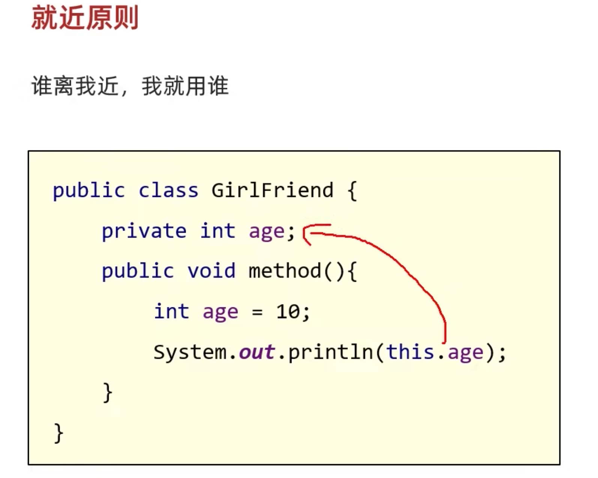

# JAVA_BASIC

## 1. base

### 1.1 JDK 和 JRE

- JDK是什么？有哪些组成？

  JDK是Java开发工具包

  - JVM虚拟机：Java程序运行的地方
  - 核心类库：Java已经写好的东西，直接用
  - 开发工具：javac、java、jdb、jhat

- JRE是什么？有哪些组成？

  JRE是Java运行环境

  - JVM、核心类库、运行工具

- JDK、JRE、JVM三者的包含关系

  - JDK包含了JRE
  - JRE包含了JVM

---

### 1.2 字面量（字面值/常量）

：数据在程序中书写的 格式


#### 1.2.1 字面量类型

6种

整数、字符串、字符、布尔、空类型

null-->得用字符串的形式来打印

#### 1.2.2 特殊字符

制表符-->`\t`

- 在打印的时候，把前面的字符串的空格补齐到8，或者8的倍数。最少补 1 个空格，最多补8个空格

### 1.3 运算符

#### 1.3.1 ++ --

```java
int a = 10;
int b = a++; // 先用后加 a=11,b=10

int a = 10;
int b = ++a; // 先加后用 a=11, b=11
```

### 1.4 循环

default写在哪里并没有关系，只是习惯使然

```java
String key = sc.next();
switch (key) {
    case "1":
        System.out.println(1);
        break;
    case "2":
        System.out.println(2);
        break;
    default:
        System.out.println("Invalid input");
        break;
}
```

**新特性**

```java
String key = sc.next();
switch (key) {
    case "1" -> System.out.println(1);
    case "2" -> System.out.println(2);
    default -> System.out.println("Invalid input");
}
```

#### 1.4.1 for while的区别

```java
/**
->for 循环中，循环控制的变量，因为归属for循环的语法结构，在结束后，不能被访问到
->while循环中，控制循环的变量，对于while循环来说不归属于其语法结构，结束后，能被继续访问使用
**/
for(int i = 0; i < 4; i++){
	sout(i);
}
// -----
int i = 0;
while(i < 4){
	i++;
}
sout(i);
// 改变for循环
int i = 0;
for(; i < 4; i++){
  sout(i);
}
```

>- for循环知道循环的次数或者循环的范围可以使用
>- while循环  不知道循环的次数和范围，只知道循环的结束条件


#### 1.4.2 质数

```java
public class PalindromePlus {
    public static void main(String[] args) {
        int number = 97;
        boolean flag = true;
        System.out.println((int)Math.sqrt(number));
        for (int i = 2; i <= ((int)Math.sqrt(number)); i++) {
            if (number % i == 0) {
                System.out.println("不是质数" + number);
                flag = false;
                break;
            }
        }
        if (flag) {
            System.out.println(number + "是负数");
        }
    }
}
```

### 1.5 数组

- 数组指的是一种容器，可以用来存储同种数据类型的多个值

**静态初始化**

```java
// 数据类型[] 数组名 = new 数据类型[]{元素1, 元素2, 元素3...}
int[] array = new int[]{1,2,3,4}
// 简写
// 数据类型[] 数组名 = {元素1, 元素2, 元素3}
int[] array = {1,2,3,4}
```

```java
public static void main(String[] args) {
        int[] arr = {1,2,3,4,5};
        int sum = 0;
        for (int j : arr) {
            sum += j;
        }
        System.out.println(sum);
    }
```


**动态初始化**

- 初始化的时候只指定长度，由系统为数组分配默认初始值

```java
// 数据类型[] 数组名 = new 数据类型[数组长度]
int[] arr =new int[3];
```

```java
public static void main(String[] args) {
        int[] arr = {1,2,3,4,5};
        int temp = 0;
        for (int i = 0, j = arr.length -1; i < j; i++, j--) {
            temp = arr[i];
            arr[i] = arr[j];
            arr[j] = temp;
        }
        for (int i = 0; i < arr.length; i++) {
            System.out.println(arr[i]);
        }
    }
```

#### 1.5.1 数组内存图

>`栈`-->方法运行时使用的内存，比如main方法运行，进入方法栈中执行
>
>`堆`-->存储对象或数组，new来创建的，都存储在堆内存
>
>方法区-->存储可以运行的class文件
>
>本地方法栈-->JVM在使用操作系统功能的时候使用
>
>寄存器-->给CPU使用


**总结**

1. 只要是new出来的一定是在堆里面开辟了一个小空间
2. 如果new了多次，那么在堆里面有多个小空间，每个小空间中都有各自的数据


`两个数组指向同一个空间的内存图`


**总结**

- 当两个数组指向同一个小空间时，其中一个数组对小空间中的值发生了改变，那么其他数组再次访问的时候都是修改之后的结果了

---

### 1.6 方法

方法是程序中最小的执行单元

```java
public static 返回值类型 方法名(参数) {
  方法体;
  return 返回值;
}
```


#### 1.6.1 方法重载

同一个类中`方法名一样，形式参数（数量、数据类型、顺序）不同`，与返回值无关

```java
public class Demo {
	public static void sum(int a , int b) {
    return a + b;
  }
  public static void sum(int a , int b, int c) {
    return a + b + c;
  }
}
```

---

#### 1.6.2 基本和引用数据类型

基本：整数、浮点数、布尔、字符类型


引用：除基本之外的所有

`只要new出来的都是` -->数据值是存储在其他空间中，自己空间中存的是地址值


---

#### 1.6.3 方法值返回


---

### 1.7 二维数组

**静态初始化**

- 格式：数据类型[]\[] 数组名 = new 数据类型[]\[] {{元素1,元素2},{元素1,元素2}};
- int[]\[] arr =new int[]\[] {{33,44}, {31,32}};
- 简化格式：数据类型[]\[] 数组名 = {{11,12},{1,2}};
- int[]\[] arr = {{},{}};  int arr[]\[] = {{},{}};

```java
// 二维数组的遍历
for (int i = 0; i < arr.length; i++) {
  // i 表示二维数组中的每一个索引
  // arr[i] 表示二维数组中每一个元素（每一个一维数组）
  for(int j = 0;j < arr[i].lengthl; j++) {
    // j表示一维数组中的每一个元素
    sout(arr[i][j] + " ");
  }
  sout();
}
```

**动态初始化**

- 格式：数据类型[]\[] 数组名 = new 数据类型[m]\[n];
  - m表示这个二维数组，可以存放多少个一维数组
  - n表示每个一维数组，可以存放多少个元素
- int[]\[] arr = new int[2]\[3];
  - 该数组可以存放`2个一数组` 每个一维数组 可以存放 3个int类型的元素

#### 1.7.1 内存图


**特殊情况**


---

## 2. 面向对象

- 用来描述一类事物的类，叫做Javabean类
  - Javabean类中，是不写main方法的
- 编写main方法的类叫做测试类
  - 我们可以在测试类中创建Javabean类的对象并进行赋值调用

```java
public class Student {
  // 属性（成员变量）
  private String name;
  private int age;
  // 行为（方法）
  public void study() {}
	public void sleep() {}
}
```

- 类名建议大写，见名知意，驼峰模式
- 一个Java文件中，可以定义多个class类，但是只能有一个`public`修饰的，而且public修饰的类必须成为代码文件名
  - 成员变量的完整定义格式：`修饰符 数据类型 变量名称 = 初始化值;` 一般无需指定初始化值，存在默认值

----

### 2.1 封装

#### 2.1.1 private

1. 可以修饰成员变量和方法
2. 被修饰的成员只能在本类中访问
3. 提供set和get方法，用public来修饰

```java
public class GirlFriend {
  private int age;
  public void setAge(int a) {
    if (a >= 18 && a <= 50) {
      age = a;
    }else {
      sout("非法数据")
    }
  }
  public int getAge() {
    return age;
  }
}
```

### 2.2 this

不加this，就近原则，想要用成员变量用this



```java
{
  private String name; // 成员变量
  public void setName(String name) {
    // 局部变量表示测试类中调用方法传递过来的数据
    // 等号左边，表示成员位置的name
    this.name = name;
  }
}
```

### 2.3 构造方法

- 构造方法也叫作构造器、构造函数
- `作用：`在创建对象的时候给成员变量进行赋值的，初始化

```java
public class Student {
  修饰符 类名(参数) {
    方法体;
  }
}
```

**特点**

1. 方法名与类名相同，大小写也要一致
2. 没有返回值类型，连void都没有
3. 没有具体的返回值（不能有return带回结果数据）
4. 如果不自己写空参构造，虚拟机会加一个
5. 如果我们写了有参构造，必须先手动写空参构造

**执行时机**

1. 创建对象的时候由虚拟机调用，不能手动调用构造方法
2. 每创建 一次对象，就会调用一次构造方法

### 2.4 标准的JavaBean

1. 类名见名知意
2. 成员变量使用`private`修饰
3. 提供至少两个构造方法
   - 无参构造
   - 带全部参数的构造方法
4. 成员方法
   - 提供每一个成员变量对应的set和get方法
   - 如果有其他行为记得写上

---

### 2.5 对象的内存

Student s = new Student();

1. 加载class文件
2. 申明局部变量
3. 在堆内存中开辟一个空间
4. 默认初始化
5. 显示初始化
6. 构造方法初始化
7. 将堆内存中的地址值赋值给左边的局部变量


### 2.6 this的内存

this的作用：区分成员变量和局部变量

this的本质：代表方法调用者的地址值


### 2.7 成员和局部变量

成员变量：类中方法外的变量

局部变量：方法中的变量


### 2.8 键盘录入

> nextInt(); 
>
> nextDouble();
>
> next(); 接收字符串
>
> -----遇到空格，制表符，回车就停止接收。-----
>
> nextLine(); 接收字符串
>
> -----可以接收空格，制表符，遇到回车才停止接收数据-----

---

## 3. 字符串

### 3.1 String构造方法的实现

`String s1 = new String("")`---> ""等同于 所以我们一般写成 String s1 = "abc"

```java
// 传递一个字符数组，根据字符数组的内容创建一个新的字符串对象
// abc --> {'a','b','c'} --> {'Q','b','c'} -->"Qbc"
char[] chs = {'a','b','c','d'};
String s4 = new String(chs);
sout(s4); // abcd

// 传递一个字节数组，根据字节数组的内容再创建一个新的字符串对象
// 应用场景：以后在网络当中传输的数据其实都是字节信息
// 把字节信息转换成字符串
byte[] bytes = {97,98,99,100};
String s5 = new String(bytes);
sout(s5); // abcd
```


### 3.2 String对象的内存

StringTabel(串池) 存放字符串的常量池

`只有直接赋值的字符串才会存放进去，new出来的不会`

从JDK7开始，从方法区挪到了堆内存

**直接赋值**


**new出来的**


---

### 3.3 常用方法

#### 3.3.1 比较


- `boolean equals方法(要比较多字符串)` 完全一样结果才是true，否则false


- `boolean equalsIgnoreCase(要比较多字符串)` 忽略大小写的比较


#### 3.3.2 遍历


- `public char charAt(int index): 根据索引返回字符`
- `public int length(): 返回此字符串的长度`
- `数组的长度(属性):数组名.length`
- `字符串的长度(方法): 字符串对象.length()`

```java
// 遍历
public static void main(String[] args) {
        Scanner sc = new Scanner(System.in);
        System.out.println("请输入一个你要遍历 字符串：");
        String keyStr = sc.next();
//        for (int i = 0; i < keyStr.toCharArray().length; i++) {
//            System.out.println(keyStr.toCharArray()[i]);
//        }
        for (int i = 0; i < keyStr.length(); i++) {
            // i 依次表示字符串的每一个索引
            System.out.println(keyStr.charAt(i));
        }
    }
```

```java
public static void main(String[] args) {
        int uppercase = 0; // 大写
        int lowercase = 0; // 小写
        int number = 0; // 数字字符
        int other = 0; // 其他字符

        Scanner sc = new Scanner(System.in);
        System.out.print("请输入你要输入的字符: ");
        String keyStr = sc.next();
        for (int i = 0; i < keyStr.length(); i++) {
            int index = keyStr.charAt(i);
            // ASCII码表
            if (index >= 97 && index <= 122) {
                lowercase++;
            }else if (index >= 65 && index <= 90) {
                uppercase++;
            }else if (index >= 48 && index <= 57) {
                number++;
            }else {
                other++;
            }
        }
        System.out.println("小写->" + lowercase);
        System.out.println("大写->" + uppercase);
        System.out.println("数字->" + number);
        System.out.println("其他->" + other);
    }
```

**金额转换**

```java
public static String toAmount(int number) {
        // 查表法
        int count = 7;
        char[] chs = {'元', '拾', '佰', '仟', '万', '拾', '佰'};
        char[] chs1 = {'零', '壹', '贰', '叁', '肆', '伍', '陆', '柒', '捌', '玖'};
        String resStr = "";
        int num = 0;
        for (int i = 0; i < count; i++) {
            String str = "";
            num = number % 10;
            if (number == 0) {
                resStr = str + chs1[0] + chs[i] + resStr;
            }else {
                resStr = str + chs1[num] + chs[i] + resStr;
            }
            number /= 10;
        }
        return resStr;
    }
```

---

#### 3.3.3 截取

- `String substring(int beginIndex, int endIndex)`
- **包头不包尾，包左不包右**，返回值是截取的小串

- 重载的方法`String substring(int beginIndex)` 截取到末尾

```java
    public static void IdInfo(String str) {
        String year = str.substring(6,10) + "年";
        String month = str.substring(10,12) + "月";
        String day = str.substring(12,14) + "日";
        // 第一种
//        String sex = str.substring(16,17);
//        String[] arr = {"0","2","4","6","8"};
//        String gender = "男";
//        for (String string : arr) {
//            if (sex.equals(string)){
//                gender = "女";
//                break;
//            }
//        }
        // 第二种 利用ASCII码表进行转换
        char sex = str.charAt(16);
        int num = sex - 48;
        String gender = "男";
        if (num % 2 == 0) {
            gender = "女";
        }
        System.out.println("人物的信息为：");
        System.out.println("出生年月日："+year+month+day);
        System.out.println("性别为："+gender);

    }
```

#### 3.3.4 替换

- `String replace(旧值, 新值)`

**敏感词替换**

```java
public static void main(String[] args) {
        String oldWord = "我是你爸爸,nmgb";
        String key = "**";

        String[] strArr = {"TMD", "nmgb", "CnM", "NMSl"};
        for (String string : strArr) {
            oldWord = oldWord.replace(string, key);
        }
        System.out.println(oldWord);
    }
```

---

### 3.4 StringBuilder

**使用场景**

1. 拼接字符串
2. 字符串的反转

`可以看成一个容器，创建之后里面的内容是可变的`

提高字符串的操作效率

构造方法

- `public StringBuilder()`-->空参，创建一个空白可变字符串对象，不含有任何内容
- `public StringBuilder(String str)` -->根据字符串的内容，来创建可变字符串对象

成员方法

- `public StringBuider append(任意类型)` -->添加数据，并返回对象本身
- `public StringBuilder reverse()` -->反转容器中的内容
- `public int length()` --> 返回长度，（字符出现的个数）
- `public String toString()` --> 通过toString()就可以实现把StringBuilder转换为String

打印

sout(sb) --> 打印对象不是地址而是属性值

```java
public static void main(String[] args) {
        StringBuilder sb = new StringBuilder();
        int[] arr = {1,2,3,22,3};
        sb.append("[");
        for (int i = 0; i < arr.length; i++) {
            sb.append(arr[i]);

            if (i == arr.length - 1) {
                sb.append("]");
            }else {
                sb.append(",");

            }
        }
        String str = sb.toString();
        System.out.println(str);
    }
```

---

### 3.5 StringJoiner

跟builder差不多，JDK8出现的，只能添加**`字符串`**

**提高字符串的操作效率，**代码更简洁。

**构造方法**

- `public StringJoiner(间隔符号)` -->创建一个Joiner对象，指定拼接时的间隔符号
- `public StringJoiner(间隔符号,开始符号,结束符号)` -->指定拼接时的间隔符号，开始符号，结束符号

```java
public static void main(String[] args) {
    StringJoiner sj = new StringJoiner(", ", "[", "]");
    int[] arr = {1,2,3,4,566,666};
    for (int j : arr) {
        // 只能add添加字符串，所以+""
        sj.add(j + "");
    }
    String str = sj.toString();
    System.out.println(str);
}
```

---

### 3.6 ==字符串底层原理==

https://www.bilibili.com/video/BV17F411T7Ao?p=107&spm_id_from=pageDriver&vd_source=4eb731f77bd13aa70eb15004ef84fc15

----

## 4. ArrayList

`不能存储基本类型，只能存储对应的包装类` -->可以存储引用数据类型

泛型可以限定集合中存储数据的类型

```java
ArrayList<String> list = new ArrayList<>();
sout(list); // -->[]
// 打印对象不是地址值，而是集合中存储数据的内容
// 在展示的时候，拿[] 把所有数据进行包裹
```


---

## 5. static

static 表示静态，是一个修饰符，可以修饰成员方法，成员变量

**被static修饰的成员变量叫做，静态变量**

特点

- 被该类所有对象共享
- 不属于对象，属于类
- 随着类加载而加载，优先于对象存在

调用方式

- 类名调用
- 对象名调用


**被static修饰的成员方法叫做静态方法**

特点

- 多用在测试类或工具类中
- javabean类中很少用

调用方式

- 类名调用

- 对象调用


**注意事项**

- 静态方法只能访问静态变量和静态方法
- 非静态方法 可以访问静态变量或者静态方法，也可以方法非静态的成员变量和非静态的成员方法
- 静态方法中没有this关键字

`总结`

1. 静态方法中，只能访问静态
2. 非静态方法中可以访问所有
3. 静态方法中没有this关键字


## 6. 继承


`构造方法不能被继承下来` -->构造方法的类名是父类的名字，继承的话，名字就出现了问题


**不用private修饰**


**用private修饰**


---

**`成员方法被继承`**

 


### 6.1 继承的特点

- 父类中的构造方法不会被子类继承
- 子类中所有的构造方法默认先访问父类中的无参构造，再执行自己

**为什么？**

- 子类在初始化的时候，有可能会使用到父类中的数据，如果父类没有完成初始化，子类将无法使用父类的数据
- `子类初始化之前，一定要调用父类构造方法先完成父类数据空间的初始化`

**怎么调用父类构造方法？**

- 子类构造方法的第一行语句默认都是：`spuer()` 不写也存在，且必须在第一行
- `如果想调用父类的有参构造，必须手动写spuer 进行调用`

### 6.2 继承中构造方法的访问特点

- 子类不能继承父类的构造方法，但是可以super调用
- 子类构造方法的第一行，有一个默认的super()
- 默认先访问父类中无参的构造方法，再执行自己
- 如果想要访问父类的有参构造，必须手动写

### 6.3 super 和 this


---

## 7. 重写和重载

### 7.1 方法等重写

当父类的方法不能满足仙子的需求时，进行方法的重写

在`继承体系中`，子类出现了和父类中一摸一样的方法声明

1. @Override是放在重写后的方法上，校验子类重写时的语法是否正确
2. 建议重写方法都加上注解，更安全，代码优雅


`子类覆盖了从父类虚方法表里继承下来的方法`

**注意事项和要求**

1. 重写方法的名称，形参列表与父类中的一致
2. 子类重写父类方法时，访问权限子类必须大于等于父类
3. 子类重写父类方法时，返回值类型子类必须小于等于父类
4. `只有添加到虚方法表里的方法才能被重写`
   - 私有方法不能被重写，因为不会出现在虚方法表里
   - 子类不能重写父类静态的方法，如果重写会报错

----

## 8. 多态

同类型的对象，表现出不同的形态

- 形式

父类类型 对象名称 = 子类对象;

- 多态的前提
  - 有继承或实现关系
  - 有父类引用指向子类对象   Fu f = new Zi();
  - 有方法重写

---

### 8.1 多态调用成员的特点

- 成员变量调用：编译看左边，运行也看左边
- 方法调用：编译看左边，运行看右边,运行的是子类中的方法


---

### 8.2 多态的优劣

**优势**

- 在多态的形式下，右边对象可以实现解耦合，便于扩展和维护
  - Person p = new `Student();`
  - p.work(); // 业务逻辑发生改变时，后续代码无需更高

-  定义方法的时候，使用父类型作为参数，可以接收所有子类对象，体现多态的扩展性与便利


**弊端**

- 不能调用子类的特有功能
- 如果非要用，就要强转
- 转换的时候用instanceof关键字进行判断

```java
        //多态的弊端
        //不能调用子类的特有功能
        //报错的原因？
        //当调用成员方法的时候，编译看左边，运行看右边
        //那么在编译的时候会先检查左边的父类中有没有这个方法，如果没有直接报错。
        //a.lookHome();


        //解决方案：
        //变回子类类型就可以了
        //细节：转换的时候不能瞎转，如果转成其他类的类型，就会报错
        //Cat c = (Cat) a;
        //c.catchMouse();

        /*if(a instanceof Dog){
            Dog d = (Dog) a;
            d.lookHome();
        }else if(a instanceof Cat){
            Cat c = (Cat) a;
            c.catchMouse();
        }else{
            System.out.println("没有这个类型，无法转换");
        }*/

        //新特性
        //先判断a是否为Dog类型，如果是，则强转成Dog类型，转换之后变量名为d
        //如果不是，则不强转，结果直接是false
        if(a instanceof Dog d){
            d.lookHome();
        }else if(a instanceof Cat c){
            c.catchMouse();
        }else{
            System.out.println("没有这个类型，无法转换");
        }
```

---

## 9. 包 和 final

包需要全部小写

- 同一个包中的类时，不需要导包
- 使用java.lang包中的类时，不需要导包
- 其他情况都需要导包
- 如果同时使用两个包中的同名类，需要用全类名

---

**final**

方法

- 表明该方法是最终方法，不能被重写

类

- 表明该类是最终类，不能被继承

变量

- 叫做常量，只能被赋值一次

**常量**

- 命令规范
  - 单个单词：全部大写
  - 多个单词：全部大写，单词之间用下划线隔开
- 细节
  - final修饰的变量是基本类型：那么变量存储的`数据值`不能发生改变
  - final修饰引用类型：那么变量存储的`地址值`不能发生改变，对象内部属性值的可以改变

---


---

## 10. 代码块

**局部代码块**

```java
public class Test{
  psvm{
    {
      int a = 10;
      sout(a);
    }
  }
  
}
```


**构造代码块**

```java
public class Student {
  private String name;
  private int age;
  // 构造代码块
  // 1. 写在成员位置的代码块
  // 2. 作用：可以把多个构造方法中重复的代码抽取出来
  // 3. 执行时机：我们在创建本类对象的时候会先执行构造代码块，再执行构造方法
  {
    sout();
  }
  public Student() {
    // sout(); 重复了
  }
  public Student(String name, int age) {
    // sout();重复了
    this.name = name;
    this.age = age;
  }
}
```


**静态代码块**

- 格式 --> static{}
- 特点 --> 需要通过static关键字修饰，随着类的加载而加载，并且自动触发、只执行一次
- 使用场景 --> 在类加载的时候，做一些`数据初始化`的时候使用

---

## 11. 抽象类和方法

**抽象方法：**

将`共性的`行为（方法）抽取到父类之后，由于每一个子类执行的内容是不一样的，所以，在父类中不能确定`具体的方法体`。该方法就可以定义为抽象方法

- 定义格式
  - public abstract 返回值类型 方法名(参数列表);

**抽象类**

如果一个`类中存在抽象方法`，那么该类就`必须声明为抽象类`

- 定义格式
  - public abstract class 类名{}


抽象类`注意事项`

强制子类必须符合规则的书写

- 抽象类不能实例化
- 抽象类中不一定有抽象方法，有抽象方法的类一定是抽象类
- 可以有构造方法
  - 当创建子类对象的时候，给属性进行赋值的
- 抽象类的子类
  - 要么重写抽象类中所有的抽象方法
  - 要么是抽象类

----

## 12. 接口

是一种规则，对行为的抽象

**定义和使用**

- 接口用关键字interface来定义
  - public interface 接口名{}

- 接口不能实例化
- 接口和类之间是实现关系，通过implements关键字表示
  - public class 类名 implements 接口名{}

- 接口的子类(实现类)
  - 要么重写接口中的所有抽象方法
  - 要么是抽象类


**注意1:**

- 接口和类的实现关系，可以单实现也可以多实现
  - public class 类名 implements 接口1,接口2{}

**注意2**

- 实现类还可以在继承一个类的同时实现多个接口
  - public class 类名 extends 父类 implements 接口1, 接口2{}

---

**接口成员的特点**

- 成员变量
  - 只能是常量
  - 默认修饰符：`public` static final
- 构造方法
  - 没有
- 成员方法
  - 只能是抽象方法
  - 默认修饰符 public abstract
- JDK7以前只能定义抽象方法
- JDK8的新特性：`接口中可以定义有方法体的方法`
- JDK9的新特性：`接口中可以定义私有方法`


**接口和类之间的关系**

- 类和类的关系
  - 继承关系，只能单继承，不能多继承，但是可以多层继承
- 类和接口的关系
  - 实现关系，可以单实现，也可以多实现，还可以在继承一个类的同时实现多个接口
- 接口和接口的关系
  - 继承关系，可以单继承，也可以多继承

----

### 12.1 接口新增的方法

- JDK8新特性: 接口中可以定义有方法体的方法（默认、静态）

  - 接口中允许定义`默认`方法，使用`default`修饰

    - 解决接口升级不适配的问题

  - 默认方法的定义格式

    - pulbic `default` 返回值类型 方法名(参数列表) {}
    - public `default` void show() {}

  - 注意事项

    - 默认方法不是抽象方法，所以不强制被重写。但是如果重写，需要去掉default关键字
    - public 可以省略 ，default不能。省略了会把你当成抽象方法
    - 如果实现了多个接口，多个接口中存在相同名字的默认方法，子类就必须对该方法进行重写

  - 允许接口中定义静态方法，需要用static修饰

  - 定义格式

    - pulbic `static` 返回值类型 方法名(参数列表) {}
    - public `static` void show() {}

  - 注意事项

    - public可以省略，static不能省略

    - 静态方法只能通过接口名调用，不能通过实现类名或者对象名调用

      ​	不能被重写

- JDK9的新特性: 接口中可以定义私有方法

- 定义格式
  - private void show() {}  -->为默认方法服务
  - private static void method() {}  -->为静态方法服务

----

## 13. 设计模式

- 设计模式（Design pattern）是一套被反复使用、多数人知晓的、经过分类编目的、代码设计经验的总结
- 使用设计模式是为了可重用代码、让代码更容易被他人理解、保证代码可靠性、程序的重用性

简单理解：设计模式就是各种套路

### 13.1 适配器设计模式

- 适配器设计模式：解决接口与接口实现类之间的矛盾问题

>实现接口的时候，有些方法我不想用，可以采用适配器模式
>
>操作步骤
>
>1. 新建一个中间文件（因为是空实现，所以加abstract）去实现某个接口，方法体空着不写
>2. 在去继承这个中间文件，想要用哪个方法就去写方法体


---

## 14. 内部类

类的五大成员：属性、方法、构造方法、代码块、内部类

```java
public class Outer { // 外部类
  public class Inner{ // 内部类
  
  } 
}
```


---

### 14.1 成员内部类

- 写在成员位置的，属于外部类的成员
- 只要用来修饰成员变量的，都可以用来修饰成员内部类，地位等同
  - private、默认、protected、public、static等
- JDK16之前不能定义静态变量，16之后才可以

```java
public class Car{ // 外部类
  String name;
  int carAge;
  class Engine{ // 成员内部类
    Sting engineName;
    int engineAge;
  }
}
```

**获取成员内部类的对象**

方法一：在外部类中编写方法，对外提供内部类的对象

方法二：直接创建格式：外部类名.内部类名 对象名 = 外部类对象.内部类对象;

Car.Engine abc = new Car().new Engine();


### 14.2 静态内部类

静态内部类只能访问外部类中的静态变量和静态方法, 如果想要访问非静态的需要创建对象

**创建静态内部类对象的格式**：外部类名.内部类名 对象名 = new 外部类名.内部类名();

**调用非静态方法的格式：** 先创建对象，用对象调用

**调用静态方法的格式**： 外部类名.内部类名.方法名();

```java
public class Car{ // 外部类
  String name;
  int carAge;
  static class Engine{ // 成员内部类
    Sting engineName;
    int engineAge;
  }
}
```

### 14.3 局部内部类

1. 将内部类定义在方法里面就叫做局部内部类，类似于方法里面的局部变量
2. 外界是无法直接使用的，需要在方法内部创建并使用
3. 该类可以直接访问外部类的成员，也可以访问方法内的局部变量


### 14.4 匿名内部类（掌握）

本质是隐藏了名字的内部类

```java
new 类名或接口名() {
  重写方法;
};

// 举例
new Inter() {
  @Override
  public void show(){}
};
```

- 继承/实现
- 方法重写
- 创建对象


**使用**


---

## 15. 常见API

### 15.1 MATH


---

### 15.2 System


**System.arraycopy**

- 数据类型需要一致

- 拷贝的时候长度不能超出

- 如果数据源数组和目的数组都是引用数据类型，那么子类类型可以赋值给父类类型

  - ```java
    Student s1 = new Student("zhangsan",21);
    Student s2 = new Student("lisi",22);
    Student s3 = new Student("wangwu",23);
    
    Student[] arr1 = {s1, s2, s3};
    Student[] arr2 = new Student[3];
    // 把arr1中对象的地址值赋值给arr2
    System.arraycopy(arr1, 0, arr2, 0,3);
    ```

### 15.3 Runtime


### 15.4 Object


---

#### 15.4.1 clone


**浅拷贝**（默认）


**深拷贝**


**Gson**


### 15.5 工具类objects


>方法底层会判断s1是否为null，如果为null，直接返回false
>
>如果s1不为null，那么就利用s1再次调用equals方法
>
>此时s1对象类型，最终还是会调用对象中的eqals方法
>
>​	如果没有重写，比较地址值，如果重写了，就比较属性值


### 15.6 BigInteger


```java
public static void main(String[] args) {
        /*
            public BigInteger(int num, Random rnd) 获取随机大整数，范围:[0~ 2的num次方-11
            public BigInteger(String val) 获取指定的大整数
            public BigInteger(String val, int radix) 获取指定进制的大整数

            public static BigInteger valueOf(long val) 静态方法获取BigInteger的对象，内部有优化

            细节:
            对象一旦创建里面的数据不能发生改变。
        */


        //1.获取一个随机的大整数
        /* Random r=new Random();
            for (int i = e; i < 100; i++) {
            BigInteger bd1 = new BigInteger(4,r);
            System.out.println(bd1);//[@ ~ 15]}
            }
        */

        //2.获取一个指定的大整数，可以超出long的取值范围
        //细节:字符串中必须是整数，否则会报错
        /* BigInteger bd2 = new BigInteger("1.1");
            System.out.println(bd2);
        */

        /*
            BigInteger bd3 = new BigInteger("abc");
            System.out.println(bd3);
         */

        //3.获取指定进制的大整数
        //细节:
        //1.字符串中的数字必须是整数
        //2.字符串中的数字必须要跟进制吻合。
        //比如二进制中，那么只能写日和1，写其他的就报错。
        BigInteger bd4 = new BigInteger("123", 2);
        System.out.println(bd4);

        //4.静态方法获取BigInteger的对象，内部有优化
        //细节:
        //1.能表示范围比较小，只能在long的取值范围之内，如果超出long的范围就不行了。
        //2.在内部对常用的数字: -16 ~ 16 进行了优化。
        //  提前把-16~16 先创建好BigInteger的对象，如果多次获取不会重新创建新的。
        BigInteger bd5 = BigInteger.valueOf(16);
        BigInteger bd6 = BigInteger.valueOf(16);
        System.out.println(bd5 == bd6);//true


        BigInteger bd7 = BigInteger.valueOf(17);
        BigInteger bd8 = BigInteger.valueOf(17);
        System.out.println(bd7 == bd8);//false


        //5.对象一旦创建内部的数据不能发生改变
        BigInteger bd9 =BigInteger.valueOf(1);
        BigInteger bd10 =BigInteger.valueOf(2);
        //此时，不会修改参与计算的BigInteger对象中的借，而是产生了一个新的BigInteger对象记录
        BigInteger result=bd9.add(bd10);
        System.out.println(result);//3

    }
```

1. 如果BigInteger表示的数字`没有超出`long的范围，就可以用静态方法获取
2. 如果BigInter表示的`超出`long的范围，可以用构造方法获取
3. 对象一旦创建，BigInteger内部记录的值不能发生改变
4. 只要进行计算都会产生一个新的BigInter对象


```java
public static void main(String[] args) {
        /*
            public BigInteger add(BigInteger val) 加法
            public BigInteger subtract(BigInteger val) 减法
            public BigInteger multiply(BigInteger val) 乘法
            public BigInteger divide(BigInteger val) 除法，获取商
            public BigInteger[] divideAndRemainder(BigInteger val) 除法，获取商和余数
            public boolean equals(Object x) 比较是否相同
            public BigInteger pow(int exponent) 次幂
            public BigInteger max/min(BigInteger val) 返回较大值/较小值
            public int intValue(BigInteger val) 转为int类型整数，超出范围数据有误
        */

        //1.创建两个BigInteger对象
        BigInteger bd1 = BigInteger.valueOf(10);
        BigInteger bd2 = BigInteger.valueOf(5);

        //2.加法
        BigInteger bd3 = bd1.add(bd2);
        System.out.println(bd3);

        //3.除法，获取商和余数
        BigInteger[] arr = bd1.divideAndRemainder(bd2);
        System.out.println(arr[0]);
        System.out.println(arr[1]);

        //4.比较是否相同
        boolean result = bd1.equals(bd2);
        System.out.println(result);

        //5.次幂
        BigInteger bd4 = bd1.pow(2);
        System.out.println(bd4);

        //6.max
        BigInteger bd5 = bd1.max(bd2);


        //7.转为int类型整数，超出范围数据有误
        /* BigInteger bd6 = BigInteger.valueOf(2147483647L);
         int i = bd6.intValue();
         System.out.println(i);
         */

        BigInteger bd6 = BigInteger.valueOf(200);
        double v = bd6.doubleValue();
        System.out.println(v);//200.0
    }
```

**存储方式**


### 15.7 BigDecimal


```java
public static void main(String[] args) {
        /*
            构造方法获取BigDecimal对象
            public BigDecimal(double val) public BigDecimal(string val)

            静态方法获取BigDecimal对象
            public static BigDecimal valuef(double val)
        */

        //1.通过传递double类型的小数来创建对象
        //细节:
        //这种方式有可能是不精确的，所以不建议使用
        BigDecimal bd1 = new BigDecimal(0.01);
        BigDecimal bd2 = new BigDecimal(0.09);

        System.out.println(bd1);
        System.out.println(bd2);

        //通过传递字符串表示的小数来创建对象
        BigDecimal bd3 = new BigDecimal("0.01");
        BigDecimal bd4 = new BigDecimal("0.09");
        BigDecimal bd5 = bd3.add(bd4);
        System.out.println(bd3);
        System.out.println(bd4);
        System.out.println(bd5);

        //3.通过静态方法获取对象
        //细节:
        //1.如果要表示的数字不大，没有超出double的取值范围，建议使用静态方法
        //2.如果要表示的数字比较大，超出了double的取值范围，建议使用构造方法
        //3.如果我们传递的是0~10之间的整数，包含0，包含10，那么方法会返回已经创建好的对象，不会重新new
        BigDecimal bd6 = BigDecimal.valueOf(10.0);
        BigDecimal bd7 = BigDecimal.valueOf(10.0);
        System.out.println(bd6 == bd7);
    }
```


```java
public static void main(String[] args) {
        /*
            public BigDecimal add(BigDecimal val) 加法
            public BigDecimal subtract(BigDecimal val) 减法
            public BigDecimal multiply(BigDecimal val) 乘法
            public BigDecimal divide(BigDecimal val) 除法
            public BigDecimal divide(BigDecimal val，精确几位，舍入模式)除法
        */
        //1.加法
        BigDecimal bd1 = BigDecimal.valueOf(10.);
        BigDecimal bd2 = BigDecimal.valueOf(2.0);
        BigDecimal bd3 = bd1.add(bd2);
        System.out.println(bd3);

        //2.减法
        BigDecimal bd4 = bd1.subtract(bd2);
        System.out.println(bd4);

        //3.乘法
        BigDecimal bd5 = bd1.multiply(bd2);
        System.out.println(bd5);//20.00

        //4.除法
        BigDecimal bd6 = bd1.divide(bd2, 2, RoundingMode.HALF_UP);
        System.out.println(bd6);//3.33
    }
```


---

### 15.8 正则表达式


- [] --> 表示范围
- ^ --> 取反


```java
public static void main(String[] args) {
        //public boolean matches(String regex):判断是否与正则表达式匹配，匹配返回true
        // 只能是a b c
        System.out.println("-----------1-------------");
        System.out.println("a".matches("[abc]")); // true
        System.out.println("z".matches("[abc]")); // false

        // 不能出现a b c
        System.out.println("-----------2-------------");
        System.out.println("a".matches("[^abc]")); // false
        System.out.println("z".matches("[^abc]")); // true
        System.out.println("zz".matches("[^abc]")); //false
        System.out.println("zz".matches("[^abc][^abc]")); //true

        // a到zA到Z(包括头尾的范围)
        System.out.println("-----------3-------------");
        System.out.println("a".matches("[a-zA-z]")); // true
        System.out.println("z".matches("[a-zA-z]")); // true
        System.out.println("aa".matches("[a-zA-z]"));//false
        System.out.println("zz".matches("[a-zA-Z]")); //false
        System.out.println("zz".matches("[a-zA-Z][a-zA-Z]")); //true
        System.out.println("0".matches("[a-zA-Z]"));//false
        System.out.println("0".matches("[a-zA-Z0-9]"));//true


        // [a-d[m-p]] a到d，或m到p
        System.out.println("-----------4-------------");
        System.out.println("a".matches("[a-d[m-p]]"));//true
        System.out.println("d".matches("[a-d[m-p]]")); //true
        System.out.println("m".matches("[a-d[m-p]]")); //true
        System.out.println("p".matches("[a-d[m-p]]")); //true
        System.out.println("e".matches("[a-d[m-p]]")); //false
        System.out.println("0".matches("[a-d[m-p]]")); //false

        // [a-z&&[def]] a-z和def的交集。为:d，e，f
        System.out.println("----------5------------");
        System.out.println("a".matches("[a-z&[def]]")); //false
        System.out.println("d".matches("[a-z&&[def]]")); //true
        System.out.println("0".matches("[a-z&&[def]]")); //false

        // [a-z&&[^bc]] a-z和非bc的交集。(等同于[ad-z])
        System.out.println("-----------6------------_");
        System.out.println("a".matches("[a-z&&[^bc]]"));//true
        System.out.println("b".matches("[a-z&&[^bc]]")); //false
        System.out.println("0".matches("[a-z&&[^bc]]")); //false

        // [a-z&&[^m-p]] a到z和除了m到p的交集。(等同于[a-1q-z])
        System.out.println("-----------7-------------");
        System.out.println("a".matches("[a-z&&[^m-p]]")); //true
        System.out.println("m".matches("[a-z&&[^m-p]]")); //false
        System.out.println("0".matches("[a-z&&[^m-p]]")); //false

    }
```

```java
public static void main(String[] args) {
        // \ 转义字符 改变后面那个字符原本的含义
        //练习:以字符串的形式打印一个双引号
        //"在Java中表示字符串的开头或者结尾

        //此时\表示转义字符，改变了后面那个双引号原本的含义
        //把他变成了一个普普通通的双引号而已。
        System.out.println("\"");

        // \表示转义字符
        //两个\的理解方式：前面的\是一个转义字符，改变了后面\原本的含义，把他变成一个普普通通的\而已。
        System.out.println("c:Users\\moon\\IdeaProjects\\basic-code\\myapi\\src\\com\\itheima\\a08regexdemo\\RegexDemo1.java");


        //.表示任意一个字符
        System.out.println("你".matches("..")); //false
        System.out.println("你".matches(".")); //true
        System.out.println("你a".matches(".."));//true

        // \\d 表示任意的一个数字
        // \\d只能是任意的一位数字
        // 简单来记:两个\表示一个\
        System.out.println("a".matches("\\d")); // false
        System.out.println("3".matches("\\d")); // true
        System.out.println("333".matches("\\d")); // false

        //\\w只能是一位单词字符[a-zA-Z_0-9]
        System.out.println("z".matches("\\w")); // true
        System.out.println("2".matches("\\w")); // true
        System.out.println("21".matches("\\w")); // false
        System.out.println("你".matches("\\w"));//false

        // 非单词字符
        System.out.println("你".matches("\\W")); // true
        System.out.println("---------------------------------------------");
        // 以上正则匹配只能校验单个字符。


        // 必须是数字 字母 下划线 至少 6位
        System.out.println("2442fsfsf".matches("\\w{6,}"));//true
        System.out.println("244f".matches("\\w{6,}"));//false

        // 必须是数字和字符 必须是4位
        System.out.println("23dF".matches("[a-zA-Z0-9]{4}"));//true
        System.out.println("23 F".matches("[a-zA-Z0-9]{4}"));//false
        System.out.println("23dF".matches("[\\w&&[^_]]{4}"));//true
        System.out.println("23_F".matches("[\\w&&[^_]]{4}"));//false

    }
```

**忽略大小写**


#### 15.8.1 分组

`分组就是一个小括号`


**捕获分组**

>正则内部使用： \\\\-->表示组号
>
>正则外部使用： $ -->组号

```java
public static void main(String[] args) {
      //需求1:判断一个字符串的开始字符和结束字符是否一致?只考虑一个字符
      //举例: a123a b456b 17891 &abc& a123b(false)
      // \\组号:表示把第X组的内容再出来用一次
      String regex1 = "(.).+\\1";
      System.out.println("a123a".matches(regex1));
      System.out.println("a123b".matches(regex1));
      System.out.println("--------------------------");


      //需求2:判断一个字符串的开始部分和结束部分是否一致?可以有多个字符
      //举例: abc123abc b456b 123789123 &!@abc&!@ abc123abd(false)
      String regex2 = "(.+).+\\1";
      System.out.println("abc123abc".matches(regex2));
      System.out.println("abc123abd".matches(regex2));
      System.out.println("---------------------");

      //需求3:判断一个字符串的开始部分和结束部分是否一致?开始部分内部每个字符也需要一致
      //举例: aaa123aaa bbb456bbb 111789111 &&abc&&
      //(.):把首字母看做一组
      // \\2:把首字母拿出来再次使用
      // *:作用于\\2,表示后面重复的内容出现日次或多次
      String regex3 = "((.)\\2*).+\\1";
      System.out.println("aaa123aaa".matches(regex3));
      System.out.println("aaa123aab".matches(regex3));
  }
```

**外部使用组 用 $**

```java
public static void main(String[] args) {
      /*需求:
          将字符串:我要学学编编编编程程程程程程替换为:我要学编程
      */
      String str = "我要学学编编编编程程程程程程";

      //需求:把重复的内容 替换为 单个的
      //学学                学
      //编编编编            编
      //程程程程程程        程
      //  (.)表示把重复内容的第一个字符看做一组
      //  \\1表示第一字符再次出现
      //  + 至少一次
      //  $1 表示把正则表达式中第一组的内容，再拿出来用
      String result = str.replaceAll("(.)\\1+", "$1");
      System.out.println(result);

  }
```

**非捕获分组**

`分组之后不需要再用本组数据，仅仅是把数据括起来`  特点是: 是不占用组号的

>(?:正则)-->获取所有-->java(?:8|11|17)
>
>(?=正则)-->获取前面部分-->java(?=8|11|17)
>
>(?!正则)-->获取不是指定内容的前面部分-->java(?!8|11|17)	


----

### 15.9 爬虫

>Pattern: 表示正则表达式
>
>Matcher: 文本匹配器，作用按照正则表达式的规则读取字符串，从头开始读取
>
>​	在原始字符串中去找匹配规则的子字符串

```java
public static void main(String[] args) {
      /* 有如下文本，请按照要求爬取数据。
              Java自从95年问世以来，经历了很多版本，目前企业中用的最多的是Java8和Java11，
              因为这两个是长期支持版本，下一个长期支持版本是Java17，相信在未来不久Java17也会逐渐登上历史舞台
              要求:找出里面所有的JavaXX
       */

      String str = "Java自从95年问世以来，经历了很多版本，目前企业中用的最多的是Java8和Java11，" +
              "因为这两个是长期支持版本，下一个长期支持版本是Java17，相信在未来不久Java17也会逐渐登上历史舞台";


      //1.获取正则表达式的对象
      Pattern p = Pattern.compile("Java\\d{0,2}");
      //2.获取文本匹配器的对象
      //拿着m去读取str，找符合p规则的子串
      Matcher m = p.matcher(str);

      //3.利用循环获取
      while (m.find()) {
          String s = m.group();
          System.out.println(s);
      }


  }

  private static void method1(String str) {
      //Pattern:表示正则表达式
      //Matcher: 文本匹配器，作用按照正则表达式的规则去读取字符串，从头开始读取。
      //          在大串中去找符合匹配规则的子串。

      //获取正则表达式的对象
      Pattern p = Pattern.compile("Java\\d{0,2}");
      //获取文本匹配器的对象
      //m:文本匹配器的对象
      //str:大串
      //p:规则
      //m要在str中找符合p规则的小串
      Matcher m = p.matcher(str);

      //拿着文本匹配器从头开始读取，寻找是否有满足规则的子串
      //如果没有，方法返回false
      //如果有，返回true。在底层记录子串的起始索引和结束索引+1
      // 0,4
      boolean b = m.find();

      //方法底层会根据find方法记录的索引进行字符串的截取
      // substring(起始索引，结束索引);包头不包尾
      // (0,4)但是不包含4索引
      // 会把截取的小串进行返回。
      String s1 = m.group();
      System.out.println(s1);


      //第二次在调用find的时候，会继续读取后面的内容
      //读取到第二个满足要求的子串，方法会继续返回true
      //并把第二个子串的起始索引和结束索引+1，进行记录
      b = m.find();

      //第二次调用group方法的时候，会根据find方法记录的索引再次截取子串
      String s2 = m.group();
      System.out.println(s2);
  }
```

**网络连接**

```java
public static void main(String[] args) throws IOException {
        /* 扩展需求2:
            把连接:https://m.sengzan.com/jiaoyu/29104.html?ivk sa=1025883i
            中所有的身份证号码都爬取出来。
        */

        //创建一个URL对象
        URL url = new URL("https://m.sengzan.com/jiaoyu/29104.html?ivk sa=1025883i");
        //连接上这个网址
        //细节:保证网络是畅通
        URLConnection conn = url.openConnection();//创建一个对象去读取网络中的数据
        BufferedReader br = new BufferedReader(new InputStreamReader(conn.getInputStream()));
        String line;
        //获取正则表达式的对象pattern
        String regex = "[1-9]\\d{17}";
        Pattern pattern = Pattern.compile(regex);//在读取的时候每次读一整行
        while ((line = br.readLine()) != null) {
            //拿着文本匹配器的对象matcher按照pattern的规则去读取当前的这一行信息
            Matcher matcher = pattern.matcher(line);
            while (matcher.find()) {
                System.out.println(matcher.group());
            }
        }
        br.close();
    }
```

**练习**

```java
public static void main(String[] args) {
      /*
          需求:把下面文本中的座机电话，邮箱，手机号，热线都爬取出来。
          来黑马程序员学习Java，
          手机号:18512516758，18512508907或者联系邮箱:boniu@itcast.cn，
          座机电话:01036517895，010-98951256邮箱:bozai@itcast.cn，
          热线电话:400-618-9090 ，400-618-4000，4006184000，4006189090

          手机号的正则表达式:1[3-9]\d{9}
          邮箱的正则表达式:\w+@[\w&&[^_]]{2,6}(\.[a-zA-Z]{2,3}){1,2}座机电话的正则表达式:θ\d{2,3}-?[1-9]\d{4,9}
          热线电话的正则表达式:400-?[1-9]\\d{2}-?[1-9]\\d{3}

      */

      String s = "来黑马程序员学习Java，" +
              "电话:18512516758，18512508907" + "或者联系邮箱:boniu@itcast.cn，" +
              "座机电话:01036517895，010-98951256" + "邮箱:bozai@itcast.cn，" +
              "热线电话:400-618-9090 ，400-618-4000，4006184000，4006189090";

//        System.out.println("400-618-9090");

      String regex = "(1[3-9]\\d{9})|(\\w+@[\\w&&[^_]]{2,6}(\\.[a-zA-Z]{2,3}){1,2})|(0\\d{2,3}-?[1-9]\\d{4,9})|(400-?[1-9]\\d{2}-?[1-9]\\d{3})";

      //1.获取正则表达式的对象
      Pattern p = Pattern.compile(regex);

      //2.获取文本匹配器的对象
      //利用m去读取s，会按照p的规则找里面的小串
      Matcher m = p.matcher(s);
      //3.利用循环获取每一个数据
      while(m.find()) {
          String str = m.group();
          System.out.println(str);
      }
  }
```

---

#### 15.9.1 带条件的爬取

```java
public static void main(String[] args) {
        /*
            有如下文本，按要求爬取数据。
                Java自从95年问世以来，经历了很多版本，目前企业中用的最多的是Java8和Java11，
                因为这两个是长期支持版本，下一个长期支持版本是Java17，相信在未来不久Java17也会逐渐登上历史舞台


            需求1:爬取版本号为8，11.17的Java文本，但是只要Java，不显示版本号。
            需求2:爬取版本号为8，11，17的Java文本。正确爬取结果为:Java8 Java11 Java17 Java17
            需求3:爬取除了版本号为8，11.17的Java文本，
        */
        String s = "Java自从95年问世以来，经历了很多版本，目前企业中用的最多的是Java8和Java11，" +
                "因为这两个是长期支持版本，下一个长期支持版本是Java17，相信在未来不久Java17也会逐渐登上历史舞台";

        //1.定义正则表达式
        //?理解为前面的数据Java
        //=表示在Java后面要跟随的数据
        //但是在获取的时候，只获取前半部分
        //需求1:
        String regex1 = "((?i)Java)(?=8|11|17)";
        //需求2:
        String regex2 = "((?i)Java)(8|11|17)";
        String regex3 = "((?i)Java)(?:8|11|17)";
        //需求3:
        String regex4 = "((?i)Java)(?!8|11|17)";

        Pattern p = Pattern.compile(regex4);
        Matcher m = p.matcher(s);
        while (m.find()) {
            System.out.println(m.group());
        }
    }
```

#### 15.9.2 贪婪爬取和非贪婪爬取

>- 只写+或*表示贪婪爬取
>- +？非贪婪
>- *？非贪婪

```java
public static void main(String[] args) {
      /*
          贪婪爬取:在爬取数据的时候尽可能的多获取数据
          非贪婪爬取:在爬取数据的时候尽可能的少获取数据

          ab+:
          贪婪爬取:abbbbbbbbbbbb
          非贪婪爬取:ab
      */
      String s = "Java自从95年问世以来，abbbbbbbbbbbbaaaaaaaaaaaaaaaaaa" +
              "经历了很多版木，目前企业中用的最多的是]ava8和]ava11，因为这两个是长期支持版木。" +
              "下一个长期支持版本是Java17，相信在未来不久Java17也会逐渐登上历史舞台";

      String regex = "ab+";
      Pattern p = Pattern.compile(regex);
      Matcher m = p.matcher(s);

      while (m.find()) {
          System.out.println(m.group());
      }

  }
```

---

#### 15.9.3 replaceAll、split


```java
public static void main(String[] args) {
      //public string replaceAll(string regex,string newstr) 按照正则表达式的规则进行替换
      //public string[] split(string regex): 按照正则表达式的规则切割字符串

      /*
          有一段字符串:小诗诗dqwefqwfqwfwq12312小丹丹dqwefqwfqwfwq12312小惠惠
          要求1:把字符串中三个姓名之间的字母替换为vs
          要求2:把字符串中的三个姓名切割出来*/

      String s = "小诗诗dqwefqwfqwfwq12312小丹丹dqwefqwfqwfwq12312小惠惠";
      //细节:
      //方法在底层跟之前一样也会创建文本解析器的对象
      //然后从头开始去读取字符串中的内容，只要有满足的，那么就用第一个参数去替换。
      String result1 = s.replaceAll("[\\w&&[^_]]+", "vs");
      System.out.println(result1);

      String[] arr = s.split("[\\w&&[^_]]+");
      for (int i = 0; i < arr.length; i++) {
          System.out.println(arr[i]);
      }

  }
```

---

## 16. 时间API

### 16.1 JDK7以前的

>Date  	       时间
>
>SimpleDateFormat     格式化时间
>
>Calendar	     日历

==Date==


```java
public static void main(String[] args) {
      /*
      需求1:打印时间原点开始一年之后的时间
      需求2:定义任意两个Date对象，比较一下哪个时间在前，哪个时间在后
      */


      //需求2:定义任意两个Date对象，比较一下哪个时间在前，哪个时间在后


      Random r = new Random();

      //创建两个时间对象
      Date d1 = new Date(Math.abs(r.nextInt()));
      Date d2 = new Date(Math.abs(r.nextInt()));
      long time1 = d1.getTime();
      long time2 = d2.getTime();

      if (time1 > time2) {
          System.out.println("第一个时间在后面，第二个时间在前面");
      } else if (time1 < time2) {
          System.out.println("第二个时间在后面，第一个时间在前面");
      } else {
          System.out.println("表示两个时间一样");
      }


  }

  private static void method() {
      //需求1:打印时间原点开始一年之后的时间
      //1.创建一个对象，表示时间原点
      Date d1 = new Date(0L);

      //2.获取d1时间的毫秒值
      long time = d1.getTime();

      //3.在这个基础上我们要加一年的毫秒值即可
      time = time + 1000L * 60 * 60 * 24 * 365;
      //4.把计算之后的时间毫秒值，再设置回d1当中
      d1.setTime(time);
      //5.打印d1
      System.out.println(d1);
  }
```


==SimpleDateFormat==


```java
public static void main(String[] args) throws ParseException {
        /*
            public simpleDateFormat() 默认格式
            public simpleDateFormat(String pattern) 指定格式
            public final string format(Date date) 格式化(日期对象 ->字符串)
            public Date parse(string source) 解析(字符串 ->日期对象)
        */

        //1.定义一个字符串表示时间
        String str = "2023-11-11 11:11:11";
        //2.利用空参构造创建simpleDateFormat对象
        // 细节:
        //创建对象的格式要跟字符串的格式完全一致
        SimpleDateFormat sdf = new SimpleDateFormat("yyyy-MM-dd HH:mm:ss");
        Date date = sdf.parse(str);
        //3.打印结果
        System.out.println(date.getTime());//1699672271000


    }

    private static void method1() {
        //1.利用空参构造创建simpleDateFormat对象，默认格式
        SimpleDateFormat sdf1 = new SimpleDateFormat();
        Date d1 = new Date(0L);
        String str1 = sdf1.format(d1);
        System.out.println(str1);//1970/1/1 上午8:00

        //2.利用带参构造创建simpleDateFormat对象，指定格式
        SimpleDateFormat sdf2 = new SimpleDateFormat("yyyy年MM月dd日HH:mm:ss");
        String str2 = sdf2.format(d1);
        System.out.println(str2);//1970年01月01日 08:00:00

        //课堂练习:yyyy年MM月dd日 时:分:秒 星期 E
    }
```

```java
public static void main(String[] args) throws ParseException {
      /*
          假设，你初恋的出生年月日为:2000-11-11
          请用字符串表示这个数据，并将其转换为:2000年11月11日

          创建一个Date对象表示2000年11月11日
          创建一个SimpleDateFormat对象，并定义格式为年月日把时间变成:2000年11月11日
      */

      //1.可以通过2000-11-11进行解析，解析成一个Date对象
      String str = "2000-11-11";
      //2.解析
      SimpleDateFormat sdf1 = new SimpleDateFormat("yyyy-MM-dd");
      Date date = sdf1.parse(str);
      //3.格式化
      SimpleDateFormat sdf2 = new SimpleDateFormat("yyyy年MM月dd日");
      String result = sdf2.format(date);
      System.out.println(result);
  }
```

==Calendar==


```java
public static void main(String[] args) {
      /*
          public static Calendar lgetInstance()               获取当前时间的日历对象
          public final Date getTime()                         获取日期对象
          public final setTime(Date date)                     给日历设置日期对象
          public long getTimeInMillis()                       拿到时间毫秒值
          public void setTimeInMillis(long millis)            给日历设置时间毫秒值
          public int get(int field)                           获取日期中的某个字段信息
          public void set(int field,int value)                修改日历的某个字段信息
          public void add(int field,int amount)               为某个字段增加/减少指定的值
      */

      //1.获取日历对象
      //细节1:Calendar是一个抽象类,不能直接new,而是通过一个静态方法获取到子类对象
      //底层原理:
      //会根据系统的不同时区来获取不同的日历对象,默认表示当前时间。
      //把会把时间中的纪元,年,月,日,时,分,秒,星期,等等的都放到一个数组当中
      //日 :纪元
      // 1 :年
      // 2 :月
      // 3 : 一年中的第几周
      // 4:一个月中的第几周
      // 5: 一个月中的第几天(日期)
      // ....

      //细节2:
      //月份:范围0~11 如果获取出来的是.那么实际上是1月。
      //星期:在老外的眼里,星期日是一周中的第一天
      //      1(星期日) 2(星期一) 3(星期二) 4(星期三) 5(星期四) 6(星期五) 7(星期六)
      Calendar c = Calendar.getInstance();

      //2.修改一下日历代表的时间
      Date d = new Date(0L);
      c.setTime(d);
      System.out.println(c);

      //puslic int get(int field) 取日期中的某个字段信息
      //public void set(int field,int value) 修改日历的某个字段信息
      //public void add(int fieldint amount) 为某个字段增加/减少指定的值


      c.set(Calendar.YEAR, 2023);
      c.set(Calendar.MONTH, 8);
      c.set(Calendar.DAY_OF_MONTH, 10);


      //调用方法在这个基础上增加一个月
      c.add(Calendar.MONTH, -1);


      //java在Calendar类中,把索引对应的数字都定义成常量 
      int year = c.get(Calendar.YEAR);
      int month = c.get(Calendar.MONTH) + 1;
      int date = c.get(Calendar.DAY_OF_MONTH);
      int week = c.get(Calendar.DAY_OF_WEEK);
      System.out.println(year + "," + month + "," + date + "," + getWeek(week));
  }

  //查表法://表:容器
  //让数据跟索引产生对应的关系
  //传入对应的数字: 1 ~7//返回对应的星期
  public static String getWeek(int index) {
      //定义一个数组,让汉字星期几 跟1~7产生对应关系
      String[] arr = {"", "星期日", "星期一", "星期二", "星期三", "星期四", "星期五", "星期六"};
      //根据索引返回对应的星期
      return arr[index];

  }
```

----

### 16.2 JDK8新增的时间


==Date类==

**ZoneId**

```java
public static void main(String[] args) {
      /*
      static Set<string> getAvailableZoneIds() 获取Java中支持的所有时区
      static ZoneId systemDefault() 获取系统默认时区
      static Zoneld of(string zoneld) 获取一个指定时区
      */

      //1.获取所有的时区名称
      Set<String> zoneIds = ZoneId.getAvailableZoneIds();
      System.out.println(zoneIds.size());//600
      System.out.println(zoneIds);// Asia/Shanghai

      //2.获取当前系统的默认时区
      ZoneId zoneId = ZoneId.systemDefault();
      System.out.println(zoneId);//Asia/Shanghai

      //3.获取指定的时区
      ZoneId zoneId1 = ZoneId.of("Asia/Pontianak");
      System.out.println(zoneId1);//Asia/Pontianak
  }
```

**Instant**

```java
public static void main(String[] args) {
        /*
            static Instant now() 获取当前时间的Instant对象(标准时间)
            static Instant ofXxxx(long epochMilli) 根据(秒/毫秒/纳秒)获取Instant对象
            ZonedDateTime atZone(ZoneIdzone) 指定时区
            boolean isxxx(Instant otherInstant) 判断系列的方法
            Instant minusXxx(long millisToSubtract) 减少时间系列的方法
            Instant plusXxx(long millisToSubtract) 增加时间系列的方法
        */
        //1.获取当前时间的Instant对象(标准时间)
        Instant now = Instant.now();
        System.out.println(now);

        //2.根据(秒/毫秒/纳秒)获取Instant对象
        Instant instant1 = Instant.ofEpochMilli(0L);
        System.out.println(instant1);//1970-01-01T00:00:00z

        Instant instant2 = Instant.ofEpochSecond(1L);
        System.out.println(instant2);//1970-01-01T00:00:01Z

        Instant instant3 = Instant.ofEpochSecond(1L, 1000000000L);
        System.out.println(instant3);//1970-01-01T00:00:027

        //3. 指定时区
        ZonedDateTime time = Instant.now().atZone(ZoneId.of("Asia/Shanghai"));
        System.out.println(time);


        //4.isXxx 判断
        Instant instant4=Instant.ofEpochMilli(0L);
        Instant instant5 =Instant.ofEpochMilli(1000L);

        //5.用于时间的判断
        //isBefore:判断调用者代表的时间是否在参数表示时间的前面
        boolean result1=instant4.isBefore(instant5);
        System.out.println(result1);//true

        //isAfter:判断调用者代表的时间是否在参数表示时间的后面
        boolean result2 = instant4.isAfter(instant5);
        System.out.println(result2);//false

        //6.Instant minusXxx(long millisToSubtract) 减少时间系列的方法
        Instant instant6 =Instant.ofEpochMilli(3000L);
        System.out.println(instant6);//1970-01-01T00:00:03Z

        Instant instant7 =instant6.minusSeconds(1);
        System.out.println(instant7);//1970-01-01T00:00:02Z

    }
```

**ZoneDateTime**

```java
public static void main(String[] args) {
      /*
          static ZonedDateTime now() 获取当前时间的ZonedDateTime对象
          static ZonedDateTime ofXxxx(。。。) 获取指定时间的ZonedDateTime对象
          ZonedDateTime withXxx(时间) 修改时间系列的方法
          ZonedDateTime minusXxx(时间) 减少时间系列的方法
          ZonedDateTime plusXxx(时间) 增加时间系列的方法
       */
      //1.获取当前时间对象(带时区)
      ZonedDateTime now = ZonedDateTime.now();
      System.out.println(now);

      //2.获取指定的时间对象(带时区)1/年月日时分秒纳秒方式指定
      ZonedDateTime time1 = ZonedDateTime.of(2023, 10, 1,
              11, 12, 12, 0, ZoneId.of("Asia/Shanghai"));
      System.out.println(time1);

      //通过Instant + 时区的方式指定获取时间对象
      Instant instant = Instant.ofEpochMilli(0L);
      ZoneId zoneId = ZoneId.of("Asia/Shanghai");
      ZonedDateTime time2 = ZonedDateTime.ofInstant(instant, zoneId);
      System.out.println(time2);


      //3.withXxx 修改时间系列的方法
      ZonedDateTime time3 = time2.withYear(2000);
      System.out.println(time3);

      //4. 减少时间
      ZonedDateTime time4 = time3.minusYears(1);
      System.out.println(time4);

      //5.增加时间
      ZonedDateTime time5 = time4.plusYears(1);
      System.out.println(time5);


  }
```

==SimpleDateFormat==

日期格式化类：用于时间的格式化和解析

```java
public static void main(String[] args) {
        /*
            static DateTimeFormatter ofPattern(格式) 获取格式对象
            String format(时间对象) 按照指定方式格式化
        */
        //获取时间对象
        ZonedDateTime time = Instant.now().atZone(ZoneId.of("Asia/Shanghai"));

        // 解析/格式化器
        DateTimeFormatter dtf1=DateTimeFormatter.ofPattern("yyyy-MM-dd HH:mm;ss EE a");
        // 格式化
        System.out.println(dtf1.format(time));
    }
```


**LocalDate 年月日**

```java
public static void main(String[] args) {
      //1.获取当前时间的日历对象(包含 年月日)
      LocalDate nowDate = LocalDate.now();
      //System.out.println("今天的日期:" + nowDate);
      //2.获取指定的时间的日历对象
      LocalDate ldDate = LocalDate.of(2023, 1, 1);
      System.out.println("指定日期:" + ldDate);

      System.out.println("=============================");

      //3.get系列方法获取日历中的每一个属性值//获取年
      int year = ldDate.getYear();
      System.out.println("year: " + year);
      //获取月//方式一:
      Month m = ldDate.getMonth();
      System.out.println(m);
      System.out.println(m.getValue());

      //方式二:
      int month = ldDate.getMonthValue();
      System.out.println("month: " + month);


      //获取日
      int day = ldDate.getDayOfMonth();
      System.out.println("day:" + day);

      //获取一年的第几天
      int dayofYear = ldDate.getDayOfYear();
      System.out.println("dayOfYear:" + dayofYear);

      //获取星期
      DayOfWeek dayOfWeek = ldDate.getDayOfWeek();
      System.out.println(dayOfWeek);
      System.out.println(dayOfWeek.getValue());

      //is开头的方法表示判断
      System.out.println(ldDate.isBefore(ldDate));
      System.out.println(ldDate.isAfter(ldDate));

      //with开头的方法表示修改，只能修改年月日
      LocalDate withLocalDate = ldDate.withYear(2000);
      System.out.println(withLocalDate);

      //minus开头的方法表示减少，只能减少年月日
      LocalDate minusLocalDate = ldDate.minusYears(1);
      System.out.println(minusLocalDate);


      //plus开头的方法表示增加，只能增加年月日
      LocalDate plusLocalDate = ldDate.plusDays(1);
      System.out.println(plusLocalDate);

      //-------------
      // 判断今天是否是你的生日
      LocalDate birDate = LocalDate.of(2000, 1, 1);
      LocalDate nowDate1 = LocalDate.now();

      MonthDay birMd = MonthDay.of(birDate.getMonthValue(), birDate.getDayOfMonth());
      MonthDay nowMd = MonthDay.from(nowDate1);

      System.out.println("今天是你的生日吗? " + birMd.equals(nowMd));//今天是你的生日吗?

  }
```

**LocalTime时分秒**

```java
public static void main(String[] args) {
      // 获取本地时间的日历对象。(包含 时分秒)
      LocalTime nowTime = LocalTime.now();
      System.out.println("今天的时间:" + nowTime);

      int hour = nowTime.getHour();//时
      System.out.println("hour: " + hour);

      int minute = nowTime.getMinute();//分
      System.out.println("minute: " + minute);

      int second = nowTime.getSecond();//秒
      System.out.println("second:" + second);

      int nano = nowTime.getNano();//纳秒
      System.out.println("nano:" + nano);
      System.out.println("------------------------------------");
      System.out.println(LocalTime.of(8, 20));//时分
      System.out.println(LocalTime.of(8, 20, 30));//时分秒
      System.out.println(LocalTime.of(8, 20, 30, 150));//时分秒纳秒
      LocalTime mTime = LocalTime.of(8, 20, 30, 150);

      //is系列的方法
      System.out.println(nowTime.isBefore(mTime));
      System.out.println(nowTime.isAfter(mTime));

      //with系列的方法，只能修改时、分、秒
      System.out.println(nowTime.withHour(10));

      //plus系列的方法，只能修改时、分、秒
      System.out.println(nowTime.plusHours(10));

  }
```


**LocalDateTime年月日时分秒**

```java
ublic static void main(String[] args) {
      // 当前时间的的日历对象(包含年月日时分秒)
      LocalDateTime nowDateTime = LocalDateTime.now();

      System.out.println("今天是:" + nowDateTime);//今天是：
      System.out.println(nowDateTime.getYear());//年
      System.out.println(nowDateTime.getMonthValue());//月
      System.out.println(nowDateTime.getDayOfMonth());//日
      System.out.println(nowDateTime.getHour());//时
      System.out.println(nowDateTime.getMinute());//分
      System.out.println(nowDateTime.getSecond());//秒
      System.out.println(nowDateTime.getNano());//纳秒
      // 日:当年的第几天
      System.out.println("dayofYear:" + nowDateTime.getDayOfYear());
      //星期
      System.out.println(nowDateTime.getDayOfWeek());
      System.out.println(nowDateTime.getDayOfWeek().getValue());
      //月份
      System.out.println(nowDateTime.getMonth());
      System.out.println(nowDateTime.getMonth().getValue());

      LocalDate ld = nowDateTime.toLocalDate();
      System.out.println(ld);

      LocalTime lt = nowDateTime.toLocalTime();
      System.out.println(lt.getHour());
      System.out.println(lt.getMinute());
       System.out.println(lt.getSecond());
  }
```

==工具类 计算时间间隔==


**Period**

```java
public static void main(String[] args) {
      // 当前本地 年月日
      LocalDate today = LocalDate.now();
      System.out.println(today);

      // 生日的 年月日
      LocalDate birthDate = LocalDate.of(2000, 1, 1);
      System.out.println(birthDate);

      Period period = Period.between(birthDate, today);//第二个参数减第一个参数

      System.out.println("相差的时间间隔对象:" + period);
      System.out.println(period.getYears());
      System.out.println(period.getMonths());
      System.out.println(period.getDays());

      System.out.println(period.toTotalMonths());
  }
```

**Duration**

```java
public static void main(String[] args) {
      // 本地日期时间对象。
      LocalDateTime today = LocalDateTime.now();
      System.out.println(today);

      // 出生的日期时间对象
      LocalDateTime birthDate = LocalDateTime.of(2000, 1, 1, 0, 0, 0);
      System.out.println(birthDate);

      Duration duration = Duration.between(birthDate, today);//第二个参数减第一个参数
      System.out.println("相差的时间间隔对象:" + duration);

      System.out.println("============================================");
      System.out.println(duration.toDays());//两个时间差的天数
      System.out.println(duration.toHours());//两个时间差的小时数
      System.out.println(duration.toMinutes());//两个时间差的分钟数
      System.out.println(duration.toMillis());//两个时间差的毫秒数
      System.out.println(duration.toNanos());//两个时间差的纳秒数
  }
```

**`ChronnUnit`**

```java
public static void main(String[] args) {
        // 当前时间
        LocalDateTime today = LocalDateTime.now();
        System.out.println(today);
        // 生日时间
        LocalDateTime birthDate = LocalDateTime.of(2000, 1, 1,
                0, 0, 0);
        System.out.println(birthDate);

        System.out.println("相差的年数:" + ChronoUnit.YEARS.between(birthDate, today));
        System.out.println("相差的月数:" + ChronoUnit.MONTHS.between(birthDate, today));
        System.out.println("相差的周数:" + ChronoUnit.WEEKS.between(birthDate, today));
        System.out.println("相差的天数:" + ChronoUnit.DAYS.between(birthDate, today));
        System.out.println("相差的时数:" + ChronoUnit.HOURS.between(birthDate, today));
        System.out.println("相差的分数:" + ChronoUnit.MINUTES.between(birthDate, today));
        System.out.println("相差的秒数:" + ChronoUnit.SECONDS.between(birthDate, today));
        System.out.println("相差的毫秒数:" + ChronoUnit.MILLIS.between(birthDate, today));
        System.out.println("相差的微秒数:" + ChronoUnit.MICROS.between(birthDate, today));
        System.out.println("相差的纳秒数:" + ChronoUnit.NANOS.between(birthDate, today));
        System.out.println("相差的半天数:" + ChronoUnit.HALF_DAYS.between(birthDate, today));
        System.out.println("相差的十年数:" + ChronoUnit.DECADES.between(birthDate, today));
        System.out.println("相差的世纪(百年)数:" + ChronoUnit.CENTURIES.between(birthDate, today));
        System.out.println("相差的千年数:" + ChronoUnit.MILLENNIA.between(birthDate, today));
        System.out.println("相差的纪元数:" + ChronoUnit.ERAS.between(birthDate, today));
    }
```

-----

## 17. 包装类

 **基本数据类型的引用类型**

```java
// 已经淘汰了
public static void main(String[] args) {
      /*
          public Integer(int value) 根据传递的整数创建一个Integer对象
          public Integer(String s) 根据传递的字符串创建一个Integer对象
          public static Integer valueOf(int i) 根据传递的整数创建一个Integer对象
          public static Integer valueof(String s) 根据传递的字符串创建一个Integer对象
          public static Integer valueof(String s, int radix) 根据传递的字符串和进制创建一个Integer对象
      */

      //1.利用构造方法获取Integer的对象(JDK5以前的方式)
      /*Integer i1 = new Integer(1);
      Integer i2 = new Integer("1");
      System.out.println(i1);
      System.out.println(i2);*/

      //2.利用静态方法获取Integer的对象(JDK5以前的方式)
      Integer i3 = Integer.valueOf(123);
      Integer i4 = Integer.valueOf("123");
      Integer i5 = Integer.valueOf("123", 8);

      System.out.println(i3);
      System.out.println(i4);
      System.out.println(i5);

      //3.这两种方式获取对象的区别(掌握)
      //底层原理：
      //因为在实际开发中，-128~127之间的数据，用的比较多。
      //如果每次使用都是new对象，那么太浪费内存了
      //所以，提前把这个范围之内的每一个数据都创建好对象
      //如果要用到了不会创建新的，而是返回已经创建好的对象。
      Integer i6 = Integer.valueOf(127);
      Integer i7 = Integer.valueOf(127);
      System.out.println(i6 == i7);//true

      Integer i8 = Integer.valueOf(128);
      Integer i9 = Integer.valueOf(128);
      System.out.println(i8 == i9);//false

      //因为看到了new关键字，在Java中，每一次new都是创建了一个新的对象
      //所以下面的两个对象都是new出来，地址值不一样。
      /*Integer i10 = new Integer(127);
      Integer i11 = new Integer(127);
      System.out.println(i10 == i11);

      Integer i12 = new Integer(128);
      Integer i13 = new Integer(128);
      System.out.println(i12 == i13);*/
  }
```


```java
public static void main(String[] args) {
      /*
          public static string tobinarystring(int i) 得到二进制
          public static string tooctalstring(int i) 得到八进制
          public static string toHexstring(int i) 得到十六进制
          public static int parseInt(string s) 将字符串类型的整数转成int类型的整数
      */

      //1.把整数转成二进制，十六进制
      String str1 = Integer.toBinaryString(100);
      System.out.println(str1);//1100100

      //2.把整数转成八进制
      String str2 = Integer.toOctalString(100);
      System.out.println(str2);//144

      //3.把整数转成十六进制
      String str3 = Integer.toHexString(100);
      System.out.println(str3);//64

  		// 很重要
      //4.将字符串类型的整数转成int类型的整数
      //强类型语言:每种数据在java中都有各自的数据类型
      //在计算的时候，如果不是同一种数据类型，是无法直接计算的。
      int i = Integer.parseInt("123");
      System.out.println(i);
      System.out.println(i + 1);//124
      //细节1:
      //在类型转换的时候，括号中的参数只能是数字不能是其他，否则代码会报错
      //细节2:
      //8种包装类当中，除了Character都有对应的parseXxx的方法，进行类型转换
      String str = "true";
      boolean b = Boolean.parseBoolean(str);
      System.out.println(b);


  }
```

---

## 18. Lambda


```java
  public static void main(String[] args) {
      String[] str = {"1","12","123","1234","12345","123456"};
//        Arrays.sort(str, new Comparator<String>() {
//            @Override
//            public int compare(String o1, String o2) {
//                return o2.length() - o1.length();
//            }
//        });

//        Arrays.sort(str, (o1, o2)->{
//            return o2.length() - o1.length();
//        });
      Arrays.sort(str, ((o1, o2) -> o2.length() - o1.length()));
      System.out.println(Arrays.toString(str));
  }
```

>当参数只有一个的时候，menthod(arr, o1->()),小括号可以删除


---

## 19. 集合

### 19.1 集合体系结构

- `Collection`  单列集合   只添加一个数据
- `Map` 双列集合  kye, value

 

### 19.2 Collection

> List集合: 添加的元素是有序、可重复、有索引的
>
> Set集合: 添加的元素是无序、不重复、无索引的
>
> 遍历的选择:
>
> - 迭代器：在遍历的过程中需要删除元素
> - 增强for、Lambda：仅仅遍历，那么使用增强for或Lambda表达式


**基本常用方法**


**通用遍历方式（list、set）**

- 迭代器

  - 迭代器不依赖索引  `Iterator`

  

```java
Iterator<String> it = list.iterator();
boolean flag = it.hasNext();
while(flag) {
  String str = it.next();
  System.out.println(str);
}
```


- 增强for遍历

  

> 修改增强for中的变量, 不会改变集合中原本的数据


- Lambda表达式遍历


```java
public static void main(String[] args) {
        Collection<String> coll = new ArrayList<>();
        coll.add("1");
        coll.add("12");
        coll.add("123");
        coll.add("1234");
//        coll.forEach(new Consumer<String>() {
//            @Override
//            // 底层也是遍历集合，依次得到每一个元素
//            // 把得到的每一个元素 传递给下面的accept方法
//            // str 依次表示集合中的数据
//            public void accept(String str) {
//                System.out.println(str);
//            }
//        });
        // 第二种方法
//        coll.forEach(str -> System.out.println(str));
        // 第三种
        coll.forEach(System.out::println);
    }
```


#### 19.2.1 List

> List集合: 添加的元素是有序、可重复、有索引的


**遍历方式**

- 迭代器遍历      `删除元素`
- 列表迭代器遍历   `添加元素`
- 增强for遍历     `仅仅遍历用增强或者Lambda`
- Lambda遍历
- 普通for遍历      `遍历的时候操作索引`

-----

#### 19.2.2 LinkedList

> 底层是双向链表结构，查询慢，增删快，如果操作的是首尾元素，速度极快
>
> 以后基本用list上或collection上的方法

 


----

## 20. 泛型

> 使用场景：
>
> - 定义类、方法、接口的时候，如果类型不确定，就可以定义泛型
> - 如果类型不确定，但是知道是哪个继承体系中的，就可以使用泛型的通配符

Java中的泛型其实是`伪泛型`


JDK5引入的新特性, 可以在编译阶段约束操作的数据类型, 并进行检查

泛型的格式: <数据类型（引用数据类型）>

- 好处：
- 把运行时期的问题，提前到了编译期间，避免了 强制类型转换可能出现的异常，因为在编译阶段类型就能确定下来

**注意细节**

- 泛型中不能写基本数据类型。因为转换不了成object类型

- 指定泛型的具体类型后，传递数据时，可以传入该类类型或者其子类类型

  - ```java
    ArrayList<Animal> list = new ArrayList<>();
    list.add(new Animal());
    list.add(new Cat());
    list.add(new Dog());
    ```

- 如果不写泛型，默认时Object

----

### 20.1 泛型类

`使用场景：` 当一个类中，某个变量的数据类型不确定时，就可以定义带有泛型的类

**格式：**

修饰符 class 类名<类型>{}

**举例：**

public class ArrayList<E>{} :此处的E可以理解为变量, 但是不是用来记录数据的，而是记录数据的类型，可以写成：T E K V等

`创建该类对象时，E就确定类型`

```java
/*
*       当我在编写一个类的时候，如果不确定类型，那么这个类就可以定义为泛型类。
* */
public class MyArrayList<E> {

    Object[] obj = new Object[10];
    int size;

    /*
    E : 表示是不确定的类型。该类型在类名后面已经定义过了。
    e：形参的名字，变量名
    * */
    public boolean add(E e){
        obj[size] = e;
        size++;
        return true;
    }


    public E get(int index){
        return (E)obj[index];
    }


    @Override
    public String toString() {
        return Arrays.toString(obj);
    }
}
```


### 20.2 泛型方法

 **方法中形参类型不确定时**

- 方法一：使用类名后面定义的泛型
  - 所有方法都能用
- 方法二：在方法申明上定义自己的泛型
  - 只有本方法能用

**格式**

修饰符 <类型> 返回值类型 方法名(类型 变量名){}

**举例**

public <T> void show(T t){}

```java
public class ListUtil {
    private ListUtil(){}

    //类中定义一个静态方法addAll，用来添加多个集合的元素。


    /*
    *   参数一：集合
    *   参数二~最后：要添加的元素
    *
    * */
    public static<E> void addAll(ArrayList<E> list, E e1,E e2,E e3,E e4){
        list.add(e1);
        list.add(e2);
        list.add(e3);
        list.add(e4);
    }

/*    public static<E> void addAll2(ArrayList<E> list, E...e){
        for (E element : e) {
            list.add(element);
        }
    }*/


    public void show(){
        System.out.println("xx");
    }
}
```


---

### 20.3 泛型接口

**格式**

修饰符 interface 接口名<类型>{}

举例：

public interface List<E>{}

`使用`

方法一：实现类给出具体类型

方法二：实现类延续泛型，创建对象时再确定 MyArrayList3<String> list = new MyArrayList3<>();


---

### 20.4 泛型的通配符

泛型不具备继承性，但是数据具备继承性

```java
public class GenericsDemo5 {
    public static void main(String[] args) {
        /*
            泛型不具备继承性，但是数据具备继承性
        */

        //创建集合的对象
        ArrayList<Ye> list1 = new ArrayList<>();
        ArrayList<Fu> list2 = new ArrayList<>();
        ArrayList<Zi> list3 = new ArrayList<>();

        //调用method方法 
        //method(list1);
        //method(list2);不被允许
        //method(list3);不被允许


        list1.add(new Ye());
        list1.add(new Fu());
        list1.add(new Zi());


    }

    /*
    * 此时，泛型里面写的是什么类型，那么只能传递什么类型的数据。
    * */
    public static void method(ArrayList<Ye> list) {

    }
}
```

 ?也表示不确定的类型
     *      他可以进行类型的限定
          *      ? extends E: 表示可以传递E或者E所有的子类类型
               *      ? super E:表示可以传递E或者E所有的父类类型

```java
public class GenericsDemo6 {
    public static void main(String[] args) {
        /*
        *   需求：
        *       定义一个方法，形参是一个集合，但是集合中的数据类型不确定。
        *
        * */

        //创建集合的对象
        ArrayList<Ye> list1 = new ArrayList<>();
        ArrayList<Fu> list2 = new ArrayList<>();
        ArrayList<Zi> list3 = new ArrayList<>();

        ArrayList<Student2> list4 = new ArrayList<>();

        method(list1);
        method(list2);
        //method(list3);

        //method(list4);

    }

    /*
     * 此时，泛型里面写的是什么类型，那么只能传递什么类型的数据。
     * 弊端：
     *      利用泛型方法有一个小弊端，此时他可以接受任意的数据类型
     *      Ye  Fu   Zi    Student
     *
     * 希望：本方法虽然不确定类型，但是以后我希望只能传递Ye Fu Zi
     *
     * 此时我们就可以使用泛型的通配符：
     *      ?也表示不确定的类型
     *      他可以进行类型的限定
     *      ? extends E: 表示可以传递E或者E所有的子类类型
     *      ? super E:表示可以传递E或者E所有的父类类型
     *
     * 应用场景：
     *      1.如果我们在定义类、方法、接口的时候，如果类型不确定，就可以定义泛型类、泛型方法、泛型接口。
     *      2.如果类型不确定，但是能知道以后只能传递某个继承体系中的，就可以泛型的通配符
     * 泛型的通配符：
     *      关键点：可以限定类型的范围。
     *
     * */
    public static void method(ArrayList<? super Fu> list) {

    }
}

class Ye {
}

class Fu extends Ye {
}

class Zi extends Fu {
}

class Student2{}
```


---


---

# 计算机基础

## 1. base

### 1.1 计算机存储的规则

只存储三种类型：Text(数字、字母、汉字)、Image(通过每一个像素点中的RGB三原色来存储)、Sound(对声音的波形图进行采样再存储)

视频是图片和声音的组合体

`在计算机中任意数据都是 二进制的形式来存储的`


**不同进制在代码中的表现形式**（JDK7以后支持大小写）

二进制：由0和1组成，代码中以`0b`开头

十进制：默认

八进制：`0`开头

十六进制：`0x`开头

### 1.2 进制转换

#### 1.2.1 任意进制转十进制

`系数 * 幂数的权次幂 相加`

系数：每一位上的数字

基数：进制数

权：从右往左 0、1、2、3、4、5

- 八进制：101
  - 1\*8^2 + 0\*8^1 + 1\*8^0 = 63 -->十进制

**二进制快速转十进制 8421**

1   1  1  1  1 1 1 1 		1101

128 64 32 16 8 4 2 1		8+4+0+1=13	

------------------\-

#### 1.2.2 十进制转其他

**除基取余法**：不断除以基数，得到商数，直到尚为0，再将商数倒着拼接起来


--


---

### 1.3 原码、反码、补码

**原码：**十进制数据的二进制表现形式，最左边是符号位，0为正，1为负

**反码：**正数的 补码反码 是其本身，负数的反码是符号位保持不变，其余位取反

**补码：**正数的补码是其本身，负数的补码是在其反码的基础上 +1

>-0 --> 1 0 0 0 0 0 0 0
>
>+1 --> 1 0 0 0 0 0 0 1 --> -0+1 = 1，实际上十进制是-1
>
>+1 --> 1 0 0 0 0 0 1 0 --> -1+1 = 0，实际上十进制是-2


#### 1.3.1 反码

利用原码对正数进行计算是不会有问题的

但是如果是负数计算，结果就会出错，实际运算结果跟我们预期的结果是相反的

反码是为了解决不能计算负数的问题而出现的

计算规则：正数的反码不变，负数的反码在原码的基础上，符号位不变。数值取反，0变1，1变0

>-56 原码 1 0 1 1 1 0 0 0
>
>-56 反码 1 1 0 0 0 1 1 1
>
>-56+1 = -55 反码--> 1 1 0 0 1 0 0 0
>
>​	-55 原码--> 1 0 1 1 0 1 1 1

| 十进制数字 | 原码      | 反码          | 补码      |
| ---------- | --------- | ------------- | --------- |
| +0         | 0000 0000 | 0000 0000     | 0000 0000 |
| -0         | 1000 0000 | 1111 1111  +1 | 0000 0000 |
| -1         | 1000 0001 | 1111 1110     | 1111 1111 |
| -2         | 1000 0010 | 1111 1101     | 1111 1110 |
| -3         | 1000 0011 | 1111 1100     | 1111 1101 |
| -4         | 1000 0100 | 1111 1011     | 1111 1100 |
| -5         | 1000 0101 | 1111 1010     | 1111 1011 |
| -6         | 1000 0110 | 1111 1001     | 1111 1010 |
| -7         | 1000 0111 | 1000 1000     | 1111 1001 |
| -126       | 1111 1110 | 1000 0001     | 1000 0010 |
| -127       | 1111 1111 | 1000 0000     | 1000 0001 |
| -128       | 无        | 无            | 1000 0000 |

补码：为了解决负数计算时跨0的问题而出现的

#### 1.3.2 强制和隐式转换

```java
// 隐式
byte a = 10; // 0000 1010
int b = a; //		0000 0000 0000 0000 0000 0000 0000 1010

// 强制
int a = 300;     // 0000 0000 0000 0000 0000 0001 0010 1100 剩最右边8位
byte b = byte(a);// 0010 1100
Syste.out.prinlt(b); // --> 44

int a = 200;			// 0000 0000 0000 0000 0000 0000 1100 1000
byte b = byte(a); //1100 1000
print(b) // -56
```

#### 1.3.3 运算


`左移一次 *2 有移/2`

| 运算符 | 含义       | 运算规则             |
| ------ | ---------- | -------------------- |
| &      | 逻辑与     | 0为false 1为true     |
| ｜     | 逻辑或     | 0为false 1为true     |
| <<     | 左移       | 向左移动，低位补0    |
| >>     | 右移       | 向右移动，高位补0或1 |
| >>>    | 无符号右移 | 向右移动，高位补0    |

---

## 2. 数据结构

> 数据结构是计算机底层存储、组织数据的方式
>
> 是指数据相互之间是以什么方式排列在一起的
>
> 数据结构是为了更加方便的管理和使用数据，需要结合具体业务的场景来进行选择
>
> 精心选择数据结构可以带来更高的运行或者存储效率

长什么样？如何添加？如何删除？

- 栈
- 队列
- 数组
- 链表
- 二叉树
- 二叉查找树
- 平衡二叉树
- `红黑树`

---

### 2.1 栈

后进先出，先进后出


### 2.2 队列

先进先出，后进后出


### 2.3 数组

> 内存连续区域，查询快，增删慢


### 2.4 链表

> 元素是游离的, 查询慢, 首尾操作极快


---


对比数组增删比较快


---

### 2.5 二叉树

普通二叉树没有规律，查找只能通过遍历

二叉树方便查找

一个Node(组成): 父节点地址、值、左子节点、右子节点

度: 每一个节点的子节点数量

二叉树中，任意节点的 度 <=2

树高: 树的总层数

根节点: 最顶层的节点


**二叉查找树，又称二叉排序树或二叉搜索树**

- 每一个节点上`最多`有两个子节点
- 任意节点左子树的值都`小于`当前节点
- 任意节点右子树上的值都`大于`当前节点

添加规则：

- 小的存左边
- 大的存右边
- 一样的不存

查找规则：一一比较

**二叉树遍历**

- 二叉树前序遍历
  - 从根节点开始，按照`当前`节点，左子节点，右子节点的顺序遍历
- 二叉树中序遍历(常用)
  - 从最左边的子节点开始, 然后按照`左`子节点, `当前`节点, `右`子节点的顺序遍历


- 二叉树后序遍历


- 二叉树层序遍历


#### 2.5.1 二叉查找树的弊端

查询效率太低，---->平衡二叉树


#### 2.5.2 平衡二叉树

**规则:** `任意`节点左右子树高度差不超过 1

**旋转机制保持平衡**

- 规则:
  - 左旋
  - 右旋
- 触发时机: 
  - 当添加一个节点之后, 该树不再是一颗平衡二叉树

==左旋==(逆时针)

- 确定支点：从添加的节点开始，不断往父节点找不平衡的节点


**步骤**

1. 以不平衡的点作为支点
2. 把支点左旋降级, 变成左子节点
3. 晋升原来的右子节点

---


---

==右旋==(顺时针)

- 确定支点：从添加的节点开始，不断往父节点找不平衡的节点

 


----

##### 2.5.2.1 需要旋转的四种情况

==左左==


==左右==


==右右==


==右左==


