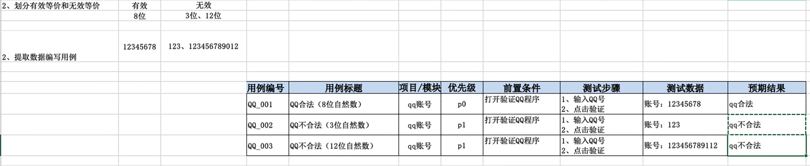
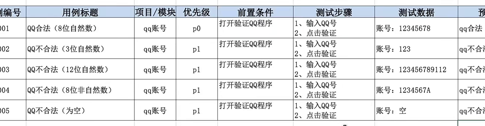
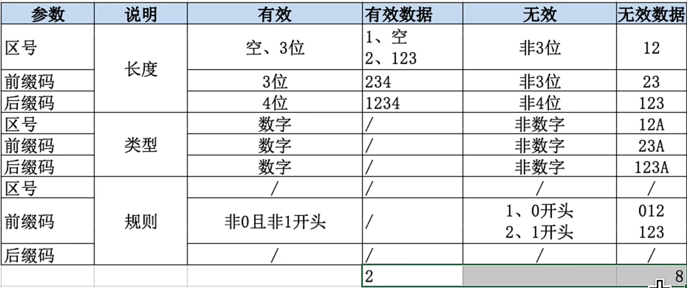
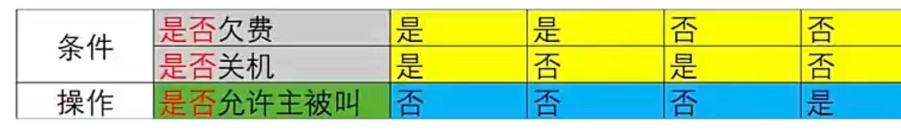
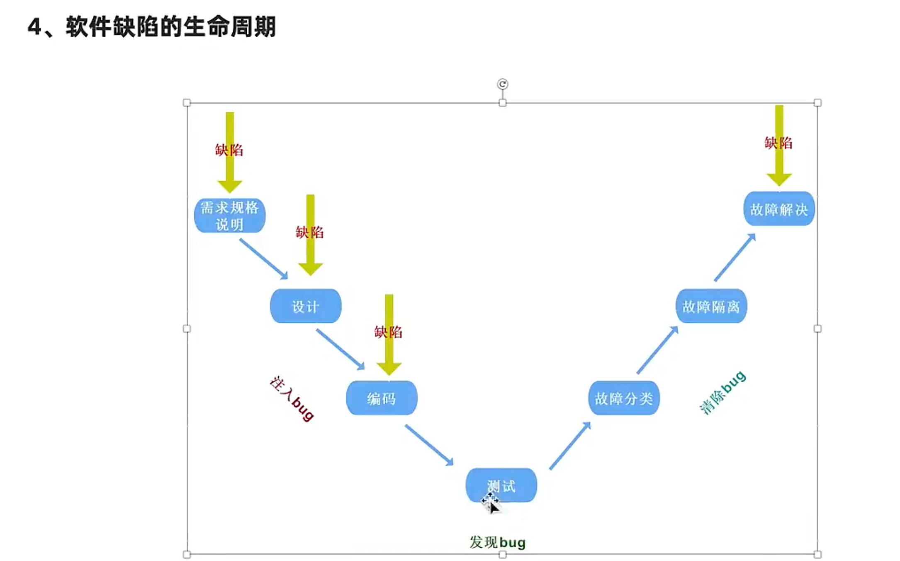
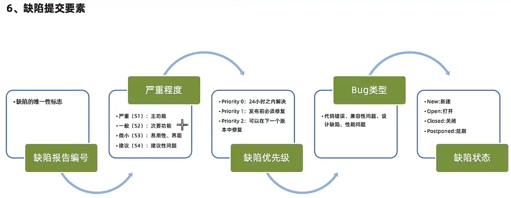

# Basic

使用技术手段验证软件是否满足使用需求

## 测试分类

### 按测试阶段分

#### 单元测试

针对源代码测试（一般开发自测）

#### 集成测试（接口测试）

针对模块之间访问地址进行测试

#### 系统测试

对整个系统进行测试包括功能、兼容、文档等测试

#### 验收测试

主要分为内测、公测，使用不同人群来发掘缺陷

### 按代码可见度划分

#### 黑盒测试（功能）

1. 源代码不可见
2. UI功能可见

#### 灰盒测试（集成）

1. 部分源代码可见
2. 功能不可见
3. 针对程序部分代码进行接口测试

#### 白盒测试（单元）

1. 全部代码可见，源代码测试
2. UI功能不可见

-----

## 质量模型(重点前5项)

衡量一个优秀软件的维度

### 功能性

- 功能数量
- 功能正确实现
- 错误处理情况

### 性能

- 服务器每秒处理请求数
- 服务器硬件配置是否满足

### 兼容性

- 浏览器（内核）
- 操作系统
- 手机品牌、分辨率、网络、其他

### 易用性

- 简洁
- 友好
- 流畅
- 美观

### 安全

- 传输加密
- 存储加密

### 可靠性

- 无响应
- 卡顿（响应时间）
- 死机（系统崩溃）

### 可维护性

### 可移植行

- 数据迁移

---

## 软件测试流程

## 字节：需评、测例、提测、缺陷、上线、验证

### 需求评审

- 理解需求

### 计划编写

- 测什么、谁来测、怎么测

### 用例设计

- 验证项目是否符合需求的操作文档

### 用例执行

- 项目模块开发完成开始执行用例文档实施测试

### 缺陷管理

### 测试报告

---

## 测试用例

- 用例：用户使用的案例
- 测试用例：为测试项目而设计的执行文档
- 作用：
  - 防止漏侧
  - 实施测试的标准
- 八大要素格式：
  - 编号（项目-模块-编号）、
  - 标题（预期结果 + 测试点）  有没有覆盖需求点
  - 模块/项目（所属项目）
  - 优先级（P0-P4）表示用例的重要程度或者影响力   **核心功能**  频率最高
  - 前置条件、测试步骤、测试数据、
  - 预期结果----》**用例执行结果+不同角色隐性结果**

----

## 测试方法

### 等价类划分法（解决穷举场景）

- 在所有测试数据中，具有**某种共同特征**的数据集合进行划分

 分类

- 有效等价类：满足需求的数据集合     ----》满足的只取其一，只能有一个
- 无效等价类：不满足需求的数据集合 ----》单个无效等价，满足的只取其一 

**步骤**

1. 明确需求
2. 确定有效和无效等价类
3. 提取数据编写测试用例

验证长度

验证类型

---

明确需求：

 	1. 区号：空或者是三位数字
 	2. 前缀码：非0且非1开头的三位数字
 	3. 后缀码：四位数字

确定有效等价和无效等价：（长度、类型、规则）

- 有效----》正向一条用例尽可能覆盖多条
  - 空+571+1234
  - 123+234+1234

- 无效----〉逆向每一条都是一个单独用例

  长度

  - 23+231+1234
  - 123+23+1234
  - 123+231+123

  类型

  - a12+234+1234
  - 123+a23+1234
  - 123+231+a123

  规则

  - 123+012+123
  - 123+123+1234

#### 使用场景---》完整的用例一般是等价类和边界值一起写

- 针对：需要大量数据测试输入，但是没法穷举测试的场景
  - 输入框
  - 下拉列表
  - 单选复选框
- 典型代表：**页面输入框类测试**

### 边界值分析法(限定边界规则设计)

#### 边界范围节点----》最多7条用例   解决位数问题不能解决类型问题

- 选取  正好等于、刚好大于、刚好小于边界的值    作为测试数据
  - 上点：边界上的点（正好等于）
  - 离点：距离上点最近的点（刚好大于、刚好小于）
  - 内点：范围内点点（区间范围内的数据）

#### 设计步骤

1. 明确需求
2. 确定有效和无效等价类
3. 确定边界范围值
4. 提取数据编写测试用例

需求：0-30个字符（无优化）

有效等价：

- 1个字符
- 15个字符
- 29个字符
- 30个字符

无效等价：

- 空字符
- 31个字符
- 15个数字

需求：6-10位自然数（无优化）

有效等价：

- 6位自然数
- 7位自然数
- 8位自然数
- 9位自然数
- 10位自然数

无效等价：

- 5位自然数
- 11位自然数
- 8为非字符

#### 优化

7---》5

- 上点必选（不考虑开闭区间）
- 内点必选
- 离点  --〉开内闭外（考虑开闭区间，开区间选内部离点，闭区间选外部离点）

#### 使用场景

- 在等价类的基础上针对有边界范围的测试数据输入的地方（重点关注边界）
- 常见的词语描述：大小、尺寸、重量、最大、最小、至多、至少等修饰词语
- 典型代表：**有边界范围的输入框**类测试---》6-10位数字

### 判定表法（多条件依赖关系）

等价类边界值分析`主要关注单个输入类条件的测试`

**判定表需要考虑**`输入条件之间的各种组合、输入条件与输出结果之间有相互制约关系的测试`

定义

判定表是：一种以表格形式表达多种多条件逻辑判断的工具

组成

- 条件桩：列出问题中的所有条件，列出条件的次序无所谓
- 动作桩：列出问题中可能采取的操作，操作的顺序没有约束
- 条件项：列出条件对应的取值，所有可能情况下的真假值
- 动作项：列出条件项的、各种取值情况下应该采取的动作结果

规则

- 判定表中贯穿条件项和动作项的一列就是一条规则
- 假设有n个条件，每个条件下的取值有(0,1)，全组合有2的n次方种规则 

---

#### 步骤

1. 明确需求
2. 画出判定表
   1. 列出条件桩和动作桩
   2. 填写条件项，对条件项进行全组合
   3. 根据条件项对组合确定动作项
   4. 简化、合并相似规则（有相同的动作）
3. 根据规则编写测试用例

#### 总结

1. 多条件之间有依赖关系，使用判定表来进行测试覆盖
2. 判定表一般适合4个条件以内的依赖关系
3. 超出4个就不适合覆盖所有条件，应采用（正交法），但是这种一般设计的不合理

### 场景法（对于项目业务设计）

先测核心业务，跑通了，再测单个功能、单模块、单页面

`保证核心业务能跑通`

1. 流程图跑业务
2. 冒烟测试（即必选正确跑通业务功能一般由开发自测再交给测试）

### 错误推测法

#### 定义

通过经验推测系统可能出现的问题

#### 思想

根据经验列举出可能出现的问题的清单，根据清单分析问题可能原因，推测发现缺陷

#### 场景

当项目用例都执行完毕，且BUG修复完成，离上线还有一段时间，在这段时间中可以使用错误推荐法复测主要业务或测试未覆盖的功能

1. 时间紧任务量大时，根据之前项目类似经验找出易出错的模块重点测试
2. 实践宽裕通过该方法列出之前出现问题较多的模块，再次测试

-----

## 缺陷

软件使用过程中存在的任何问题都叫缺陷，简称Bug

### 判定标准

- 软件未实现需求（规格）说明书中明确要求的功能---》少功能
- 软件出现了需求（规格）说明书中不应该出现的错误---〉功能错误
- 软件实现的功能超出需求（规格）说明书指明的范围---》多功能
- 软件未实现需求（规格）说明书中虽未明确指明但应该实现的要求---〉隐性功能错误
- 软件难以理解，不易使用，运行缓慢，用户体验不好---》不易使用

### 产生的原因

1. 需求文档
2. 架构设计
3. 编码设计
4. 环境（硬件、软件）

---

### 软件缺陷的核心内容

1. 缺陷的标题：描述缺陷核心问题
2. 缺陷的前置条件：缺陷产生的前提
3. 缺陷的复现步骤：复现缺陷的过程
4. 缺陷的预期结果：希望得到的结果
5. 缺陷的实际结果：实际得到的结果
6. 缺陷的必要附件：图片、日志等信息

#### 提交缺陷注意事项

1. 缺陷是否可以复现
2. 缺陷是否唯一，一个缺陷上报一个问题
3. 符合公司或者项目要求