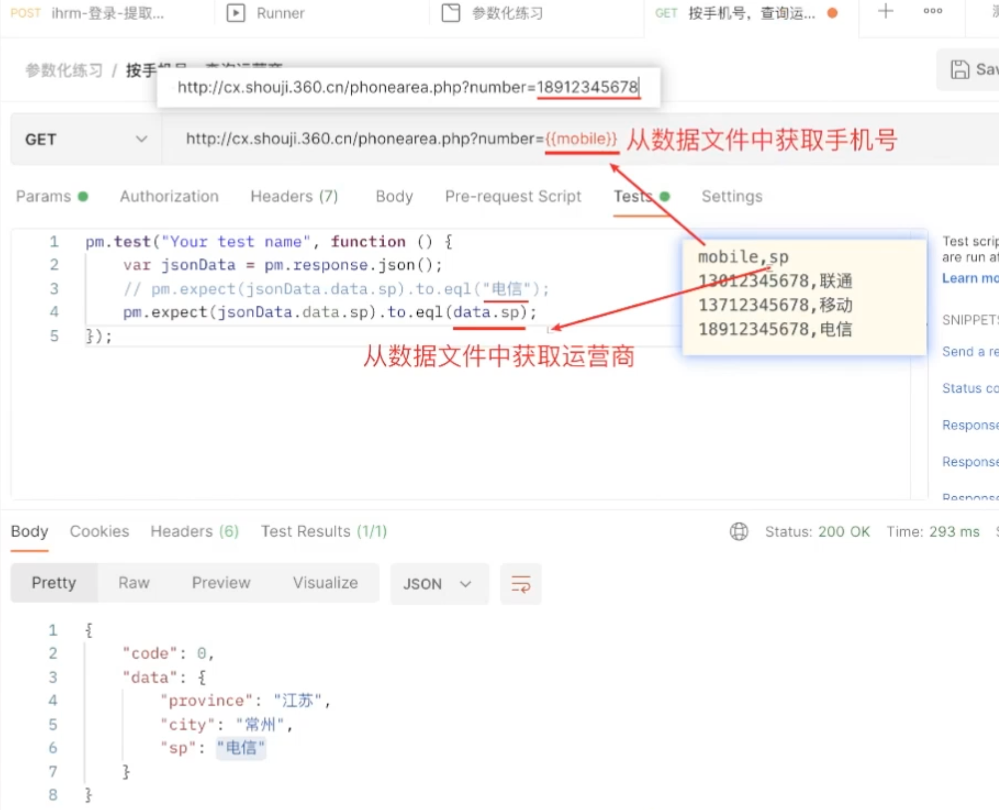
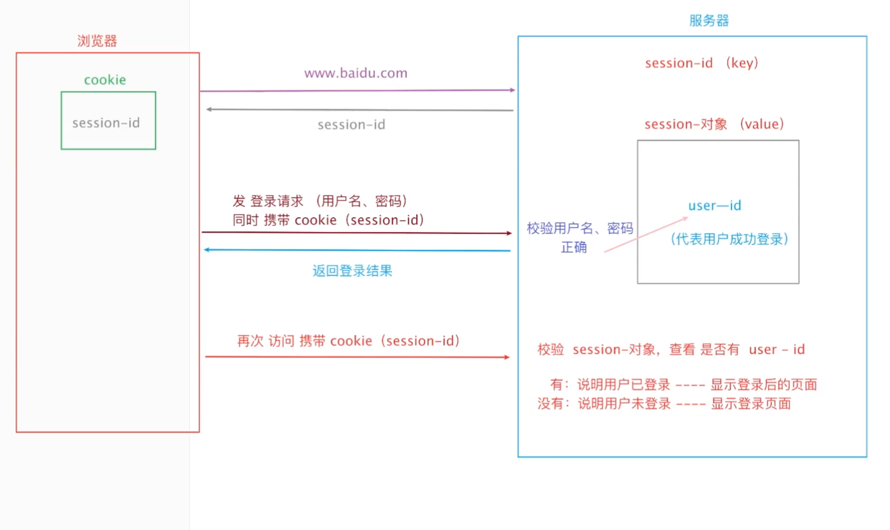
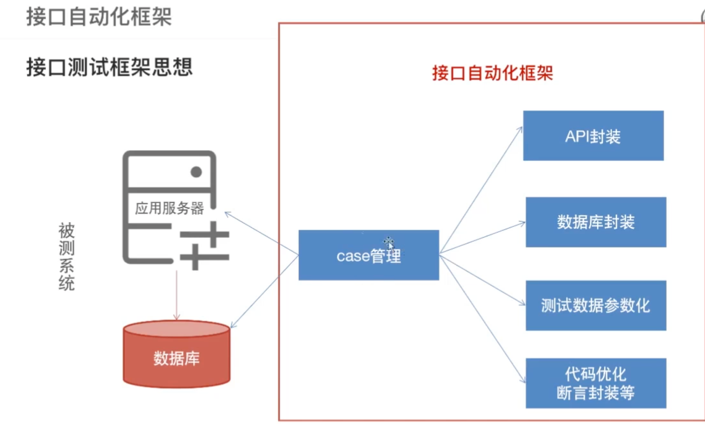
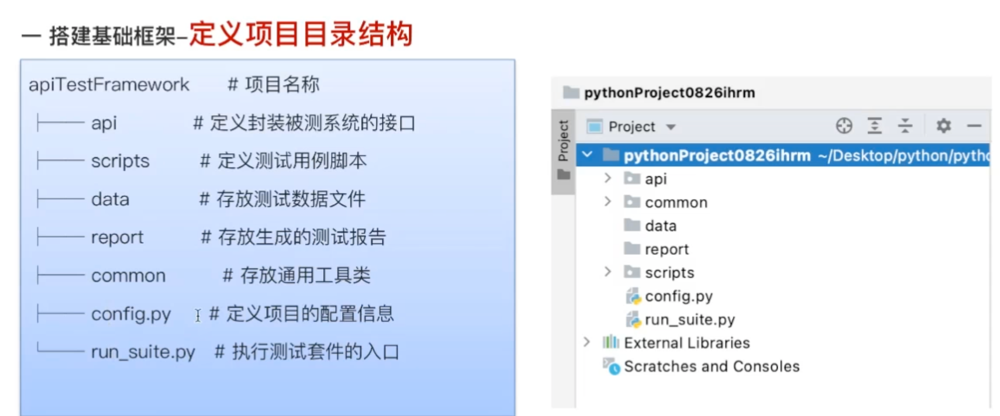
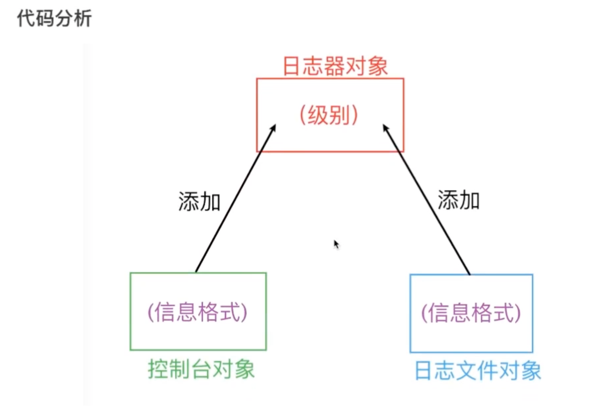
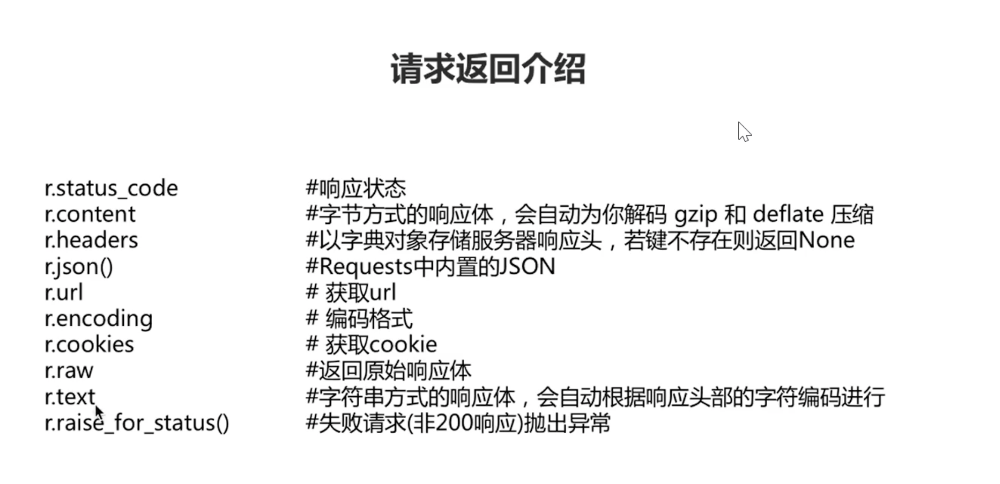

# python

## 1. 常识

### 1.1 波浪线

红色波浪线：代码错误

灰色/黄色波浪线：不影响代码的执行，是PEB8的代码规范性问题，就是代码不规范的问题--->使用代码格式化解决

绿色波浪线：不影响代码的执行，提醒你写的不是一个单 词

---

### 1.2 变量

`变量名 = 数据值`

1. 直接使用变量名就行，可使用变量中存储的数据
2. 先定义后使用


**变量名规范**

`变量名要遵循标识符的命名规范`

1. 见名知意
2. 命名习惯
   1. 大驼峰
   2. 小驼峰
   3. `下划线隔开`-->pyhton

**标识符**

编程时给变量、函数、类等命名

`规则：`

- 由数字、下环线、字母组成
- 不能用数字开头
- 不能使用内置关键字
- 严格区分大下写
- 不建议使用中文

---

### 1.3 数据类型

查看数据类型：`type(数据/变量名)`--->print(type(18))

常见数据类型分类

- 数字型
  - 整型
  - 浮点型--->float
  - 布尔型
- 非数字型
  - 字符串--->使用引号引起来的就是字符串
  - 列表--->list [1,2,3]
  - 元组--->tuple (1,2,3)
  - 集合--->set {1,2,3}
  - 字典--->dict {"name": "小明", "age": 18} 


#### 1.3.1 类型转换

`变量 = 要转换的类型(原数据)`

类型转换不会改变原数据的类型，只是 **重新生成一个新的数据**

---

### 1.4 输入与输出

**输入---> input**

```python
name = input("提示信息")
# 遇到回车表示输入结束
# 不管输入什么内容都是 str 类型
```

 

**格式化输出**

`按一定的格式，在字符串中使用变量，将变量的值进行输出`

方式一：`字符串.format()`

```python
# 1.可以在任意的python版本中使用
# 2.字符串需要使用变量的地方，使用 {} 进行占位
# 3.在 format的括号中，按照占位符的顺序，将变量写上去
name = "tom"
age = 18
sex = '男'
print("我叫{},今年{}岁,我的性别是{}".format(name, age, sex))
```

方式二：F-string

```python
# 1.>=3.6的版本
# 2.字符串前边加上F''或者f''
# 字符串中需要使用变量的地方，使用{}占位
# 将变量直接写在 占位的大括号中
name = "tom"
age = 18
sex = '男'
print(f'我叫{name},今年{age}岁,我的性别是{sex}')
```

---

### 1.5 转义字符

```yacas
\n --->换行
\t --->制表符

print( end='\n') --->print函数默认有一个 end='\n'，所以每个print结束之后都会换行
print('hello world', end='')
```

---

### 1.6 运算符

1. +
2. -
3. *
4. /
5. %
6. // ---> 求商，结果为整数，6//4 = 1
7. ** ---> 幂、次方 2 ** 3 = 8

`** > * / % // > + -`


**比较运算符**

1. ==
2. !=
3. \>=
4. \<=
5. <
6. \>


**赋值运算符**

1. =
2. +=
3. -=
4. *=
5. /=
6. %=


**逻辑运算符**

```yacas
and or not
- and 逻辑与 并且 只有都为True，结果才为True，有任一假就是假
- or 逻辑或 或者 有一个为False，结果就是False，第一个为False不进行第二个判断
- not 逻辑非 取反 True变False
```

----

 

## 2. 逻辑判断

`pass 空语句 可以占位`

pycharm一般需要两个断点才能进行debug


## 3. 循环

### 3.1 while 循环

```python
while 判断条件:
  pass
	count+=1
  # 计数器
```

### 3.2 for 循环

```yacas
for 循环也称 for 遍历
遍历：是从容器中将数据逐个取出
容器：字符串/列表/元祖/字典
```

#### 3.2.1 for循环遍历字符串

```python
for 变量 in 容器:
  pass
	
# 1. 字符串中存在多少字符，就执行多少次
# 2. 每次循环 都会从字符串中取出一个字符保存到前边的变量中
# 3. for 和 in 都是关键字

str1 = 'abc'
for i in str1:
  print(i)
```

#### 3.2.2 for指定次数循环

```python
for 变量 in range(n):
  pass

# 1. range(n)可以生成 [0-n)整数的序列，不包含n
```

----

## 4. 容器

### 4.1 字符串

定义：单引号、双引号、三引号包裹起来的

- 字符串包括单引号用双引号，
- 字符串包含双引号用单引号或者三引号
- 也可以转义字符
- `当字符串前面加'r',字符串中的 \ 就不会进行转义了`

#### 4.1.1 下标

`python支持负数下标 -1 代表最后一个位置的数据 -2代表倒数第二`


#### 4.1.2 切片----》获取多个字符

获取多个数据，但是 要存在一定的规律

```yacas
语法
容器[start:end:step]
end代表的下表位置不能取道 左闭右开，如果取到 最后一个下标 可以不写
step 两个坐标的差值  步长是1可以不写
start 下标为0 可以不写，但是冒号不能少

步长为 -1 反转字符串（逆序输出）
```


#### 4.1.3 查找find()

`str.find(key_str) 查找是否存在该key`

- 返回值
  - 如果存在，第一次出现的下标
  - 不存在返回 -1

#### 4.1.4 替换 replace()

`str.replace(old_str, new_str, count)`.replace()

- count一般不写，表示全部替换，可以指定替换的次数

- 返回值
  - 返回一个新的字符串
  - 原字符串不会 改变


#### 4.1.5 拆分 split()

`str.split(sep, maxspilt）`

- 将字符串按指定的字符串sep进行分割
  - 默认不写，就是按 `空白字符  \t \n `进行分隔
- 返回值是一个列表
  - 列表中的每一个数据就是分隔后的字符串
- maxspilt 
  - int 类型 最大分隔几次

#### 4.1.6 字符串的连接 join

`str.join(容器)`

- 容器一般是列表
- 将字符串插入到列表相邻的两个数据之间，组成新的字符串
- 列表中的数据 必须都是字符串

```python
list1 = ['hello', 'world', 'and', 'python']
# 用空格进行字符串的拼接
str1 = ' '.join(list1)
# 使用逗号连接
str2 = ','.join(list1)
```

----

### 4.2 列表

1. 列表 list 使用 []
2. 列表可以存放多个数据
3. 可以存放任意数据类型
4. 列表之间使用 逗号 隔开

```python
# 方式1 使用 类实例化的方式
# 1.1 定义空列表  变量 = list()
list1 = list()
print(type(list1), list1) # <class 'list'> []

# 1.2 定义非空列表 ----->类型转换  list(可迭代类型) -->可以使用for循环 比如容器
# 将容器中的 每一个数据  都作为列表中的一个数据进行保存
list2 = list('abcd')
print(list2) # ['a', 'b','c', 'd']

# 方式2  直接用[] 定义  -->常用
# 2.1 定义空列表
list3 = []
print(list3)

# 2.2 定义非空列表
list4 = [1, 3.14, 'hello ', False]
print(list4)
```

#### 4.2.1 列表中下标和切片

list[0]

list[-1]

```python
list[start:end:step]
```


#### 4.2.2 列表查询  index() count()

- index()和字符串中的find()一样
- 列表中没有find()方法 只有index()方法
- 字符串中同时存在

index()

1. 找到了  返回下标
2. 没有找到 直接报错


count()方法

`list.count(element)`

- 统计 指定元素出现在列表中的 次数
- 没有就是 0


#### 4.2.3 增加和删除方法  append() pop()

list.append(element) -->添加列表尾部

- 返回 None 不用接收
- 不会生成新的列表


list.pop(index)  -->根据下标删除  不写默认删除最后一个

- 返回 删除的数据


#### 4.2.4 修改和反转  reverse()

**修改数据**-->list[index] = 新数据

指定下标不存在会报错

index out of range


**列表中的反转**

- 方法1
  - list[::-1] 得到一个新的列表，原列表不会动
  - list.reverse() 直接修改原列表 


#### 4.2.5 列表的排序 sort()

`列表中的数据类型要一样`

list.sort()-->升序 改变原列表

list.sort(reverse=True) -->降序


#### 4.2.6 列表的嵌套

list = [[1],[2],[3]]

list\[0][1]


### 4.3 元祖 tuple

`在定义元祖的时候，小括号可以省略不写`

`组包(pack) 将多个数据值组成元祖的过程 a=1,2 # a= (1,2)`

`拆包(解包 unpack) 将容器中多个数据 分别给到多个变量，需要保证容器中元素的个数和 变量的个数保持一致`

 `元祖的元素不能被修改`

- 可以存储多个任意类型的数据，一旦创建不能修改
- 只有查询方法-->index() count(),支持下标和切片
- `一般用于传参和返回值`

```python
# 1. 类实例化方式
# 1.1 定义空元祖(不用)
tuple1 = tuple()

# 1.2 类型转换 将列表(其他可迭代类型)转换为元祖
tuple2 = tuple([1,2,3])
print(tuple2)

# 2. 直接使用()定义
# 2.1 定义空元祖
tuple3 = ()
# 2.2 非空元祖
tuple4 = (1,2,'hello',3.14,True)
print(tuple4)
print(tuple[4])

# 2.3 定义只有一个数据的元祖，必须加逗号
tuple5 = (10,)
```

#### 4.3.1 元祖的应用

```python
# 交换两个变量的值
a = 10
b = 20
c = b, a # 组包
print(c) # -->(20, 10)

a, b = c # -->拆包
print(a, b) # --> a(20) b(10)
a, b = b, a
print(a, b)
x, y, z = 'abc'
print(y) #-->b
```

----

### 4.4 字典 dict

`使用{}`

`字典由键(key)值(value)对来表示 key:value`

`key 不能重复`

`value主要是字符串类型，也可以是数字`

**没有下标**

```python
# 1. 类实例化的方式
my_dict = dict()

# 2. 直接使用{}
# 2.1 空
my_dict = {}

# 2.2 非空
my_dict3 = {
  'name':"xiaoming",
  'age':19,
  'isMen':True
}
```

#### 4.4.1 增加和修改

```yacas
dict['key'] = value
# 1. key 存在，修改
# 2. key 不存在，添加
```

#### 4.4.2 删除

根据 key 删除 value

`dict.pop(key)`

#### 4.4.3 查询

根据key获取value

- 方法1：
  - dict[key] -->key 不存在 会报错
- 方法2:
  - dict.get(key)--> 不存在，返回None

#### 4.4.4 遍历

分为三种情况

##### 4.4.4.1 遍历key

```python
# 方式1
for item in dict:
  print(item)
  
# 方式2
for item in dict.keys():# dict.keys()-->可以获取字典中素有key
  print(item)
```

##### 4.4.4.2 遍历value

```python
for item in dict.values():# dict.values()-->可以获取字典中所有的value
  print(item)
```

##### 4.4.4.3 遍历key 和 value

```python
# item1 -->key   item2 --> value
for item1, item2 in dict.items():# dict.items()-->获取字典中所有的键值对
  print(item1, item2)
```

----

### 4.5 集合

**in 操作符**-->not in

数据 in 容器 用来判断，包含返回True，不包含False

字典中判断key

  

`集合 set {1,2,3,4}-->不是key value，单个数据-->没有重复的数据`

应用：-->对列表 进行去重-->就是类型转换  列表转换成集合，再转换成列表

```python
my_list = [1,2,3,4,1,3,5,6,65,5,5]
my_set = list(set(my_list))
print(my_set)
# 无序的
new_list = []
for i in my_list:
  if i not in new_list:
    new_list.append(i)
print(f"--->{new_list}")
```

--------

## 5. 函数

定义和调用

### 5.1 返回值

执行的结果

没有写return 返回值是 **None**


### 5.2 lambda 函数-->匿名函数

`lambda 参数 ： 表达式`

```python
# 将lambda函数赋值给变量
add= lambda x, y: x + y
result = add(3, 5)
print(result)  # 输出：8
# 作为高阶函数的参数
# 使用lambda函数作为map函数的参数。map函数将lambda函数应用于numbers列表中的每个元素，并返回一个新的列表 squared_numbers，其中包含每个元素的平方。
numbers = [1, 2, 3, 4, 5]
squared_numbers = list(map(lambda x: x ** 2, numbers))
print(squared_numbers)  # 输出：[1, 4, 9, 16, 25]

# 结合条件表达式
is_even = lambda x: True if x % 2 == 0 else False
print(is_even(4))  # 输出：True
print(is_even(7))  # 输出：False
```


### 5.3 参数

- 缺省参数(可写可不写)
- 不定长参数(多值, 可变) *args
  - def 函数名(参数1, *args, xx=oo)

----

## 6. 模块和包

### 6.1 模块

```yacas
每一个py文件都是一个模块
在模块中，别人书写好的 功能，可以直接拿来用
自己写的代码文件想要作为模块让别人使用。模块名字需要满足标识符的规则
想要使用-->导入模块
```

#### 6.1.1 导入

**方式一**-->多用于系统的模块

```python
import 模块名 

# 使用其中的功能
模块名.功能名 -->变量，函数，和类
import random
num = random. randint (1, 10)
print (num)
```


**方式二**-->多用于自己的模块或者第三方库

```python
from 模块名 import 功能名 -->指定的功能名
#  使用
功能名

from random import randint
num = randint (1, 10)
print (num)
```

快捷键：-->alt + 回车

#### 6.1.2 \_\_name_ _变量

- 导入模块的时候，会执行原模块中的代码
- 如果在导入模块的时候，模块中的部分代码不想被执行，可以使用\__name__来解决
- name变量是python解释器内置的变量，变量的值是自动维护的，每个代码文件中都有这个变量
  - 在原模块中，直接run，\__name__的值-->'\_\_main\_\_\'
  - 在导入文件中，直接run，\__name__的值-->'\_\_模块名\_\_\'

```python
if __name__ == '__main__':
  # 在if缩紧中的代码在缩紧中不能被导入-->输入main 直接生成  
```

#### 6.1.3 导入的顺序

1. 在导入模块时候的，会先从代码所在的目录进行导入
2. 如果没有找到，会去从系统的目录查找导入
3. 还没有就报错

**建议  不要定义和系统的模块文件名一样的**

### 6.2 包(package)

```yacas
包：将多个模块放在一个目录中集中管理，并在这个目录中创建一个 __init__.py文件
```

#### 6.2.1 包的导入

```python
# 方式一
import 包名.模块名
# 使用
包名.模块名.工具名

# 方式二
from 包名 import 模块名
# 使用
模块名.工具名

# 方式三-->快捷键
from 包名.模块名 import 工具名
# 使用
工具名
```

----

## 7. 面向对象

Object Oriented Programming -->OOP

```yacas
面向对象(class关键字)
-> 概念(类/对象)
-> 封装(定义类，调用里边的方法(函数))
```

- 类：是具有相同特征或者行为的事物的一个统称，是抽象的，不能直接使用
  - 指代多个事物
  - 代码中 类是由关键字`class`定义的
- 对象：是由类创建出来的一个具体存在的事物，可以直接使用
  - 指代一个具体事物
  - 代码中使用类去创建（实例化）

### 7.1 类的构成

```yacas
1. 类名：见名知意，大驼峰
2. 属性 (事物的特征)
3. 方法 (事物的行为)
```


1. 设计类（类的三要素）
2. 定义类（三要素变成代码）
3. 创建对象（实例化对象）
4. 由对象调用类中的方法

### 7.2 类的设计

-->找三要素 类名 属性 方法

需求：

- 进入某 web 项目登录页面，输入用户名、密码、验证码之后，点击登录按钮可以登录系统

```yacas
-类名：LoginPage
属性：用户名(username），密码(password)，验证码(verify_code)，登录按钮 (1ogin_btn)
方法：登录方法(1ogin)
```


### 7.3 面向对象的基本语法

#### 7.3.1 定义类

```python
class 类名:
  # 在class 的缩进中定义类的属性和方法
  def function(self,):
    # 方法的本质是函数
    pass
```

#### 7.3.2 创建对象（实例化）

`由类创建对象`

`类名()-->就是创建对象`

```yacas
一般使用变量将创建的对象保存起来
变量 = 类名() # 一般将这个变量 称为对象，本质是，变量中保存的是对象的引用地址
```

#### 7.3.3 调用类之中的方法

- 语法
- `对象.方法名`

```python
class Cat:
    def eat(self):
        print("小猫吃鱼")

    def drink(self):
        print("小猫喝水")


cat1 = Cat()
cat1.drink()
cat1.eat()

```


### 7.4 self 参数

```yacas
形参 习惯叫self
特殊点：
	self是一个普通的参数，在调用的时候必须传递实际参数
	python解释器自动将调用这个方法的 对象 传递给了self

self 就是调用这个方法的对象
```

### 7.5 属性

```yacas
属性表示事物的特征
可以给对象添加属性，或者获取对象的属性值

给对象添加属性：
对象.属性名 = 属性值 -->添加或者修改（存在修改，不存在添加）

获取：
对象.属性名

在方法中操作属性(self 是对象)：
self.属性名 = 属性值
```


### 7.6 魔法方法

```yacas
魔法方法：以两个下划线开头，两个下划线结尾，再满足某个条件的情况下，会自动调用
```

#### 7.6.1 初始化 init

**调用时机**

- 在创建对象之后会自动调用

**应用场景**

- 初始化对象，给对象添加属性

**注意事项**

- 不要写错
- 如果属性会变化，，可以作为参数传递

```python
class Cat:
  def __init__(self, name):
    print("被调用了")
    self.name = name
    
Cat() # -->会被调用
tom = Cat()
blue = Cat # -->不会 不是创建对象  即 blue 也是类
t = tom # --> 不是创建对象  只是引用的传递
t1 = tom() # --> tom已经是类  加括号  就是创建对象
```


#### 7.6.2 --str--方法

**调用时机**

- 使用print(对象)，打印对象的时候，会自动调用
- 如果没定义str方法，默认打印的是 对象的引用地址
- 如果定义了，打印的是 方法的返回值

**应用场景**

- 使用print(对象)  打印输出对象的属性信息

**注意事项**

- 必须返回一个  字符串
- 如果不返回一个字符串就会报错

```python
class Cat:
    def __init__(self, name, age):
        self.name = name #添加name 厲性
        self.age = age #添加 age属性

    def __str__(self): #一般不使用 print,直接返回
        return f"姓名：{self.name}，年齡：{self.age}"

blue = Cat('汤姆', 22)
print(blue)
```

####  7.6.3 dir()

`dir(对象变量)-->查看对象内的所有属性及方法`

不具备输出功能，需要print()


---

```python
class House:
    def __init__(self, h_type, total_area):
        self.h_type = h_type
        self.total_area = total_area
        self.free_area = total_area
        self.item_list = []

    def __str__(self):
        output = f"户型为{self.h_type}, 总面积为{self.total_area}, 剩余面积为{self.free_area}, 家具目前有{self.item_list}"

        return output

    def add_item(self, item): # 家具对象（传参） 房子对象（self）
        if self.free_area > item.area:
            self.item_list.append(item.name)
            self.free_area -= item.area
            print(f"添加家具-->{item.name}成功！！！")

        else:
            print("家里剩余面积不足,添加失败")


class HouseItem:
    def __init__(self, name, area):
        self.name = name
        self.area = area

    # def __str__(self):
    #     print(f"")


house1 = House('old', 7)

bed = HouseItem('席梦思', 4)
chest = HouseItem('衣柜', 2)
table = HouseItem('餐桌', 1.5)

print(house1)
house1.add_item(bed)
print(house1)
house1.add_item(chest)
print(house1)

```

---

## 8. 面向对象高级

```yacas
--> 继承(重点)
--> 多台(了解)
--> 权限划分(公有 和 私有)

--> 对象(实例对象 和 类对象)
--> 属性(实例属性 和 类属性)
--> 方法(实例方法 类方法 静态方法)
```

### 8.1 继承

`多个类存在相同的代码的逻辑 -->封装到父类中 再通过继承 直接实例化子类对象 并调用父类中的方法`

**`子类可以拥有父类中所有方法和属性`**

**使用继承需要考虑类与类之间是否存在  is……a 的关系**


语法：

```python
class son(father):
  pass
class A: # --> 默认继承object类
  pass
class B(A): # -->类B继承类A
  pass
# 类A：父类 或 基类
# 类B：子类 或 派生类
```

### 8.2 重写 -->override

```yacas
重写是在子类中 定义了和父类中名字一样的方法
为什么要重写？
父类中的代码不能满足子类对象的需要
重写的方式
	覆盖式重写
	扩展是重写
```

#### 8.2.1 覆盖式重写

`直接在子类中定义和父类方法名字一样的接口，直接重新写代码`

```python
class Animal:
  def bark(self):
    print(2)
    
class Dog(Animal):
  def bark(self):
    print(3)
```

#### 8.2.2 扩展式重写

`父类中的功能还需要，只是添加了新的功能`

- 先在子类中定义和父类中名字相同的方法
- 在子类中，使用super().方法名 调用父类中的功能
- 书写新的功能

```python
class Animal:
  def bark(self):
    print(2)
    
class Dog(Animal):
  def bark(self):
    super().bark
    print(3)
```


### 8.3 多态

调用代码的技巧

`不同的子类对象调用相同的方法，产生不同的执行结果`

以 继承 和重写父类方法为前提

```python
class Dog:
    def __init__(self, name):
        self.name = name
    def play_game(self):
        print(f"{self.name}在玩耍")


class Xtq(Dog):
    def play_game(self):
        print(f"{self.name}在天tian")

class Person:
    def play_with(self, dog):
        print(f"人和{dog.name}在玩耍")
        dog.play_game()

dog1 = Dog('普通狗')
dog22 = Dog('666')
xtq = Xtq('啸天犬')

xw = Person()
xw.play_with(dog22)
xw.play_with(dog1)
xw.play_with(xtq)
```

### 8.4 私有和公有

`在python中,定义类的时候，可以给 属性和方法 设置访问权限`

#### 8.4.1 公有权限

- 定义
  - 直接定义的属性和方法就是公有的
- 特点
  - 可以在任何地方访问和使用，只要有对象就可以访问和使用

#### 8.4.2 私有权限

- 定义
  - 只能在类内部定义
  - 只需要在属性名 或者方法名 前边加上两个 下划线
- 特点
  - 只能在当前类的内部使用
  - 不能在类外部和子类直接使用
- 应用场景
  - 一般来说，定义的属性和方法 都是公有的
  - 某个属性 不想在外部直接使用 定义为私有
  - 某个方法 是内部的方法(不想在外部使用), 定义为私有

```python
class Person:
    def __init__(self, name, age):
        self.name = name # 公有
        self.__age = age # 私有

    def __str__(self):
        return f"{self.name} --> {self.__age}"# 定义公有方法 修改私有属性

    def ste_age(self, age):
        self.__age = age

wang = Person('王祥', 18)
print(wang)
wang.age = 99
print(wang)
wang.ste_age(22)
print(wang)
```


### 8.5 对象 属性 方法

python中一切皆对象

#### 8.5.1 对象分类

**类对象**

```yacas
类就是 一个 类对象 class 定义的一个类
在代码执行的时候，解释器会自动的创建
作用：
使用类对象创建  实例对象 a = A()
存储一些类的特征值(类属性) init里面
```

**实例对象**

```yacas
创建对象也称为实例化，所以 由类对象(类) 创建的对象 称之为 实例对象 简称实例
一般来说没有特殊强调，我们所说的对象  都是指 实例对象(实例)
实例对象  可以保存实力的特征值(实例属性)

就是使用类名 来创建的对象
```

#### 8.5.2 属性分类

```yara
使用 实例对象.属性  访问属性的时候  会现在 实例属性中查找 如果找不到，去类属性中查找，找到就使用，找不到就报错
即：每个实例对象 都有可能访问类属性值(前提，实例属性和类属性不能重名)
正常情况下不用 self.类属性 -->一般为了区分就  `类名.属性名`
```


**实例属性**

- 概念

  - 是每一个 实例对象 具有的特征(属性)  每个实例对象的特征

- 定义

  - 一般都是在  init  方法中，使用 self.属性名 = 属性值 来定义

- 特征

  - 每一个实例对象 都会保存 自己实例属性  多份

- 访问和修改

  - ```yacas
    # 可以认为是通过 self 
    实例对象.属性 = 属性值 # 修改
    实例对象.属性 # 访问
    ```


**类属性**

- 概念

  - 是类对象具有的特征  是整个类的特征

- 定义

  - 一般在 类的内部(class 缩进中)，方法的外部 定义的变量

- 特征

  - 只有类对象保存一份，即在内存中只有一个

- 访问和修改

  - ```yacas
    # 即通过类名
    类对象.属性 = 属性值
    类对象.属性
    ```


>什么时候定义 类属性？
>
>代码中 使用的属性 基本上都是实例属性  即通过self定义
>
>当 某个属性值的描述信息 是整个类的特(在这个值变动的时候 所有的这个类的对象这个特征都会发生变化)

#### 8.5.3 方法分类

**实例方法**

- 定义时机

  - 如果方法中  需要使用 实例属性，则这个方法 `必须` 定义为实例方法

- 定义

  - ```python
    # 直接定义的方法 就是实例方法
    class 类名:
      def 方法名(self):
        pass
    ```

- 参数

  - 参数一般写作 self  表示的是 实例对象

- 调用

  - 实例对象.方法名()


**类方法**

- 定义时机

  - 如果方法中 不需要使用 实例属性，但需要用到 类属性，则这方法 **建议** 定义为类方法

- 定义

  - ```python
    # 定义类方法，需要在方法名上方  书写 @classmethod，即使用@classmethod --> 装饰器 装饰
    class 类名:
      @classmethod
      def 方法名(cls):
        pass
    ```

- 参数

  - 参数一般写作 cls，表示的是类对象，即类名，同样不需要手动传递，Python解释器会自动传递

- 调用

  - 类名.方法名()
  - 实例对象.方法名()

**静态方法**

- 定义时机

  - 方法中 即不需要使用 实例属性 也不需要使用 类属性  就可以定义为 静态方法

- 定义

  - ```python
    # 定义静态方法，需要使用 装饰器 @staticmethod 装饰方法
    class 类名:
      @staticmethod
      def 方法名():
        pass
    ```

- 参数

  - 静态方法 对参数没有 要求 一般不传

- 调用

  - 实例对象.方法名()
  - 类名.方法名()

---

```python
"""
需求：
1．设计一个Game 类
2.属性：
•定义一个 top_score 类属性 -＞记录游戏的历史最高分
。定义一个 player_name 实例属性-＞记录当前游戏的玩家姓名
3.方法：
。静态方法 show help(-＞显示游戏帮助信息
。类方法 show_top_score(）-＞品示历史最高分
。实例方法 start_game（）-＞开始当前玩家的游戏
① 使用随机数 生成 10-10日 之问数字 作为本次游戏的得分
② 打印本次游戏等分：玩家 xxx 本次游戏得分 000
② 和历史最高分进行比较，如果比历史最高分高，修改历史最高分
4．主程序步骤：main
1查看帮助信息
2查看历史最高分
3创建游戏对象，开始游戏
4 再一次游戏
"""
import random


class Game:
    top_score = 0

    def __init__(self, player_name):
        self.player_name = player_name

    def __str__(self):
        return f"{self.player_name}"

    @staticmethod
    def show_help():
        print(f"--->查看游戏帮助")

    @classmethod
    def show_top_score(cls):
        return cls.top_score

    def start_game(self):
        once = random.randint(10, 100)
        print(f"w玩家{self.player_name} 本次得分 {once}")
        if once > Game.top_score:
            Game.top_score = once


faker = Game('faker')
faker.start_game()
print(Game.show_top_score())
faker.start_game()
print(Game.show_top_score())
```

---

## 9. 文件操作

文件：可以存储在长期存储设备中的一段数据

文件以二进制的形式进行存储

- 文件的分类(根据能否使用文本软件进行打开)
  - 文本文件
    - txt、py、md、json
  - 二进制文件
    - 不能使用记事本打开的
      - 音视频
      - 图片
      - exe

### 9.1 文件的操作

#### 9.1.1 **打开文件** --> open()

```yacas
open(file, mode='r',encoding=None)
- file:表示要操作的文件的名字，可以相对路径 和 绝对路径
			 绝对路径 C:/
			 相对路径 ./ ../
- mode:打开文件的方式
	- r -->只读 read  不存在会报错
	- w -->只写 write 存在会覆盖原文件
	- a -->追加 append 在文件末尾写入新的内容
不能传递 encoding 参数
	- rb -->只读 以二进制格式打开一个文件用于只读
	- wb -->只写 以二进制格式打开一个文件用于只写
	- ab -->追加
- encoding:编码格式，指 二进制数据 和 汉子 转换的规则
	- utf-8(常用):将一个汉子转换为 3个 字节的二进制
	- gbk:将一个汉字转换为 2个字节 的二进制
返回值: 文件对象, 后续对文件的操作, 都需要这个文件对象
```

**推荐写法！！！**

```python
with open(file, 'w', encoding=None) as f(变量):# 变量 就是文件对象
  pass
# 使用这种写法打开文件，会自动进行关闭，不用手动书写关闭的代码
# 出了with 的缩进之后，文件就会自动关闭
```

#### 9.1.2 **读写文件** -->

`文件对象.read()`

返回值：返回读取到文件内容，类型是字符串

`文件对象.write()`

- 参数：写入文件的内容，类型 字符串
- 返回值：写入文件中的字符数，字符串的长度，一般不关注


**按行读取**`readline()`

```yacas
文件对象.readline() # 一次读取一行，返回读取到的内容
read() 和 readline() 如果读到文件末尾，返回的都是  空字符串
```

```python
with open('a.txt', 'w') as f:
  buf = f.readline()
  print(buf)# 第一行内容
  buf1 = f.readline()
  print(buf1)# 读取到的是第二行内容
```


**读取大文件**

```python
with open('a.txt', 'r', encoding=None) as f:
  while True:
    buf = f.readline() # 文件读完 返回 空字符串
    if buf: # 读到空字符串 是False
      print(buf)
    else:
      break
      
-->-->-->
with open('a.txt', 'r', encoding=None) as f:
  for line in f:
    pass
```


#### 9.1.3 关闭文件(保存) close()

`文件对象.close() `如果是写文件，会自动保存，即内存中的数据同步到硬盘中


### 9.2 json文件操作

JavaScript Object Notation

是一种基于文本，独立与语言的轻量级数据交换格式

- json文件的本质也是 文本文件 可以直接使用read 和 write 进行操作，

- 有专门的方法 可以快速得到python中的字典列表

#### 9.2.1 json语法

- {}大括号保存对象
- []中括号保存数组
- 对象数组可以相互嵌套
- 数据采用键值对表示
- 多个数据由逗号分隔

`json键`：**必须是字符串类型，英文双引号**

`json值`：

- 数字（整数或浮点数）
- 字符串（使用双引号）
- 逻辑值（true 和 false）
- 数组 [] --->python 列表
- 对象 {} ---> python 字典
- 空值 null ---> python None


`json文件是一个对象，或者是数组，对象和数组可以相互嵌套`

#### 9.2.2 json文件的定义

```json
'r'
```

#### 9.2.3 读取json文件

**read读**

```python
with open('info.json', 'r') as f:
  buf = f.read()
  print(type(buf)) # <class 'str'>
  print(buf)
  # 不建议以上写法
```


**json专门读取方法**

1. 导包 import json
2. json.load(文件对象) --> 得到的是 `列表 或者 字典`

```python
with open('info.json', 'r') as file:
  buf = json.load(file)
  print(type(buf)) # <class 'dict'>
  print(buf)
  # 取姓名
  print(buf.get('name'))
  # 城市
  print(buf.get('address').get('city'))
  # 获取第二个爱好
  print(buf.get('hobbies')[1])
```


```python
# 方法一
import json

with open('info.json', 'r') as file:
    buf = json.load(file)

    for item in buf:
        if bool(item.get('isMen')):
            sex = '男'
        else:
            sex = '女'
        print(f"{item.get('name')}  {sex} {str(item.get('age'))} {item.get('address').get('city')}")
        
        
# 方法二
with open('data.json', 'r') as file:
    json_data = json.load(file)

# 提取姓名、年龄和性别
for person in json_data:
    name = person["name"]
    age = person["age"]
    is_men = person["isMen"]

    print("姓名:", name)
    print("年龄:", age)
    print("性别:", "男" if is_men else "女")
```

#### 9.2.4 json文件的写入

```yacas
# 将python 中列表或者字典 转为 json文件
```

>1. 导包
>
>2. 使用 json.dump(python中的数据, 文件对象)
>
>3. 
>
>4. ```python
>     info = {'name': 'admin', 'age': 77}
>   ```
>
>  with open('info.json', 'w') as f:
>      bu = json.dump(info, f, ensure_ascii=False, indent=4)
>
>   ```
>
>  ```

## 10.异常

程序在运行时，如果python解释器遇到一个错误，就会停止程序的执行，并且提示一些错误信息，这就是异常

程序停止执行并且提示错误信息这个动作，被称之为 抛出(raise)异常

在自动化测试中，可以借助捕获异常操作，完成类似：用例执行报错时截图、打印日志信息等操作

### 10.1 捕获异常

`异常类型：异常的描述`

```python
try:
  # 可能会发生异常的代码
  pass
except:
  # 当遇到异常时候进行的操作
  pass
```

`捕获特定的异常`

针对不同的异常，处理方案不一样

```python
try:
  # 可能会发生异常的代码
  pass
except 异常类型1:
  # 当遇到异常类型1时候进行的操作
  pass
except 异常类型2:
  pass
```


`捕获未知类型的异常`

```python
try:
  # 可能会发生异常的代码
  pass
except Exception as e: # Exception 常见的异常类的父类，变量 异常对象 可以print 打印异常的信息
  # 当遇到异常类型时候进行的操作
  print(e)
  pass
```


**`异常捕获完整的结构`**

```python
try:
  pass
except 异常类型:
  pass
except Exception as e:
  # 发生了其他未捕获的异常
  pass
else:
  # 没有发生异常，会执行的代码
  pass
finally:
  pass
```


```python
# 获取用户输入的数字
num = input("请输入数字：")
try:
  # 判断获取的数字是否是整数
  num = int(num) # 如果没有发生异常 说明是整数 如果发生了异常 说明不是整数
except Exception as e:
  # 如果不是整数，提示输入错误 并且打印错误
  print("输入错误", e)
else:
  # 如果是整数 则进一步判断是奇数还是偶数
  if num % 2 == 0:
    print("偶数")
  else:
    print("奇数")
# 最终提示
finally:
  print("程序运行结束")
```


`字符串.isdigit()-->纯int数字才会True`

```python
# 获取用戸輸入的数字
num = input("清輸入数字：")
try:
    # 2．判断荻取的数字是否整数
    num =int(num) # 没有发生异常，说明是整数，如果发生异常，说明不是整数
except Exception as e:
    # 3．如果不是整数，提示输入错误
    print("输入错误",e)
else:
    if num % 2 == 0:
        # 4.如果是整数，则进一步判断是奇数还是偶数
        print("偶数")
    else:
        print("奇数")
# 5．最终提示：程序运行结束
finally:
    print("程序运行结束")
```

### 10.2 异常的传递

- 异常的传递：当 函数/方法 执行出现异常，会将异常传递给 函数/方法 的调用一方
- 如果传递到 主程序 仍然没有异常处理 程序就会终止

### 10.3 抛出异常

代码会终止 是因为遇到了 raise 关键字

raise 关键字到作用 就是来 抛出异常 让代码中止执行

**应用场景**

--> 自己书写代码模块让别人使用，再不满足条件的情况下，使用`raise`抛出异常

```python
def input_password():
    
    pwd = input("请输入密码")
    if len(pwd) < 8:
        # raise 异常对象
        raise Exception("密码长度不足8位")
    else:
        return pwd
```


```python
import json
import random

data_json = []
for i in range(10):
    # 使用随机数产生10个 1-50 之间的数字
    num = random.randint(1, 50)
    data_json.append(num)
# 将这些数字保存到文件 data.json 中
with open('data.json', 'w') as data:
    json.dump(data_json, data)
# 读取data.json 中的内容，按照数字大小进行降序排序
with open('data.json', 'r') as data:
    new_list = json.load(data)


new_list.sort(reverse=True)
print(new_list)
# 将最大的五个数字存入文件data1.json中
with open('data1.json', 'w') as data:
    json.dump(new_list[:5], data)
```

----

---

# unittest

```yacas
unittest 框架, 自动化测试中使用, 管理执行测试用例的
->unittest 框架的基本使用方法(组成)
->断言的使用 ->(让程序自动的判断预期结果和实际结果是否相符)
->参数化 ->(多个测试数据，测试代码写一份 传参)
->生成测试报告
```

>框架：framework 为解决一类事物的功能集合
>
>UnitTest框架：是python自带的一个单元测试框架-->也可以用来自动化测试
>
>- 管理和执行用例的(ui/接口自动化)

**使用的原因**

- 能够组织多个用例去执行
- 提供丰富的断言方法
- 能够生成测试报告

`核心要素`

```yacas
-->TestCase 测试用例，这个测试用例是unittest组成的部分。用来书写真正的用例脚本
-->Testsuite 测试套件，用来组装(打包) TestCase的，将多个用例脚本 组装到一起
-->TestRunner 测试执行(运行)，用来执行用例  执行TestSuite 的
-->TestLoader 测试加载 是对TestSuite功能的补充，作用是用来组装(打包)TestCase的
-->Fixture 测试夹具，是一种代码结构，书写前置方法(执行用例之前的方法)代码和 后置方法(执行用例之后的方法)代码，-->即 用例执行顺序  前置-->用例--> 后置
```

---

## 1. TestCase测试用例

`书写真正的用例代码(脚本)`

>1. 导包 unittest
>2. 定义测试类，需要继承unittest.Testcase类，习惯性类名以Test开头
>3. 书写测试用例，必须以`test`开头
>4. 书写测试用例的方法
>5. 执行

- 注意事项
  - 代码文件名字 满足标识符规则
  - 不要中文

```python
# 1. 导包
import unittest


# 2. 定义测试类 只需要去 --> 继承unittest.TestCase 类, 就是测试类
class TestDemo(unittest.TestCase):
    # 3. 书写测试方法, 方法中的代码就是真正的用例代码, 方法名 必须-->test 开头
    def test_method1(self):
        print("测试方法111")

    def test_method2(self):
        print("测试方法222")


# 4. 执行
# 4.1 在测试的类名冒号后面右键运行-->执行类中所有方法
# 4.2 在测试方法冒号后面右键运行-->执行该方法

if __name__ == '__main__':
    
    # 4.3 在主程序中 使用unittest.main()方法来执行
    unittest.main()

```

## 2. TestSuite 和 TestRunner

### 2.1 TestSuite(测试套件)

`将多条用例脚本集合在一起，就是套件，即用来组装用例的`

1. 导包 unittest
2. 实例化套件对象 unittest.TestSuite()
3. 添加 用例方法


### 2.2 TestRunner (测试执行)

`用来执行套件对象`

1. 导包 unittest
2. 实例化 执行对象  unittest.TextTestRunner()
3. 执行对象去执行 套件对象 -->执行对象.(套件对象)

### 2.3 整体步骤

```yacas
1. 导包
2. 实例化套件对象 unittest.TestSuite()
3. 添加用例方法
	3.1 套件对象.addTest(测试类名('测试方法名')) -->一次只能添加一个
	3.2 扩展：套件对象.addTest(unittest.defaultTestLoader.loadTestsFromTestCase(ClassName))--》将指定ClassName类中的测试用例全部添加到测试套件中
	3.3 套件对象.addTest(unittest.makeSuite(测试类名)) # 不同版本可能没提示
4. 实例化 执行对象  unittest.TextTestRunner()
5. 执行对象去执行 套件对象 -->执行对象.(套件对象)
```

```python
# 1. 导包
import unittest
from unittest_study.testcase_ import TestDemo1
from unittest_study.testcase__ import TestDemo2

# 2. 实例化套件对象 -->unittest.TestSuite()
suite1 = unittest.TestSuite()
# 3. 添加用例方法
# 3.1 套件对象.add(测试类名('测试方法名')) 建议复制
suite1.addTest(TestDemo1('test_method1'))
suite1.addTest(TestDemo1('test_method2'))
suite1.addTest(TestDemo2('test_method1'))

# 3.2 套件对象.addTest(unittest.makeSuite(测试类名))-->python3.13中被弃用
suite1.addTest(unittest.makeSuite(TestDemo1))
suite1.addTest(unittest.makeSuite(TestDemo2))
# 3.3 扩展：套件对象.addTest(unittest.defaultTestLoader.loadTestsFromTestCase(ClassName))--》将指定ClassName类中的测试用例全部添加到测试套件中
suite1.addTest(unittest.defaultTestLoader.loadTestsFromTestCase(TestDemo2))

# 4. 实例化执行对象 -->unittest.TextTestRunner()
test_run = unittest.TextTestRunner()
# 5. 执行对象去执行 -->套件对象 执行对象.run(套件对象)
test_run.run(suite1)
```

## 3. TestLoader 测试加载

```yacas
作用和 TestSuite 作用一样,组装用例代码,同样也需要使用 TextTestRunner()去执行
```

- 用来加载TestCase 到 TestSuite中，即加载满足条件的测试用例，并把测试用例封装成测试套件
- 使用unittest.TestLoader,通过该类下面的discover()方法自动搜索指定目录下指定开头的 .py文件，并将查找到的测试用例组装到测试套件

```python
import unittest
# 实例化加载对象并且加载用例-->得到的是 套件对象
# 套件对象-->unittest.TestLoader().discover('用例所在的目录','用例代码文件名*可以匹配.py')
suite = unittest.TestLoader().discover('.', 'testca*.py')
# 实例化套件对象 并执行
# runner = unittest.TextTestRunner()
# runner.run(suite)
unittest.TextTestRunner().run(suite)
```

`test_项目_模块_功能.py`

----

## 4. Fixture

```yacas
代码结构， 在用例执行前后会自动执行的代码结构
tpshop 登录
1.打开浏览器（一次）
2．打开网页，点击登录（每次：
3.输入用户名密码验证码1，点击登录（每次，测试方法）
4.关闭页面（每次）
2．打开网页，点击登录（每次）
3．输入用户名密码验证码2，点击登录（每次，测试方法）
4. 关闭页面（每次）
2．打开网页，点击登录（每次）
3．输入用户名密码验证码了，点击登录（每次 测试方法）
4. 关闭页面（每次）
5. 关闭浏览器（一次）
```

#### 4.1 方法级别 Fixture

```yacas
在每个用例执行前后都会自动调用，方法名是固定的
```

```python
def setUp(self): # 前置
  # 在每个用例执行之前都会自动调用
  pass

def tearDown(self): # 后置
  # 每个用例执行之后，都会自动调用
  pass

# 方法前置 用例 方法后置
# 方法前置 用例 方法后置
# 方法前置 用例 方法后置
```


### 4.2 类级别 Fixture

```yacas
在类中所有的测试方法执行前后 会自动执行的代码，只执行一次、
```

```python
# 类级别的Fixture 需要写作类方法
@classmethod
def setUpClass(cls): # 类前置
  pass

@classmethod
def tearDown(cls): # 类后置
  pass

# 类前置 方法前置 用例 方法后置 方法前置 用例 方法后置 类后置
```

### 4.3 模块级别Fixture

```yacas
模块，就是代码文件
模块级别 在这个代码文件执行前后都会执行一次
```

```python
# 在类外部定义函数
def setUpModule():
  pass

def tearDownModule():
  pass
```

---

```python
import unittest


class TestFixture(unittest.TestCase):
    @classmethod
    def setUpClass(cls):
        print("打开浏览器")

    def setUp(self):
        print("打开网页，点击登陆")

    def test_case01(self):
        print("输入密码1，点击登陆")

    def test_case02(self):
        print("输入密码2，点击登陆")

    def test_case03(self):
        print("输入密码3，点击登陆")

    def tearDown(self):
        print("关闭网页")

    @classmethod
    def tearDownClass(cls):
        print("关闭浏览器")

```

---

## 5. 断言

```yacas
用例脚本中：
-->断言 (使用代码自动的判断 预期结果和实际结果是否相符)
-->参数化 (将测试数据定义到 json 文件中进行使用)
-->跳过 (某些用例由于某种原因不想执行，设置为跳过)

生成测试报告 (suite 和 runner(第三方))
```

`断言：让程序代替人判断 `

| **序号** | **断言方法**                            | 断言描述                         |
| -------- | --------------------------------------- | -------------------------------- |
| 1        | assertTrue(expr, msg=None)              | 验证expr是true，if false -> fail |
| 2        | assertFalse(expr, msg=None)             | 验证是false，if true -> fail     |
| 3        | assertEqual(expected, actual, msg=None) | 验证excepted==actual，不等则fail |
| 4        | assertNotEqual                          |                                  |
| 5        | asserIstNone(obj, msg=None)             | 验证obj是None                    |
| 6        | assertIsNotNone(obj, msg=None)          | 验证obj不是None                  |
| 7        | assertIn(member, container,msg=None)    | 验证是否member in container      |
| 8        | assertNotIn(member, container,msg=None) |                                  |

>- assertEqual(预期结果, 实际结果)
> - 判断预期结果和实际结果是否相等，如果相等，用例通过，如果不相等，抛出异常，用例不通过
>- assertIn(预期结果, 实际结果)
> - 判断预期结果是否包含在 实际结果中，如果存在，用例通过， 如果不存在，抛出异常，用例不通过


```python
class TestDemo(unittest.TestCase):
    def test_case1(self):# assertEqual(self, first, seconde, msg)
        self.assertEqual(3, add(1, 2), '错误')

    def test_case2(self):
        self.assertEqual(5, add(3, 2), '错误')
```


## 6. 参数化

> - 通过参数的方式来传递数据，从而实现数据和脚本分离
> - 并且可以实现 用例的重复执行 (在书写用例的时候 测试数据使用变量代替 在执行的时候进行参数传递)
> - unittest测试框架本身不支持参数化，但是可以通过安装插件`parameterized`来实现
>   - 需要进行安装
>   - pip3 install parameterized
>   - pip3 list # 查看安装的所有插件

**使用**

```yacas
1. 导包 from para... import para...
2. 修改测试方法，将测试方法中的测试数据使用 变量表示
3. 组织测试数据，格式[(),(),()],一个元祖就是一组测试数据
4. 参数化，在测试方法上使用装饰器 @parameterized.expand(测试数据)
5. 运行(直接 TestCase 或者 使用 suite运行)
```

```python
import unittest

from parameterized import parameterized

from tools.add import add

data = [(1, 2, 3), (3, 4, 7), (35, 1, 36)]

class TestDemo(unittest.TestCase):
    @parameterized.expand(data)
    def test_case1(self, a, b, excepted):
        self.assertEqual(excepted, add(a, b), '错误')


if __name__ == '__main__':
    unittest.main()
    
-----------

import unittest
# 方法一 直接在TestCase里面运行
# 方法二 unittest.TestLoader().discover
# suite = unittest.TestLoader().discover('.', 'test_case1.py')
# unittest.TextTestRunner().run(suite)

# 方法三
from case.test_case1 import TestDemo

suite = unittest.TestSuite()
suite.addTest(unittest.defaultTestLoader.loadTestsFromTestCase(TestDemo))
runner = unittest.TextTestRunner().run(suite)
```

----

## 7. json参数读取

**方式一**

```json
[[1, 2, 3], [3, 4, 7], [35, 1, 37]]
```

```python
with open('json.data', 'r') as f:
  data = json.load(f) # 得到[{}, {}]----》[(), ()] 两者不需要转

return data
```

**方式二**

```json
[{"a": 1, "b": 2, "expected": 3}, {"a": 2, "b": 7, "expected": 9}, {"a": 1, "b": 20, "expected": 21}, {"a": 6, "b": 5, "expected": 11}]
```

```python
new_list = []
with open('data.json', 'r') as f:
  data = json.load(f)
  for item in data:
    a = item.get('a')
    b = item.get('b')    
    expected = item.get('expected')
    new_list.append((a, b, expected))
return new_list
```

```python
new_list = []
with open('data.json', 'r') as f:
  data = json.load(f)
  for item in data:
    a = item['a']
    b = item['b']
    expected = item['expected']
    new_list.append((a, b, expected))
return new_list
```

**方式三**

```json
[{"a": 1, "b": 2, "expected": 3}, {"a": 2, "b": 7, "expected": 9}, {"a": 1, "b": 20, "expected": 21}, {"a": 6, "b": 5, "expected": 11}]
```

```python
# 如果json里面的所有数据都需要
new_list = []
with open('data.json', 'r') as f:
    data = json.load(f)
    for item in data:
        tuple1 = (item.values())  # 直接转换为元祖
        new_list.append(tuple1)
return new_list
```

---


## 8.生成测试报告

说明：

- UnitTest框架本身不支持生成HTML格式的测试报告
- 网上有很多类库，基本用法类似，只是报告样式有差别
- 本次介绍HTMLTestReport类库来生成测试报告
- pip3 install HTMLTestReport
  - 本质是TestRnner

```python
# 导包unittest HTMLTestReport
import unittest
from htmltestreport import HTMLTestReport

from case.test import TestDemo
# 组装用例（makeSuite 或者loader）
suite = unittest.TestSuite()
suite.addTest(unittest.defaultTestLoader.loadTestsFromTestCase(TestDemo))
# 使用HYMLTestReport中的runner执行套件
runner = HTMLTestReport('report.html')
runner.run(suite)
```

### 8.1 绝对路径

```yacas
项目将会分目录书写，使用相对路径会出现找不到文件的情况
此时需要使用 绝对路径
方法：
1. 在项目的根目录下，创建一个python文件（app.py 或者 config.py）
2. 在这个文件中 获取项目的目录，在其他代码中使用，路径拼接 -->完成绝对路径的书写
```


`获取当前文件的绝对路径`

```python
abspath = os.path.abspath(__file__)
```

`获取文件路径的目录名称`

```python
dirname = os.path.dirname(filepath)
```

---

```python
# app.py文件 位于项目的根目录下
import os
BAS_DIR = os.path.dirname(os.path.abspath(__file__))
BAS_DIR = os.path.dirname(__file__)-->也可以这样写

print("BASE_DIR",BASE_DIR)
```

## 9. 跳过

`	跳过：对于一些未完成的或者不满足测试条件的测试函数和测试类，可以跳过执行`	

**使用方式：**

- 直接将测试函数标记成跳过
  - @unittest.skip('代码未完成')
- 根据条件判断测试函数是否跳过
  - @unittest.skipIf(condition(判断条件), reason) # 判断条件为true

-----

----

# interface

接口：系统之间 数据交互的通道

接口测试：`校验接口响应数据和预期结果 是否一致`

## 1. HTTP协议

协议：规则，双方必须要严格遵守

http协议：超文本传输协议,基于请求和响应的应用层协议

特点：

- 客户端/服务器模式
- 简单快速灵活
- 无连接
- 无状态

### 1.1 URl

`协议://hostname[:port]/path/[?查询参数1&查询参数2]`

### 1.2 HTTP请求

产生于客户端，当客户端向服务器发送请求时，使用该协议

**整体格式**

```yacas
- 请求行：请求方法 空格 URL 空格 协议版本 回车符 换行符
- 头部字段名称 :(冒号) 值(k:v)  回车符换行符
 	………………
- 头部字段名称 :(冒号) 值(k:v)  回车符换行符
- 空行（回车符 或 换行符） --->代表请求头结束了
- 请求体 ---> 发送给服务器式，携带的数据
```

#### 1.2.1 请求行

格式：请求方法 空格 URL 空格 协议版本 回车符 换行符

- 位于第一行
- 请求方法
  - GET：查询 --->没有请求体
  - POST：添加
  - DELETE：删除 --->没有请求体
  - PUT：修改
- URL
- 协议版本：常见 HTTP/1.1

#### 1.2.2 请求头

- 位于 请求行之下  空行之上 格式：k:v
- Content-Type:指定  请求体数据类型
  - `application/json`:JSON数据格式
  - `application/x-www-form-urlencoded`:表单默认的提交数据格式
  - text/html:HTML格式
  - image/jpeg:纯文本格式
  - multipart/form-data:jpg图片格式

#### 1.2.3 请求行

- 位于 空行之下
- 有的请求协议没有请求体
- 请求体的数据类型  会受到 Content-Type的值影响

---

### 1.3 HTTP响应

产生于服务端，当服务器接收到http请求之后，发送请求报文

**整体格式**

```yacas
- 响应行：协议版本 空格 状态码 空格 状态码描述 回车符 换行符--->状态行
- 响应头：头部字段名称 :(冒号) 值 回车符 换行符
……………………
- 响应头：头部字段名称 :(冒号) 值 回车符 换行符
- 空行(回车符或换行符)
- 响应体
```

#### 1.3.1 响应行

- 位于第一行 格式：协议版本 空格 状态码 空格 状态码描述 回车符 换行符
- 状态码 5类

#### 1.3.2 响应头

- 位于响应行之下，空行之上 k:v类型

#### 1.3.3 响应体

- 位于空行之下
- 几乎所有请求都会有响应体
- 响应体中的包含数据 是接口测试过程中所需要的-->实际结果

---

## 2. 接口测试用例设计

### 2.1 接口测试的测试点

**功能测试**

- 单接口测试
- 业务场景功能
  - 多个接口杯连续调用（模拟用户的实际使用场景）

**性能测试**

- 响应时长
  - 从发送请求到接收到服务器回发响应所经历的时间
- 错误率
  - 服务器运行出错的概率
- 吞吐量
  - 单位时间内 服务器处理请求的数量
- 服务器资源使用率
  - cpu、内存、网络、磁盘等硬件的占用率

**安全测试**

- 攻击安全：木马、病毒

  - 由具备专业安全技术、会使用专业安全测试工具的 安全测试工程师负责

- 业务安全

  - 必须登陆才能访问

  - 敏感数据是否加密

  - sql注入

- 其他

---

### 2.2 接口用例设计方法

#### 2.2.1 单接口测试

**`正向测试`**

1. 必填参数组合   `P0`
2. 必填 + 非必填组合  `P2/P3`
3. 全部参数组合  `P1`


**`反向测试`**

1. 功能异常  `P1`(覆盖反向需求)
2. 数据异常  `P2`(空、类型不符、长度不符   等价类、边界值)
3. 参数异常  `P3`(多参、少参、无参、错误参数)


#### 2.2.2 业务场景测试

- 从功能业务用例转化`P0`
  - 针对业务功能用例操作步骤，分析对应的接口请求

`P0>P1>P2>P3`

- 尽量用最少的用例去覆盖最多的场景
- 一般情况下，覆盖正向测试即可

---

## 3. postman高级

### 3.1 postman断言

**断言响应状态吗**

```javascript
// 断言响应状态码 为 200
pm.test("Status code is 200", function () {
    pm.response.to.have.status(200);
});
// 解释
pm --> postman的实例
test(string, function) --> postman实例的测试方法  有两个参数
	参数1 --> "Status code is 200",表示断言成功之后  提示的信息
  参数2 --> function(){} 是一个匿名函数 调用
  
pm.response.to.have.status(200);-->响应结果中应该包含状态码 200
```


**断言包含某些字符串**

```javascript
pm.test("Body matches string", function () {
    pm.expect(pm.response.text()).to.include("string_you_want_to_search");
});

postman期望 响应文本中  包含 想要搜索的预期结果
```


**断言JSON数据**

```javascript
pm.test("Your test name", function () {
    var jsonData = pm.response.json();
    pm.expect(jsonData.value).to.eql(100);
});

pm.expect(jsonData.value).to.eql(100) --> value 能取json 的key
	
```

---

### 3.2 postman关联

`当接口和接口之间，有依赖关系时 需要借助postman关联结束 来实现`

**步骤 思路**

1. 相关接口B 从B中拿到相关数据-->`保存到公共容器中`（全局变量、环境变量）
2. 被测接口A 从公共容器中 引用关联数据

```javascript
// 1. 提取响应数据
var jsonData = pm.response.json();

// 2. 设置环境变量
pm.environment.set("var_name", value);
// 全局变量
pm.globals.set("var_name", value);

// 3. 在postman界面中(url、请求头、请求体) 提取全局、环境变量名数据
请求参数中引用：{{var_name}}
代码中引用：
var value = pm.environment.get("var_name");
```

**创建环境**

- 全局变量：在整个postman中都可以使用的变量。不需要 单独创建环境
- 环境变量：在特定的环境下，才能使用的变量。需要给此变量创建单独的环境

----

### 3.3 postman参数化

#### 3.3.1 数据文件格式

**CSV**

- 优点

  - 数据组织格式简单

  - ```tex
    ID,name,msg
    1,name1,msg1
    2,name2,msg2
    ```

- 缺点

  - 不能测试bool类型。因为postman读取csv后，将所有非数值类型数据，自动添加为双引号 变成字符串
  - 不能存储复杂数据类型(元祖、列表、字典)
  - 不能实现参数测试(因为文件里字段列值是写死的)

- 应用场景

  - 数据量较大，数据组织格式简单


**JSON**

- 优点
  - 可以测试bool类型
  - 可以实现参数测试
  - 能使用复杂数据类型
- 缺点
  - 相同数据量，json文件要远大于csv文件
- 应用场景：
  - 数据量较少，数据组织格式复杂，需要进行参数测试

----

#### 3.3.2 读取数据文件数据

**根据 使用位置  不同 有两种方法**

- 第一种：请求参数（请求行、请求头、请求体）中，使用 数据文件中 的数据
  - csv文件：{{字段名}}   json文件：{{键名}}
- 第二种：代码（Test）中，使用 数据文件中 的数据
  - 使用postman 内置的 关键字 data， 索引 字段名 或 键名
  - csv文件：data.字段名  json文件：data.键名



`用run去执行，而不是send`

---

### 3.4 测试报告

**newman生成测试报告**

```shell
newman run 测试集文件 -e 环境变量文件 -d 测试数据文件 -r html --report-htmlextra-export report.html
run xxx.json:执行测试集文件
-e source:环境变量文件
-d source:测试数据文件
-r htmlextra:生成测试报告类型
--reporter-htmlextra-export source:存放报告单路径
```

---

## 4. Requests

`基于urllib的HTTP库`

```python
respone = requests.请求方法(url='URL地址', headers={k:v}, data={k:v}, json={k:v}, cookies='cookie数据'(如token))

params：查询参数 - 字典
headers：请求头 - 字典
data：表单格式 请求体 - 字典
json：json格式的 请求体 - 字典
cookies：cookie数据 - string类型
```

### 4.1 Cookie

- 工程师 针对 http协议是无连接、无状态特性，设计的一种技术，可以在浏览器端存储用户的信息
- 特性：
  - cookie 用于存储 用户临时不敏感信息
  - cookie 位于浏览器（客户端），默认是4K（可以调整）
  - cookie 中的数据 可以随意访问 没有安全性可言
  - cookie 中存储的数据类型 受浏览器限制 


 

---

### 4.2 session 

- 会话 网络通信中  从客户端借助访问终端登上服务器  直到退出登陆 所产生的通信数据 保存在会话中
- 特性
  - 存储用户的信息
  - 位于服务器端 大小直接使用服务器的存储大小
  - 不能随意被访问  安全性高
  - 存储的数据类型 受服务器影响 几乎能支持所有的数据类型

**session自动管理cookie**

- 因为cookie中的数据 都是session传递的  可以自动管理


```python
import requests
# 1. 创建一个Session 实例
session = requests.Session()

# 2. 使用Session 实例 调get方法 发送 获取验证码请求（不需要获取cookie）
resp_v = session.get(url="")

# 3. 使用 同一个 Session 实例 调用post方法 发送 登陆请求 （不需要cookie）
resp = session.post(ul="", data="")
print(resp.json)

# 4. 使用 同一个 Session 实例 调用 get方法 发送 查看我订单请求 （不需要获取cookie）
resp_o = session.get(url="",)
print(resp_o.text)
```


---

### 4.3 获取指定响应数据

- 获取URL：resp.url
- 获取 相应状态码: resp.status_code
- 获取Cookie: resp.cookies
- 获取响应头: resp.headers
- 获取响应体:
  - 文本格式： resp.text
  - json格式：resp.json()


---

## 5. PyMysql

- 应用场景
  - 校验测试数据
    - 接口发送请求后明确会对数据库中某个字段进行修改，但是 响应结果中无该字段数据时
  - 构造测试数据
    - 测试数据使用一次就失效
    - 测试前，无法保证测试数据是否存在

---

**步骤**

1. 导包 import pymysql
2. 创建连接 conn = pymysql.connect()
3. 获取游标 cursor = conn.Cursor() -->刚创建的时候指向 0
   - 提取数据时 提取游标所在位置的 下一行
   - 没提取一行数据 自动向下 移动
4. 执行sql cursor.execute("sql语句")
   - 查询语句（select）
     - 处理结果集（提取数据fetch*）
       - fetchone():从结果集中 提取一行
       - fetch many(size): 从结果集中 提取size 行
       - fetchall(): 提取所有结果集
       - 属性rownumber: 可以设置游标的位置
   - 增删改（insert、update、delete）
     - 成功：提交事务 conn.commir()
     - 失败：回滚事务 conn.rollback()
5. 关闭游标 cursor.close()
6. 关闭连接 conn.close()

---

### 5.1 建立连接

```python
con = pymysql.connect(host="", port=0, user="", password="", database="", charset="")
host: 数据库所在主机 ip地址 -->string
port: 数据库使用的 端口号 -->int
user: 连接数据库使用的 用户名
password: 连接数据库使用的 密码
database: 要连接的那个数据库的名字
charset: 字符集 常用utf8

con: 连接数据库的对象
```

```python
# 1. 导包
import pymysql
# 2. 建立连接
con = pymysql.connect()

# 3. 获取游标
corsor = con.cursor() # -->默认创建的时候指向 0号 位置
# 4. 执行sql语句 --book
cursor.execute("select * from book")

# 5. 获取结果
res1 = cursor.fetchone()
print(res1)
# 5.1 提取前两条
# 回零
cursor.rownumber = 0
res2 = cursor.fetchmany(2) # 2 -->前2行

cursor.rownumber = 0
res3 = cursor.fetchall()
print(res3)

# 6. 关闭游标
cursor.close()
# 7. 关闭连接
con.close()
```

----

### 5.2 封装数据库操作类

```python
import pymysql
# 封装数据库工具类
class DBUtil(object):
  # 添加属性
  con = None
  
  @classmethod
  def __get_con(cls):
    # 判断con 是否为空 如果是再创建
    if cls.con is None:
      cls.con = pymysql.connect(host,port,user,password,database,charset)
    # 返回 非空连接
    return cls.None
  
  @classmethod
  def __close_con(cls):
    # 判断 con 不为空 需要要关闭
    if cls.con is None:
      cls.con.close()
      cls.con = None
  # 常用的方法  查询第一条
  @classmethod
  def select_one(cls, sql):
    cursor = None
    res = None
    try:
      # 获取连接
      cls.con = cls.__get_con()
      # 获取游标
      cursor = cls.con.cursor()
      # 执行 查询语句
      cursor.execute(sql)
      # 提取一条结果
      res = cursor.fetchone()
    except Exception as e:
      print("查询sql错误:", str(e))
    finally:
      # 关闭游标
      cursor.close()
      # 关闭连接
      cls.__close_con()
      # 将查询sql执行的  结果  返回
      return res
    
    # 常用方法  增删改
    @classmethod
    def uid_db(cls, sql):
      cursor = None
      try:
        # 获取连接
        cls.con = cls.__get_con()
        # 获取游标
        cursor = cls.con.cursor()
        # 执行uid 语句
        cursor.excute(sql)
        print("影响的行数-->", cls.con.affected_rows())
        # 提交事务
        cls.con.commit()
      except Exception as e:
        # 回滚事务
        cls.con.rollback()
        print("增删改sqlzhi xing shi bai： ", str(e))
      finally():
        # 关闭游标
        cursor.close()
        # 关闭连接
        cls.__close_con()
        
if __name__ == '__main__':
  res = DBUtil.select_one("select * from t_book;")
  print("查询结果为---->", res)
  DBUtil.uid_db("update t_book set is_delete where id = 111;")
```

----

## 6. 接口自动化框架



---



**目录**

>7部分（5个目录、2个文件）
>
>1. api/:存储接口对象层(自己封装的 接口)
>2. script/:存储测试脚本层(unittest框架实现的测试类、测试方法)
>3. data/:存储 json数据文件
>4. report/:存储 生成的 html测试报告
>5. common/:存储通用的工具方法
>6. config.py:存储项目的配置信息(全局变量)
>7. run_suite:组装测试用例、生成测试报告 的代码

---

## 7. 日志收集

`日志就是用于记录系统运行时的信息，对一个事件的记录  也称为Log`

**记录：**

- 某个重要的变量
- 方法的输入参数和返回结果
- 异常信息

**作用**

- 查看系统运行是否正常
- 分析、定位bug

### 7.1 日志级别

`指日志信息的优先级、重要性或者严重程度`   **总共9级**

**备注：**

- 日志级别设定后，只有比该级别低的日志会打印
  - 如设定日志级别为info。debug级别的日志信息不回打印，warring、error、critical会打印

| 日志级别 | 描述                                                         |
| -------- | ------------------------------------------------------------ |
| DEBUG    | 调试级别，打印非常详细的日志信息，通常用于代码的调试-->调试级别 高 |
| INFO     | 信息级别，一般用于记录突出强调的运行过程步骤-->信息级别 次高 |
| WARNING  | 警告级别，可能出现潜在错误的情况，一般不影响系统的使用-->警告级别 中 |
| ERROR    | 错误级别，打印错误异常信息，出现BUG-->错误级别 低            |
| CRITICAL | 严重错误级别，系统可能已经无法运行-->严重错误级别 极低       |

### 7.2 日志代码分析



```python
"""
步骤：
# 0. 导包
# 1. 创建日志器对象
# 2. 设置日志打印级别
    # logging.DEBUG 调试级别
    # logging.INFO 信息级别
    # logging.WARNING 警告级别
    # logging.ERROR 错误级别
    # logging.CRITICAL 严重错误级别
# 3. 创建处理器对象
    # 创建 输出到控制台 处理器对象
    # 创建 输出到日志文件 处理器对象
# 4. 创建日志信息格式
# 5. 将日志信息格式设置给处理器
    # 设置给 控制台处理器
    # 设置给 日志文件处理器
# 6. 给日志器添加处理器
    # 给日志对象 添加 控制台处理器
    # 给日志对象 添加 日志文件处理器
# 7. 打印日志
"""
import logging.handlers
import logging
import time

# 1. 创建日志器对象
logger = logging.getLogger("取名")

# 2. 设置日志打印级别
logger.setLevel(logging.DEBUG)
# logging.DEBUG 调试级别
# logging.INFO 信息级别
# logging.WARNING 警告级别
# logging.ERROR 错误级别
# logging.CRITICAL 严重错误级别

# 3.1 创建 输出到控制台 处理器对象
st = logging.StreamHandler()
# 3.2 创建 输出到日志文件 处理器对象
fh = logging.handlers.TimedRotatingFileHandler('a.log', when='midnight', interval=1,
                                               backupCount=3, encoding='utf-8')
# when 字符串，指定日志切分间隔时间的单位。midnight：凌晨：12点。
# interval 是间隔时间单位的个数，指等待多少个 when 后继续进行日志记录
# backupCount 是保留日志文件的个数

# 4. 创建日志信息格式
fmt = "%(asctime)s %(levelname)s [%(filename)s(%(funcName)s:%(lineno)d)] - %(message)s"
formatter = logging.Formatter(fmt)

# 5.1 日志信息格式 设置给 控制台处理器
st.setFormatter(formatter)
# 5.2 日志信息格式 设置给 日志文件处理器
fh.setFormatter(formatter)

# 6.1 给日志器对象 添加 控制台处理器
logger.addHandler(st)
# 6.2 给日志器对象 添加 日志文件处理器
logger.addHandler(fh)

# 7. 打印日志
while True:
    # logging.debug('我是一个调试级别的日志')
    logging.info('我是一个信息级别的日志')
    # logging.warning('我是一个警告级别的日志')
    # logging.error('我是一个错误级别的日志')
    # logging.critical('我是一个严重错误级别的日志')
    time.sleep(1)
```

**调用**

```python
import logging.handlers
import logging
import time


def init_log_config(filename, when='midnight', interval=1, backup_count=7):
    """
    功能：初始化日志配置函数
    :param filename: 日志文件名
    :param when: 设定日志切分的间隔时间单位
    :param interval: 间隔时间单位的个数，指等待多少个 when 后继续进行日志记录
    :param backup_count: 保留日志文件的个数
    :return:
    """
    # 1. 创建日志器对象
    logger = logging.getLogger()

    # 2. 设置日志打印级别
    logger.setLevel(logging.DEBUG)
    # logging.DEBUG 调试级别
    # logging.INFO 信息级别
    # logging.WARNING 警告级别
    # logging.ERROR 错误级别
    # logging.CRITICAL 严重错误级别

    # 3. 创建处理器对象
    # 控制台对象
    st = logging.StreamHandler()
    # 日志文件对象
    fh = logging.handlers.TimedRotatingFileHandler(filename,
                                                   when=when,
                                                   interval=interval,
                                                   backupCount=backup_count,
                                                   encoding='utf-8')

    # 4. 日志信息格式
    fmt = "%(asctime)s %(levelname)s [%(filename)s(%(funcName)s:%(lineno)d)] - %(message)s"
    formatter = logging.Formatter(fmt)

    # 5. 给处理器设置日志信息格式
    st.setFormatter(formatter)
    fh.setFormatter(formatter)

    # 6. 给日志器添加处理器
    logger.addHandler(st)
    logger.addHandler(fh)


if __name__ == '__main__':
    # 初始化日志
    init_log_config('a.log')
    # 打印输出日志信息
    logging.debug('我是一个调试级别的日志')
```

## 8. 全量字段校验   json Schema

- **概念**：校验接口返回响应结果的全部字段(更进一步的断言)

- 校验内容

  - 字段值
  - 字段名 或 字段类型

- 校验流程

  - 定义json语法校验格式
  - 比对接口实际响应数据是否符合json校验格式

- ```python
  pip install jsonschema
  ```

### 8.1 JSON Schema入门

**python代码校验**

1. 导包 import jsonschema
2. 定义 jsonschema 格式 数据校验规则
3. 调用jsonschema.validate(instance="json数据",schema="jsonschema规则")

**查验校验规则**

- 校验通过 -->返回None
- 校验失败
  - schema规则错误 -->返回SchemaErroe
  - json数据错误 --> 返回ValidationError


```python
data={}
data_rule = {}

# 调用validate方法  校验
result = jsonschema.validate(instance=data, schema=data_result)
print(result)
```

---

### 8.2 JSON Schema语法

| 关键字     | 描述                                                     |
| ---------- | -------------------------------------------------------- |
| type       | 表示待校验元素的类型                                     |
| properties | 定义待校验的JSON对象中，各个key-value对中vaule的限制条件 |
| required   | 定义待校验的JSON对象中  必须存在的key                    |
| const      | JSON元素必须等于指定的内容                               |
| pattern    | 使用正则表达式约束字符串类型数据                         |

#### 8.2.1 type

**作用：**约束数据类型

```yacas
integer --> 整数
string --> 字符串
object --> 对象
array --> 数组 
number --> 整数/小数
null --> 空值
boolean --> 布尔值

语法：
{
  "type": "数据类型"
}
```


#### 8.2.2 properties

**说明：**是type关键字的辅助  用于type的值为object的场景

**作用：**指定 对象中 每个字段的校验规则  可以嵌套使用

```json
{
  "type": "object",
  "properties":{
    "字段名1":{规则},
    "字段名2":{规则},
    ……
  }
}
```


案例1

```json
{
  "success": true,
  "code": 10000,
  "message": "操作成功",
  "money": 6.66,
  "address": null,
  "data": {
    "name": "tom"
  },
  "luckyNumber": [6, 7, 8]
}

{
  "type": "object",
  "properties":{
    "success":{"type": "boolean"},
    "code":{"code": "integer"},
    "message":{"type": "string"},
    "money": {"type": "number"},
    "address":{"type":"null"},
    "data":{"type":"object"}
    "luckyNumber":{"type":"array"}
  }
}
```


嵌套案例

```json
{
  "success": true,
  "code": 10000,
  "message": "操作成功",
  "money": 6.66,
  "address": null,
  "data": {
    "name": "tom",
    "age":18,
    "height":1.78
  },
  "luckyNumber": [6, 7, 8]
}


// 校验
{
  "type": "object",
  "properties":{
    "success":{"type": "boolean"},
    "code":{"code": "integer"},
    "message":{"type": "string"},
    "money": {"type": "number"},
    "address":{"type":"null"},
    "data":{"type":"object",
            "porperties":{
              "name":{"type":"string"},
              "age":{"type":"integer"},
              "height":{"type":"number"}
            }
           }
    "luckyNumber":{"type":"array"}
  }
}
```

#### 8.2.3 required

必须存在

```json
data = {
  "success":true,
  "code":11,
  "msg":"112",
  "data":null  
}

{
  "type": "object",
  "required":["success", "code", "msg", "data"]
}
```


#### 8.2.4 const

`校验字段的值  是一个 固定的值`

```json
{
  "const":具体值
}
```

#### 8.2.5 pattern

指定正则表达式，对字符串进行模糊匹配

```json
{
  "字段名":{"pattern":"正则表达式"}
}
```

---

## 9. 持续集成

概念

- 团队成员将自己的工作成果  持续集成到一个公共平台的过程。成员可以每天集成一次，也可以一天集成多次

相关工具

- 本地代码管理：git
- 远程代码管理：gitee(国内)、github(国外)、gitlib(公司私有服务器)
- 持续集成：jenkins


---

## 10. Dubbo接口测试

### 10.1 RPC

- 远程过程调用(Remote Procedure Call)-->像调用本地方法一样，调用远程方法
- 常见的RPC框架有Dubbo、Thrift、grpc


### 10.2 Dubbo

- Dubbo是一款高性能、轻量级、基于Java的开源RPC框架(最早由阿里开源、2018贡献给了Apache组织)

- Dubbo接口的作用：远程调用java写段方法。需要传参、获取返回值


---

### 10.3 python借助dubbo远程调用

Dubboclient，封装了telnetlib库。telnetlib是python内置模块，可以实现远程调用Dubbo接口

- 安装：pip install dubboclient
- 在pip中：pip list或pip show dubboclient
- 在pycharm中：file-settings-项目名下的python解释器列表

```python
from dubboclient import DubboClient
# 创建DubboClient对象
dubbo_client = DubboClient("ip地址", 端口号)

# 调用服务接口
response = dubbo_client.invoke("服务名", "方法名", "方法需要的参数")

# 获取响应数据
print("response===>", response)
print(type(response))----->str
```


---

# pytest

- api	--> 定义封装被测系统的接口
- script     --> 定义测试用例的脚本
- data       --> 存放测试数据文件
- report     --> 存放生成的测试报告
- common     --> 存放通用工具类
- config.py  --> 定义项目的配置信息
- pytest.ini --> pytest配置文件

>- 简单易上手，入门简单，文档丰富
>- 支持重复执行失败的Case、支持运行Unittest编写的测试Case
>- 具有很多第三方插件，可以自定义扩展
>- 方便和持续集成工具集成
>- 可以用来做Selenium、appium、requests等自动化测试


---

**Requests处理multipart/form-data**

>requests.post(url,data=None,json=None,headers=None,filse=None)
>
>- files:上传的文件
>
>  1. 读取文件数据
>     - f = open("test.pdf", "rb")
>  2. 设置请求数据
>     - response = requests.post(url=xxx, files={"file":f})

----

## 0. 基础

### 0.1 下载插件配置

requirements.txt--->执行命令 pip3 install -r requirements.txt-->下载文件里的插件

```tex
pytets
pytest-html
pytest-xdist(多线程运行的插件)
pytest-ordering(改变测试用例的执行顺序的插件)
pytest-rerunfailures(失败重跑)
allure-pytest(生成allure报告)
pyyaml
requests
```

### 0.2  测试用例规则及应用

**用例规则**

- 测试文件必须以"test"开头或者"test"结尾-->test_ab.py   ab_test.py
- 测试方法必须以"test"开头或结尾
- 测试类名以"Test"开头, 并且不能带有init

**执行**

1. 命令行执行

   - pytest

   - 参数

     - -v 输出详细信息
     - -s 输出简单信息
     - -n -->多线程  要求安装xdist插件 --> pytest -vs -n=2
     - --reruns num 失败重跑次数 --reruns = or == 2
     - `raise Exception() -->抛出异常`
     - -x 出现一个用例失败直接停止 -->pytest -vs -x
     - --maxfail 出现几个fail才终止 -->pytest -vs --maxfail=2
     - --html 生成报告-->pytest -vs --html ./report/report.html
     - -k 运行 -> 测试用例名称中包含某个字符串的测试用例-->pytest -vs -k "xx or xxx"

   - **有多个类执行**

     指定：`pytest -s 文件名::类名`    -->`pytest -s 文件名::类名::方法名`

pytest：

2. 主函数main执行-->如果加了ini文件，，会根据全局配置文件进行执行

   - ```python
     if __name__ == '__main__':
       pytest.main()
       
     # 加参数
     if __name__ == '__main__':
       pytest.main(["-vs"])
     ```

3. 通过全局配置文件pytest.ini文件执行

   - 一般放在根目录下，名称必须是pytest.ini

   - 编码格式为ASNI

   - pytest.ini文件可以改变默认的测试用例规则

   - 不管是命令运行还是主函数运行，都会加载这个文件

   - ```ini
     [pytest] -->表示是pytest的配置文件
     # 所有参数都可以写这里
     addopts = -vs
     # 表示测试用例的位置
     testpaths = ./testcases 
     # 指定测试模块规则
     python_files = test_*.py
     # 指定测试类
     python_classes = Test*
     # 指定方法
     python_functions = test_*
     
     # 分模块执行
     addopts = -vs -m "smoke"
     # 标记
     markers = 
     	smoke:冒烟
     	product_manage:商品管理
     ```

```python
@pytest.mark.smoke
def test_001(self):
  print("冒烟")
```


## 1. \__all\_\_

```python
'''
__all__是一个特殊的变量，用于定义模块的公开接口。
它是一个包含字符串的列表，指定了模块中应该被导出（公开）的属性、函数、类等。

当使用from module import *语句导入一个模块时，
Python只会导入__all__列表中指定的属性。
如果__all__不存在或为空，那么导入时将只导入模块中不以下划线开头的所有全局名称（变量、函数、类等）
'''
# module.py

def public_function():
    print("This is a public function.")

def _private_function():
    print("This is a private function.")

class PublicClass:
    def __init__(self):
        print("This is a public class.")

class _PrivateClass:
    def __init__(self):
        print("This is a private class.")

__all__ = ['public_function', 'PublicClass']

'''
在上面的模块中，__all__列表指定了public_function和PublicClass应该被导出。而_private_function和_PrivateClass是以单个下划线开头的，它们被认为是私有的，不会被导出。

使用from module import *语句导入该模块时，只有public_function和PublicClass会被导入，而私有的函数和类不会被导入。
'''
from module import *

public_function()  # 输出：This is a public function.
PrivateClass()     # 报错：NameError: name 'PrivateClass' is not defined
```

----

## 2. 前后置、固件

**主函数模式**

```python
import pytest
class Test:
  def test_case01(self):
    print(1)
  def test_case02(self):
    print(2)
    
# 主函数
if __name__ == '__main__':
  pytest.main(['-s', '文件名'])
```


### 2.1 setup 和 teardown

**函数级别方法**

运行于测试方法的 始末 运行一次测试函数会运行一次setup和teardown

```python
import pytest
class Test(object):
  def setup(self):
    print("------>每个用例之前执行一次")
    
  def teardown(self):
    print("----->每个用例之后执行一次")
  
  def test_calse01(self):
    print(1)
  def test_case02(self):
    print(2)
    
# 主函数
if __name__ == '__main__':
  pytest.main(['-s', '文件名'])
 
```


**类级别方法**

运行于测试类的 始末 ,在一个测试内`只运行一次` setup_class  和  teardown_class 

不关心测试内有多少个测试函数

```python
import pytest
class Test(object):
  def setup_class(cls):
    print("test--->每个类之前执行一次")
  
  def teardown_class(cls):
    print("test--->teardown_class每个类之后执行一次")
    
  def test_case01(self):
    print("test--->test_case01")
    
  def test_case02(self):
    print("test--->test_case02")
```


### 2.2 fixture实现部分前后置

`@pytest.fixture(scope="function",autouse=False,params=None,ids=None,name=None)`

1. scope 作用域

- 如果fixture中有通过return或yield返回值的话，那么可以把这个值传到测试用例中
  - yield "success" 或者 return "success"
- ,function -->函数之前之后执行
- calss -->在类之前和之后执行
- package/session -->在整个项目会话之前和之后执行  一般会结合conftest.py文件来实现

2. autouse 自动执行 默认False 

- 

```python
@pytest.fixture(scope="function")
def exe_database_sql():
	print("执行sql查询")
class TestDemo():
  def test_001(self):
    print(111)
  def test_002(self):
    print(222)
    
  def test_003(self, exe_database_sql):
    print(333+"--->")

# 结果
111
222
执行sql查询
333--->
```

**用例之后也执行**

`yield` 

```python
@pytest.fixture(scope="function")
def exe_database_sql():
	print("执行sql查询")
  yield
  print("关闭数据库连接")
class TestDemo():
  def test_001(self):
    print(111)
  def test_002(self):
    print(222)
    
  def test_003(self, exe_database_sql):
    print(333+"--->")

# 结果
111
222
执行sql查询
333--->
关闭数据库连接
```

**在类中手动调用**

```python
@pytest.mark.usefixture("fixture的名字")
class Test:
  print("1")
```

3. 参数化 params

- 如何把值传递到 fixture -->在fixture函数的参数里加入`request`来接受参数-->`request.param`来取值

  - ```python
    def read_yaml():
      return ["1","2","3"]
    @pytest.fixture(scope="function",autouse=False,params=read_yaml())
    def exe_database_sql(request):
      # print(request.param)
      print("sql查询")
      yield request.param
      print("关闭连接")
      
    ```

4. ids 不能单独使用，只能和params一起使用 ，-->给参数起别名

```python
def read_yaml():
  return ["1","2","3"]
@pytest.fixture(scope="function",autouse=False,params=read_yaml()，ids=['11','22','33'])
def exe_database_sql(request):
  # print(request.param)
  print("sql查询")
  yield request.param
  print("关闭连接")
```

5. name --> 作用是给fixture起别名  一旦使用了别名，fixture的名称就失效了

```python
def read_yaml():
  return ["1","2","3"]
@pytest.fixture(scope="function",autouse=False,params=read_yaml()，ids=['11','22','33'],name='db')
def exe_database_sql(request):
  # print(request.param)
  print("sql查询")
  yield request.param
  print("关闭连接")
```

### 2.3  fixture和conftest

**如果希望在另外一个py文件中调用需要结合  `conftest.py`文件使用**

conftest.py

```python
@pytest.fixture(scope="function",autouse=False,name='db')
def exe_database_sql(request):
  # print(request.param)
  print("sql查询")
  yield 'success'
  print("关闭连接")

  
@pytest.fixture(scope="function",autouse=False,name='user')
def exe_database_sql(request):
  print("用户管理")
  yield 'usermanager'
  print("后置")
```


test.py

```python
def test_001(self,db，user):
  print("1"+db+user) -->sql查询  用户管理 1 success usermanager 关闭连接 后置 
```


1. conftest.py是专门用于存放fixture的配置文件。名称是固定的，不能变
2. 在conftest.py文件里面所有的方法在 调用 时不需要导包
3. conftest.py文件可以有多个，并且多个conftest.py文件里面的多个fixture可以被一个用例调用

### 2.4  总结

**优先级**

fixture的会话级别-->fixture的class级别-->setup_lcass-->fxiture的function级别-->setup

`执行过程`

1. 查询当前目录下的conftest.py文件
2. 查询当前目录下的pytest.ini文件，找到测试用例的位置
3. 查询用例目录下的conftest.py文件
4. 查询py文件中是否含有setup,teardown,setup_class,teardown_class
5. 再根据pytest.ini文件的测试用例的规则去查找用例并且执行

---

## 3. pytest的断言

就是python的断言  `assert`

- assert 1==1
- assert 'a' in 'abc'
- assert is True
- assert 1 < 2

`assert 之后的表达式 就是python 自己的表达式`

## 4. 结合allure-pytest生成报告

1. 安装插件
2. 下载allure软件 ，配置环境变量
3. 验证allure --version
4. 生成临时的json报告，在pytest.ini文件里加入

```ini
addopts = -vs --alluredir=./temps --clean-alluredir
```

- --alluredir=./temp生成临时报告, 

- --clean-alluredir 清空临时报告

5. 生成正式的allure报告

   - ```python
     if __name__ == '__main__':
       pytets.main()
       time.sleep(3)
       os.system("allure generate ./temps -o ./reports --clean")
     ```

---

## 5. YAML格式测试用例读、写、封装

- yaml是一种数据格式，扩展名可以是yaml,yam, 支持 # 注释，通过缩进表示层级，区分大小写---->读取出来是一个字典列表格式
- 用途-->
  - 用于做配置文件（yaml和ini都可以）
  - 用于编写自动化测试用例
- 数据组成（两种写法）
  - map对象，键值对 -->key:(space)值
  
  - ```python
    name: 张三
    
    key:(一般空两格)
      child-key: value
      child-key2: value2
    或者
    key: {child-key: value, child-key2: value2, child-key3: value3}
    {"key":{"child-key": "value", "child-key2": "value2"}}
    ```
    
  - 数组(list)-->用`-`来表示
  
  - ```python
    key:
      - A
      - B
      - C
    {"key": [A,B,C]}
    ```
  
  - 组合的形式
  
  - ```python
    key:
      - child-key: vaule
        child-key2: value2
    {"key": [{"child-key": "value", "child-key2": "value2"}]}
    ```
  
  - 数组嵌套
  
  - ```yaml
    key:
      -
       - A
       - B
       - C
    或者
    key:
    - - A
    	- B
    	- C
    {"key": [[A,B,C]]}
    ```
  
- 使用

```python
# 单个
with open("./data,yaml", "r") as f:
  r = yaml.safe_load(f)
	print(r)
  
# 多个文档
with open("./data,yaml", "r") as f:
  r = yaml.safe_load_all(f)
	print(r)
```

```yaml
# 读取多个文档
---
username: "张三"
age: 18
---
username: "李四"
age: 11
```

### 5.1 封装yaml

```python
class yamlReader(object):
  def __init__(self,yaml_file):
    if os.path.exists(yaml_file):
      self.yaml_file = yamle_file
    else:
      raise FileNotFoundError("")
    self._data = None
    self._dat_all = None
    
  # 单个文档读取
  def yaml_data(self):
    # 第一次调用，读取yaml文件。如果不是直接返回之前保存的数据
    if not self._data:
      with open(self.yaml_file, "rb") as f:
        self.data = yaml.safe_load(f)
    return self._data
	# 多个文档读取
  def yaml_data_all(self):
    # 第一次调用，读取yaml文件。如果不是直接返回之前保存的数据
    if not self._data_all:
      with open(self.yaml_file, "rb") as f:
        self.data = yaml.safe_load_all(f)
    return self._data_all
```


---


## 6. parametrize()实现数据驱动

`@pytest.mark.parametrize(args_name, args_value)`

- args_name -->参数名称，用于将参数值传递给函数
- args_value -->参数值， (列表和字典列表，元祖和字典元祖)，有n个值那么用例就会执行n 次

**第一种用法**

```py
@pytest.mark.parametrize('case_info', ['1','2','3'])
def test_01_get_token(self, case_info):
  print("获取-->"+case_info)
```

**第二种用法**

```python
@pytest.mark.parametrize('args1, args2', [['1',1],['2',2]])
def test_01_get_token(self, args1,args2):
  print("获取-->"+str(args1)+""+str(args2))
```


**单次循环** 只有一个参数

```python
@pytest.mark.parametrize("key", ["value"])
def test_parametrize(key):
  print("我是" + key)
key与装饰器的key要对应
```

**多次循环**

```python
@pytest.mark.parametrize("key", ["value", "vaule1", "value2"])
# 每次运行时 将数组里的值分别赋值给变量，每赋值一次运行一次代码
def test_parametrize(key):
  print("我是" + key)
  assert key == "断言"
key与装饰器的key要对应


@pytest.mark.parametrize("name, word", [["name1", "word1"], ["name2", "word2"],["name3", "word3"]])
# 每次运行时 将数组里的值分别赋值给变量，每赋值一次运行一次代码
def test_parametrize(name,word):
  print(f"{name}的台词是{word}")
```

### 6.1 xlsx数据

**简单读取**

```python
# 1. 导入包
import xlrd

# 2. 创建workbook对象
book = xlrd.open_workbook("../")
# 3. sheet对象
# 3.1 索引
sheet = book.sheet_by_index(0)
# 3.2 名称
# sheet = book.sheet_by_name("表的名字")
# 4. 获取行数和列数
rows = sheet.nrows  # 行数
clos = sheet.ncols  # 列数
# 5. 读取每行的内容
for r in range(rows):
    r_values = sheet.row_values(r)
    print(r_values)
# 6. 读取每裂的内容
for c in range(clos):
    c_values = sheet.col_values(c)
    print(c_values)
# 7. 读取固定列的内容
print(sheet.cell(1, 1))

```


**封装** 返回list

```python
import os
import xlrd

#目的：参数化，pytest list
#自定义异常
class SheetTypeError:
    pass
#1、验证文件是否存在，存在读取，不存在报错
class ExcelReader:
    def __init__(self,excel_file,sheet_by):
        if os.path.exists(excel_file):
            self.excel_file = excel_file
            self.sheet_by = sheet_by
            self._data=list()
        else:
            raise  FileNotFoundError("文件不存在")
#2、读取sheet方式，名称，索引
    def data(self):
        #存在不读取，不存在读取
        if not self._data:
            workbook = xlrd.open_workbook(self.excel_file)
            if type(self.sheet_by) not in [str,int]:
                raise SheetTypeError("请输入Int or Str")
            elif type(self.sheet_by) == int:
                sheet = workbook.sheet_by_index(self.sheet_by)
            elif type(self.sheet_by) == str:
                sheet = workbook.sheet_by_name(self.sheet_by)
    #3、读取sheet内容
            #返回list，元素:字典
            #格式[{"a":"a1","b":"b1"},{"a":"a2","b":"b2"}]
            #1.获取首行的信息
            title = sheet.row_values(0)
            #2.遍历测试行，与首行组成dict，放在list
                #1 循环，过滤首行，从1开始
            for col in range(1,sheet.nrows):
                col_value = sheet.row_values(col)
                #2 与首组成字典，放list
                self._data.append(dict(zip(title, col_value)))

#4、结果返回
        return self._data

# head = ["a","b"]
# value1 = ["a1","b1"]
# value2 =  ["a2","b2"]
# data_list= list()
# #zip
# data_list.append(dict(zip(head,value1)))
# data_list.append(dict(zip(head,value2)))
# #print(dict(zip(head,value1)))
# #print(dict(zip(head,value2)))
# print(data_list)

if __name__ == "__main__":
    reader = ExcelReader("../data/testdata.xlsx","美多商城接口测试")
    print(reader.data())
```


---


## 7. fixture夹具的使用

- 除了setup和teardown，pytest提供了fixture自定义夹具的使用
- 我们可以把夹具看成一个过程，可以具备返回值

**自定义**

```python
# 无返回值
@pytest.fixture()
def before():
  print("before")
  
# 有返回值
@pytest.fixture()
def login():
  print("login")
  return "user"

# 有参数
@pytest.fixture()
def data(item):
  print("data")
```

**使用**

```python
@pytest.mark.usefixtures("before")
def test_01(): # ---->执行前，会运行夹具的代码
  print("123")

def test_02(login):
  print("111", login) # ---->不用再写一遍夹具，会执行login()
```


---


## 8. PO模式

`page object`页面对象模型

把测试页面和测试脚本进行分离，把页面封装成类


----

## 9. Request



### 9.1 session自动管理cookie

- 因为cookie中的数据 都是session传递的  可以自动管理


```python
import requests
# 1. 创建一个Session 实例
session = requests.Session()

# 2. 使用Session 实例 调get方法 发送 获取验证码请求（不需要获取cookie）
resp_v = session.get(url="")

# 3. 使用 同一个 Session 实例 调用post方法 发送 登陆请求 （不需要cookie）
resp = session.post(ul="", data="")
print(resp.json)

# 4. 使用 同一个 Session 实例 调用 get方法 发送 查看我订单请求 （不需要获取cookie）
resp_o = session.get(url="",)
print(resp_o.text)
```

---

### 9.2 重构Request

**原本**

```python
# 1. 创建封装get方法
def request_get(url, headers):
  # 2. 发送request get请求
  r = requests.get(url, headers=headers)
  # 3. 获取结果的相应内容
  code = r.status_code
  try:
    body = r.json()
  except Exception  as e:
    body = r.text
  # 4. 内容存到字典里
  res = dict()
  res["code"] = cdoe
  res["body"] = body
  # 5. 字典返回
  return res

# 1. 创建封装post方法
def request_post(url, json=None, headers=None):
  # 2. 发送request post请求
  r = requests.post(url, json=json, headers=headers)
  # 3. 获取结果的相应内容
  code = r.status_code
  try:
    body = r.json()
  except Exception  as e:
    body = r.text
  # 4. 内容存到字典里
  res = dict()
  res["code"] = cdoe
  res["body"] = body
  # 5. 字典返回
  return res
```

**重构**

```python
# 重构

# 1. 创建类
class Request(object):
# 2. 定义公共方法
	# 2.1 增加方法的参数，根据参数来验证get/post，方法请求
  def request_api(self, json=None, headers=None, method='get'):
    if method == 'get':
      r = requests.get(url, json=json, headers=headers)
    elif method == 'post':
      r = requests.post(url, json=json, headers=headers)
  # 2.2 重复的内容，复制进来
    code = r.status_code
    try:
      body = r.json()
    except Exception  as e:
      body = r.text
    # 4. 内容存到字典里
    res = dict()
    res["code"] = cdoe
    res["body"] = body
    # 5. 字典返回
    return res
# 3. 重构get/post方法
	# get
  # 3.1 定义方法
  def request_get(self, url, **kwargs):
  # 3.2 定义参数
  	# url,json,headers,cookies,met
  # 3.3 调用公共方法
 		return self.requests_api(url, method='get', **kwargs)
  
  # post
  # 3.1 定义方法
  def request_post(self, url, **kwargs):
  # 3.2 定义参数
  	# url,json,headers,cookies,met
  # 3.3 调用公共方法
 		return self.requests_api(url, method='post', **kwargs
```


---


## 3. 常用插件

### 3.1 pytest-html测试报告

```shell
pip install pytest-html==2.1.1 --> 安装
pytest 文件名 --html=./report/report.html --> 执行
```

### 3.2 Ordering

```shell
pip install pytest-ordering
```

- 标记于被测试函数  @pytest.mark.run(order=x)
- 根据order传入的参数来解决运行顺序
- order值全为正数或全为负数时，运行顺序--> 值越小，优先级越高
- 正数和负数同时存在：-->正数优先级高

```python
class Test_order(object):
  def test_case01(self):
    print("test--->test_case01")
  def test_case02(self):
    print("test--->test_case02")
  @pytest.mark.run(order=1)  -->执行顺序为312 
  def test_case03(self):
  	print("test--->test_case03")
```


### 3.3 失败重试

**应用场景**

- 由于网络的原因造成自动化脚本报错，我们可以使用失败重试的插件，当失败后尝试再次运行，一般情况最终可以视为成功，但最好进行脚本问题的排查

```shell
pip install pytest-rerunfailures  
# 在配置文件中的命令行参数增加 --reruns n 失败重跑次数3  失败后延迟1秒
pytest -s 文件名 --reruns 3 --reruns-delay 1

# 只想针对某个方法进行重试 -->加装饰器   如果是通过的就不会重试
@pytest.mark.flaky(reruns=3, reruns_delay=2)# -->就不能写配置文件
```


---

## 4. 高级使用

### 4.1 跳过测试函数

**区分有条件跳过和无条件跳过**

- 应用场景
  - 调试时不运行这个用例
  - 无法在某些平台上运行的测试功能
  - 有些版本中不支持
  - 当前外部资源不可用

```python
@pytest.mark.skip(reason="原因")

class Test:
  def test_001(self):
    assert 1,1
  def test_eeeeeeeeeeeeeeee002(self):
    print("fail")
    @pytest.mark.skip(reason="跳过")
    assert 0,1
    
age = 10
@pytest.mark.skip(reason="无条件跳过")
def test_001(self):
  print("111")
@pytest.mark.skipif(age>10, reason"判断条件跳过)
def test_002(slef):
  print("222")
```

### 4.2 预期失败

**场景**

- 功能尚未实现或者修复的错误，结果会预计失败
- 自己希望哪种情况失败


```python
@pytest.mark.xfail() -->可以传递条件或者原因

@pytest.mark.skip(reason="原因")

class Test:
  def test_001(self):
    assert 1,1
  def test_002(self):
    print("fail")
    @pytest.mark.xfail(reason="跳过")
    assert 0,1
```


### 4.3 数据参数化

```python
@pytest.mark.parametrize(argnames, argvaules)
```


- argnames 参数名
- argvaules 参数对应值，类型必须为可迭代类型，一般使用 list


**一个参数的使用**

1. argnames 为字符串类型  根据需求决定合适的参数名
2. argvaules 为列表类型  根据需求决定列表元素中的内容
3. 在测试脚本中, 参数, 名字与argnames 保持一致

- argvaules 列表中有多少个内容，这个脚本就会运行几次


```python
class Test:
  @pytest.mark.parametrize('age', [18,19,20,21,22]) -->会依次打印
  def test_001(self, age):
    print(age)
```


**多个参数 --> 元祖形式传递**

```python
class Test:
  @pytest.mark.parametrize(('name', 'age'), [('zhangsan', 18), ('lisi', 22)]) -->会依次打印
  def test_001(self,name, age):
    print(name, age)
```


### 4.4 fixture 自定义夹具

`应用场景`

fixture 修饰器来标记固定的函数, 在其他函数 类调用它时会被激活并优先执行, 通常会被用于`完成预置处理和重复操作`


通过函数引用

```python
class Testlogin:
  @pytest.fixture()
  def test_login(self):
    print("登陆操作")
    uname = '初始化'
    returm uname
    
  def test_a(selg,test_login):
    print(f'test_a {test_login}')
  def test_b(self):
    print('不需要登录的前置操作')
```


---

## 10. Allure

- 是一个独立的报告插件，生成美观易读的报告
- 提供详细的测试报告、测试步骤、日志
- 可以集成到Jenkins

win: 需要配置环境变量

mac: brew install allure

pip install allure-pytest==2.8.16

### 10.1 生成步骤

1. 执行生成的json，指定结果保存目录
2. pytest --alluredir=report 文件.py


**查看报告方式**

- 将json转成html，使用allure generate 生成html格式的测试报告
  - 进入report 上级目录执行命令
  - allure generate report/ -o report/html --clean
    - report/ 表示xml 所在的目录
    - -o 表示output输出
    - --clean 覆盖路径
    - report/html 表示将 index.html 报告生成到哪个文件夹
  - report 目录下会生成html文件夹，html下会有一个index.html

### 10.2 与pytest结合

**添加测试步骤**

```python
@allure.step(title='不需要登录')
def test_b(self):
  print('不需要登录')
```

**添加主要功能模块的描述**

```python
@allure.feature('test模块')
def test_a(slef, test_login):
  print(f"test_a  {test_login}")
```

### 10.3 添加严重等级  severity

- BLOCKER 最严重 blocker
- CRITICAL 严重  critical
- NORMAL  普通 normal -->默认
- MINOR 不严重  minor
- TRIVIAL 最不严重 trivial

```python
@allure.severity(alluer.severity_level.TRIVAL) -->替换最后一个词
def test_c(self, test_login):
  print(f"testc {test_login}")
```

```python
@allure.severity(alluer.severity_level.CRITICAL) -->替换最后一个词
@allure.feature('testa模块')
def test_a(self, test_login):
  print(f"testa {test_login}")
```

---

## 11. 日志文件

logging模块是内置模块，用于输出运行日志，可以设置输出日志的等级、日志保存路径等

### 11.1 基本使用

日志输出控制台或文件

1. 设置logger名称
2. 设置log级别
3. 创建handler 用于输出控制台或写入日志文件
4. 设置日志级别
5. 定义handler的输出格式
6. 添加handler

```python
import logging

# 输出控制台
# 1. 设置logger名称
logger = logging.getLogger("取名")
# 2. 设置log级别
logger.setLevel(logging.INFO)
# 3. 创建handler 用于输出控制台或写入日志文件
fh_stream = logging.StreamHandler()

fh_file = logging.FileHandler("./test.log")  # 写入文件
# 4. 设置日志级别
fh_stream.setLevel(logging.INFO)
fh_file.setLevel(logging.INFO)  # 设置日志文件的等级
# 5. 定义handler的输出格式
formatter = logging.Formatter('%(asctime)s %(name)s %(levelname)s %(message)s ')
fh_stream.setFormatter(formatter)
fh_stream.setFormatter(formatter)
# 6. 添加handler
logger.addHandler(fh_stream)
logger.addHandler(fh_file)
# 运行输出
logger.info("aa")
logger.debug("ss")

```


### 11.2 Format格式说明

- %(levelno)s --->打印日志级别的数值
- %(levelname)s --->打印日志级别的名称
- %(pathname)s --->打印当前执行程序的路径 就是sys.argv[0]
- %(filename)s --->打印当前执行程序名
- %(funcName)s --->打印日志的当前函数
- %(lineno)d --->打印日志的当前行号
- %(asctime)s --->打印日志时间
- %(thread)d --->打印线程ID
- %(threadName)s --->打印线程名称
- %(process)d --->打印进程ID
- %(message)s --->打印日志信息


### 11.3 封装Log工具类

```python
import logging

# 定义日志级别的映射
log_level_mapping = {
    "info": logging.INFO,
    "debug": logging.DEBUG,
    "warning": logging.WARNING,
    "error": logging.ERROR
}
# 创建类
class Logger(object):
    # 定义参数
    # 输出文件名称，日志名称 日志级别等等
    def __init__(self, log_file, log_name, log_level):
        self.log_file = log_file
        self.log_name = log_name
        self.log_level = log_level

    # 编写输出控制台或者文件里

        # 设置logger名称
        self.logger = logging.getLogger(self.log_name)
        # 设置log级别
        self.logger.setLevel(log_level_mapping[self.log_level])
        # 判断handler 是否已经存在
        if not self.logger.handlers:

            # 用于输出控制台
            fh_stream = logging.StreamHandler()
            fh_stream.setLevel(logging.INFO)
            formatter = logging.Formatter('%(asctime)s %(name)s %(levelname)s %(message)s ')
            fh_stream.setFormatter(formatter)

            # 写入文件
            fh_file = logging.FileHandler(self.log_file)
            fh_file.setLevel(log_level_mapping[self.log_level])
            fh_stream.setFormatter(formatter)
            #  添加handler
            self.logger.addHandler(fh_stream)
            self.logger.addHandler(fh_file)
        
# 提供一个对外的方法，初始化log工具类，提供其他类使用
def my_log(log_name = __file__): # -->不填就是默认该文件的名字
	return Logger(log_file=, log_name=, log_level=).logger
main:
	my_log().debug("XXX")
  
```

