# UI'自动化

- UI：User Interface，用户界面是系统和用户之间进行信息交换的媒介
- UI自动化测试：使用程序、脚本对系统界面体现的功能和数据信息展示等进行的测试技术

**使用场景**

1. 项目需要回归测试的
2. 项目需要实现自动化的功能模块需求不频繁
   - 一般只实现核心功能模块
   - 页面功能页面展示信息变更
3. 项目周期长
   - Time：功能测试，UI自动化测试=1:3

**工具选择**

- web项目实施自动化：python + selenium + pytest
- app：python + appium + pytest

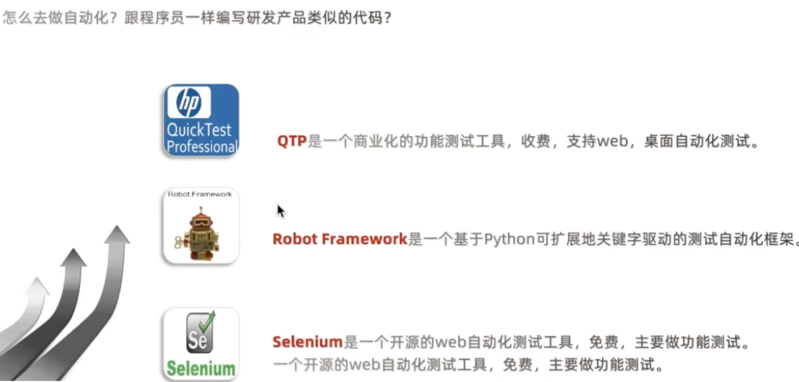

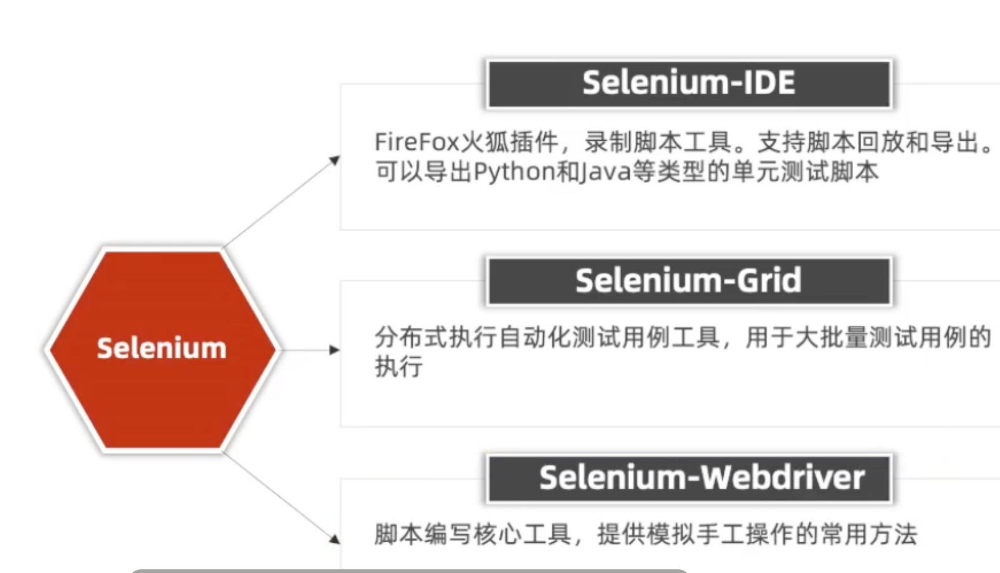

---

## 1. Selenium

### 1.1 环境安装

- pip install selenium
- show show selenium
- pip uninstall selenium

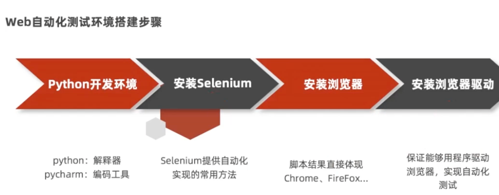

----

### 1.2 元素定位

8种

- id

  - 前置：所要定位的元素必须有id属性

  - ```python
    driver.find_element_by_id(id属性值)
    ```

  - 方法返回的是`元素对象`

- name
- class_name
- tag_name
- link_text
- partial_link_text
- XPATH
- CSS

```python
from time import sleep

from selenium import webdriver

# 1. 打开谷歌浏览器（实例化浏览器对象）
driver = webdriver.Chrome()
# 2. 输入url
driver.get(url="https://www.baidu.com")
# 3. 定位元素及操作

# 4. 关闭浏览器
sleep(3)
driver.quit()
# driver.close()
```

---

#### 1.2.1 by_id

```python
from time import sleep

from selenium import webdriver

# 1. 打开谷歌浏览器（实例化浏览器对象）
driver = webdriver.Chrome()
# 2. 输入url
driver.get(url="")
# 3. 定位元素及操作
# 用户名
driver.find_element_by_id("xxx").senk_keys("admin")
# 密码
driver.find_element_by_id("password").send_keys("123456")
# 4. 关闭浏览器
sleep(3)
driver.quit()
# driver.close()
```

#### 1.2.2 name/class

name定位

`driver.find_element_by_name("xxx")`

- 当前页面可以重复

- name属性值可以重复，使用的时候检查是否唯一

class定位

`driver.find_element_by_class_name("xxx")`

- class属性值可以有多个值 -->class="a1 a2 a3"
  - 可以选择任意单个值，不能多个值

前置：必须要存在name属性值

```python
from time import sleep

from selenium import webdriver

# 1. 打开谷歌浏览器（实例化浏览器对象）
driver = webdriver.Chrome()
# 2. 输入url
driver.get(url="")
# 3. 定位元素及操作
# 用户名
driver.find_element_by_name("xxx").senk_keys("admin")
# 密码
driver.find_element_by_name("password").send_keys("123456")
# 4. 关闭浏览器
sleep(3)
driver.quit()
# driver.close()
```

```python
from time import sleep

from selenium import webdriver

# 1. 打开谷歌浏览器（实例化浏览器对象）
driver = webdriver.Chrome()
# 2. 输入url
driver.get(url="")
# 3. 定位元素及操作
# 用户名
driver.find_element_by_name("xxx").senk_keys("admin")
# 密码
driver.find_element_by_name("xxx").send_keys("123456")
# 电话
driver.find_element_by_class_name("xxx").send_keys("xxx")
# 4. 关闭浏览器
sleep(3)
driver.quit()
# driver.close()
```

#### 1.2.3 by_tag_name

重复性高不建议使用，多个的时候默认返回第一个

用户名

driver.find_element_by_tag_name("input").senk_keys("admin")

- 使用标签名定位确认符合条件的元素是第几个？

- 如果需要获取所有的相同的标签：使用查找一组的元素的方法

#### 1.2.4 by_link_text

- 专门用来定位超链接元素(\<a>标签)

```python
# 全部匹配
driver.find_element_by_link_text(超链接的全部文本内容).click()
# 模糊匹配
driver.find_element_by_partial_link_text(部分内容).click()
```

#### 1.2.5 定位一组元素

- 说明`添加下标或者遍历`
- 方法`driver.find_elements_by_xxx()`
- 八大元素定位方法，都可以使用一组元素定位，如果没有搜索到指定的元素，返回空列表[]

```python
from time import sleep

from selenium import webdriver

# 1. 打开谷歌浏览器（实例化浏览器对象）
driver = webdriver.Chrome()
# 2. 输入url
driver.get(url="")
# 3. 定位元素及操作
# 查找所有的input标签
inputs = driver.find_elements_by_tag_name("input")
for input in inputs:
  input.send_keys("admin")  # 所有input输入框都输入了admin
  print(input)
inputs[0].send_keys("admin")
inputs[1].send_keys("123456")
inputs[2].send_keys("19112455052")
inputs[3].send_keys("123@qq.com")
# 4. 关闭浏览器
sleep(3)
driver.quit()
# driver.close()
```

----

#### 1.2.6 Xpath

XML Path的简称，用于XML文档中查找元素信息的语言

`driver.find_element_by_xpath(xpath表达式)`

- 策略：
  - 路径定位
  - 属性定位
  - 属性与逻辑结合
  - 层级与属性结合

==路径定位==

1. **绝对路径**

对界面依赖强，不建议使用

- 概念: 从最外层元素指定到元素之间所有经过的元素层级的路径
- 表达式写法：绝对路径以`/html`根节点开始，使用/来分隔元素层级

`/html/body/div/filedset/p[1]/input`

2. **相对路径**

- 概念：从目标定位元素的任意层级的上级元素开始到目标元素所经过的层级的路径
- 表达式写法：以`//`开始，后续每个层级都是用`/`来分隔

`//fieldset/p[1]/input`   某个文件下/，有很多个P标签，就+[n]，n从1开始计数


==属性定位==

- 概念：利用元素的任意属性来进行定位
- 示例：
  - //input[@type='submit']
  - //*[@value='提交']
- 挑选哪个属性来定位
- 较为常用的：id、name、class、value
  - 总之挑选精准定位到唯一元素的属性
  - 与class_name不同的是，如果具有多个值的class属性，**需要传入全部的属性值**
    - //*[@class='emailA wasdA']

`driver.find_element(by=By.XPATH, value="//input[@id='su']").click()`

==属性与逻辑结合==

- 概念：利用元素的多个属性来进行定位
- 示例：`//input[@value='提交' and @class='banana']`

==层级与属性结合==

- 概念：利用元素的多个属性进行定位
- 示例：`//*[@value='提交' and @class='banana']/input`

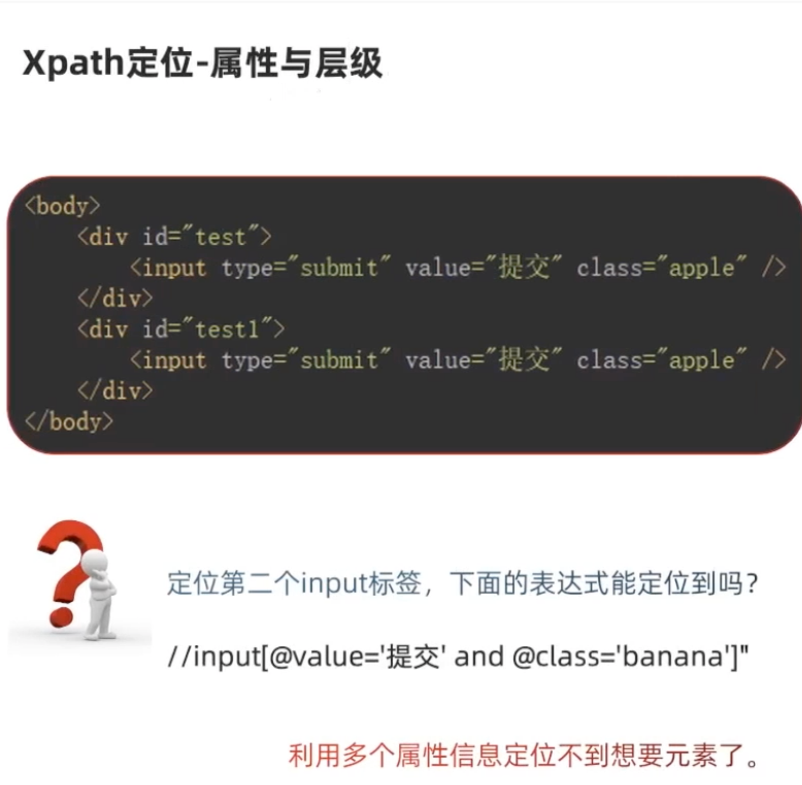

---

**延伸**

>//*[text()="xxx"]    --> 文本内容是xxx的元素
>
>//*[contains(@attribute,'xxx')]  --> 属性中含有xxx的元素
>
>//*[starts-with(@attribute,'xxx')] --> 属性以xxx开头的元素


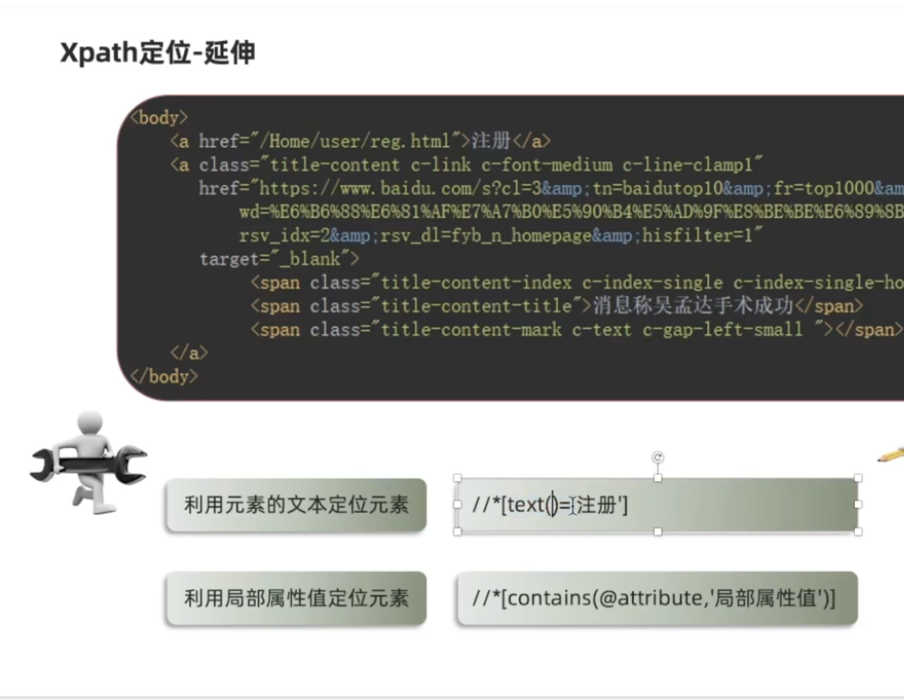

包含

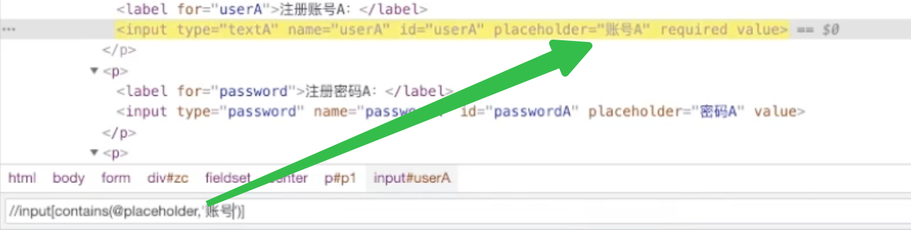

---

#### 1.2.7 CSS定位

- 比XPath速度更快
- 写法更简洁
- 概念：（Cascading Style Sheets）是一种语言，用来描述HTML元素的显示样式
- 选择器：一种表达式，可以找到HTML中的标签元素

**CSS定位**

- 概念：selenium利用选择器定位元素的定位方式
- 方法：`driver.find_element(by=By.CSS_SELECTOR, value="选择器表达式")`

==策略==

- ID选择器

  - 利用元素ID属性
  - `#id属性值`

- 类选择器

  - 利用元素class属性来选择
  - `.class属性值`

- 元素选择器

  - 利用元素标签名来选择
  - `标签名`
    - input -->选择所有的input元素

- 属性选择器

  - 利用元素任何属性来选择
  - `[属性名='属性值']`或者element[attribute=value]
  - 与class_name不同的是，如果具有多个值的class属性，**需要传入全部的属性值**
    - [type="password"]  -->选择type属性值为password的元素

- 层级选择器

  - 父子关系

  - 后代关系包含了父子关系，一般只需要记忆后代关系即可

  - 概念：据元素的父子关系来选择元素

  - 表达式写法：element1>element2

    `p[id='p1']>input`

  - 后代关系

    - 概念：根据元素的上级元素来选择（只要是目标元素上层元素即可）
    - 表达式写法：element1 element2
    - `p[id='p1'] input`

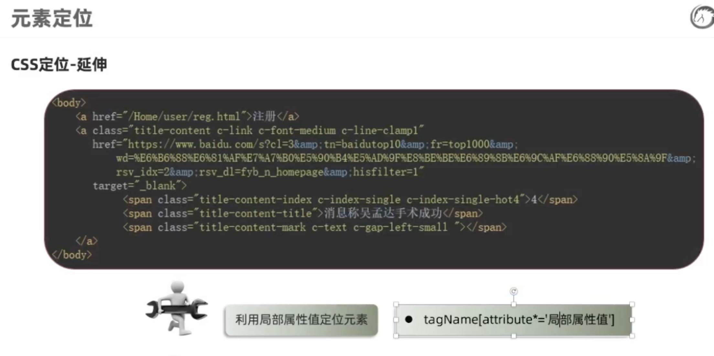

**CSS延伸**

>input[type^='p']   -->  type属性以p字母`开头`的元素
>
>input[type$='d']   -->  type属性以d字母`结束`的元素
>
>input[type*='w']   -->  type属性`包含`w字母的严肃

`driver.find_element_by_css_selector([placeholder*='账']").send_keys("admin")`

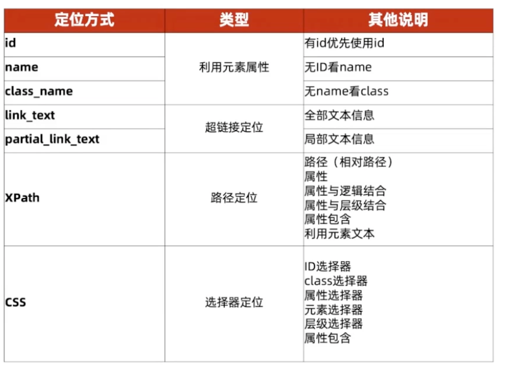

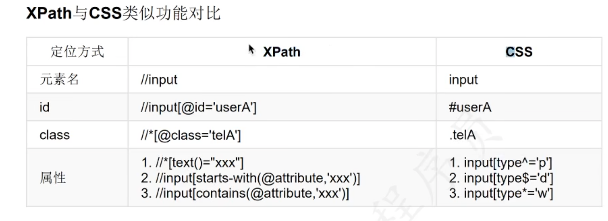

**结论**

>1. 首推css定位，原因是执行速度快
>   - 如果有ID属性，使用#id
>   - 如果没有ID属性使用其他属性（能代表唯一的属性）
>   - 如果属性都带不了唯一，使用层级
>2. 如果css解决不了，使用xpath

---

### 1.3 操作方法

>- 输入 .send_keys("")
>- 清空 .clear()
>- 点击 .click()

### 1.4 获取元素信息

- 获取大小：`element.size`
- ==获取文本==：`element.text`
- 获取属性：`element.get_attribute('属性名')`
- 元素是否可见：`element.is_displayed()`
- 元素是否可用：`element.is_enabled()`
- 元素是否选择：`element.is_selected()`

### 1.5 浏览器操作

**设置浏览器显示范围**

- **窗口最大化** `driver.maxmize_window()`
- 设置窗口大小 driver.set_window_size(width, height)
- 设置窗口位置 driver.set_window_position(x, y)

**浏览器显示页面操作**

- 页面后退操作 driver.back()
- 页面前进操作 driver.forword()
- **窗口刷新** `driver.refresh()`

**浏览器关闭操作**

- 关闭当前窗口 `driver.close()`
  - close关闭的是当前焦点所在的窗口
  - quit关闭的是浏览器
  - 启动那个窗口，默认焦点就在那个窗口
  - 如果需要切换窗口，需要调用其他api
- 关闭浏览器 `driver.quit()`

**获取浏览器信息**

- 获取标题 `driver.title`
- 获取网页地址 `driver.current_url`

**当前窗口**

创建驱动时第一个打开的窗口，对于当前窗口的元素一般都可以直接定位和操作，如果弹出新的窗口，对于新的窗口元素是不能直接进行操作，需要学习后续的窗口切换。

### 1.6 页面交互操作api

==下拉框==

三种方法

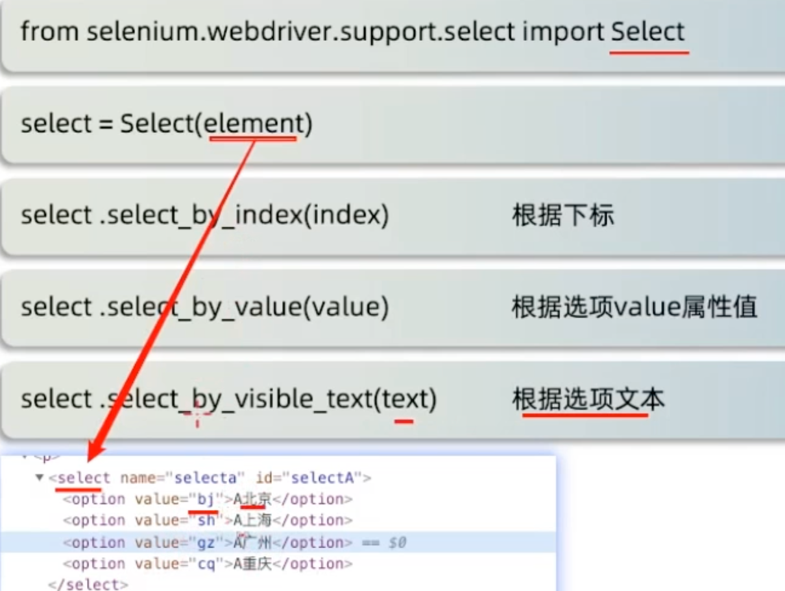

1. 导包
2. 创建select对象
3. 选择选项
4. 如果有多个下拉框就要实例化多个Select对象

```python
# 使用Select类来实现
# 1、定位下拉框元素 select
el = driver.find_element(By.CSS_SELECTOR，"#seLectA")
# 2、实例化Select对象
select = Select (el)
# 3、使用下标定位广州
select. select_by_index(2)
sleep (2)
# 使用value定位上海
select. select_by_value（"sh"）
# 使用文本定位 北京
sleep (2)
select. select_by_visible_text ("A北京" )
```

==弹出框==

当界面存在弹出框时，必须先处理才能继续其他操作

**类型**

- 自定义弹出框
  - 可以直接通过web浏览器开发者工具查看道具体的元素信息
  - 通过元素定位后直接可以处理掉
- JS弹出框（系统弹窗）
  - 通过JS函数实现，通过web浏览器开发者工具无法查看元素信息
  - 常见JS弹出框的形式：alert(警告框)、confirm(确认框)、prompt(提示框)
  - 不能通过元素定位进行处理

**`处理`**

- 获取弹窗对象
  - alert = driver.switch_to.alert-->（三种对象，在对象获取的时候都一样）
  - alert.text -->获取弹出框文本
- 弹出框处理方法
  - alert.accept() -->接受弹出框
  - alert.dismiss() -->取消弹出框
    - 确认框没有取消按钮，取消的方法是一样可以生效的

```python
# 点击弹窗
driver. find_element(By.ID, "alerta").click()
sleep (2)
# 获取弹窗对象
el = driver.switch_to.alert
处理弹窗 同意/取消
# el.dismiss()
# 取消
# print（"弹出文本："，el.text）
el.accept()
#同意
sleep (2)
# 输入用户名
driver. find_element(By.CSS_SELECTOR, "#userA") •send_keys("admin")
```

==滚动条处理==

所要操作的元素不在当前展示页面，需要滑动滚动条才能找到

如：阅读完需求才能勾选

- 定义JS字符串
  - js = "window.scrollTo(0,10000)"
- 执行JS字符串
  - driver.execute_script(js)

*当页面很长的时候可以动态获取高度*

js = "window.scrollTo(0, document.body.scrollHeight)" 

```python
#js->向下滑动10000像素
# js_down = "window.scrollTo(0,10000)"
# 动态执行滑倒底部 向下滑动滚动条高度
# js(0,10000) 第一个0为水平滚动条
js_down = "window.scrollTo(0, document.body.scrollHeight)"
＃ 执行js方法
driver.execute_script(js_down)
＃js->向上
js_top = "window.scrollTo(0,0)"
driver.execute_script(js_top)
```


### 1.7 鼠标操作

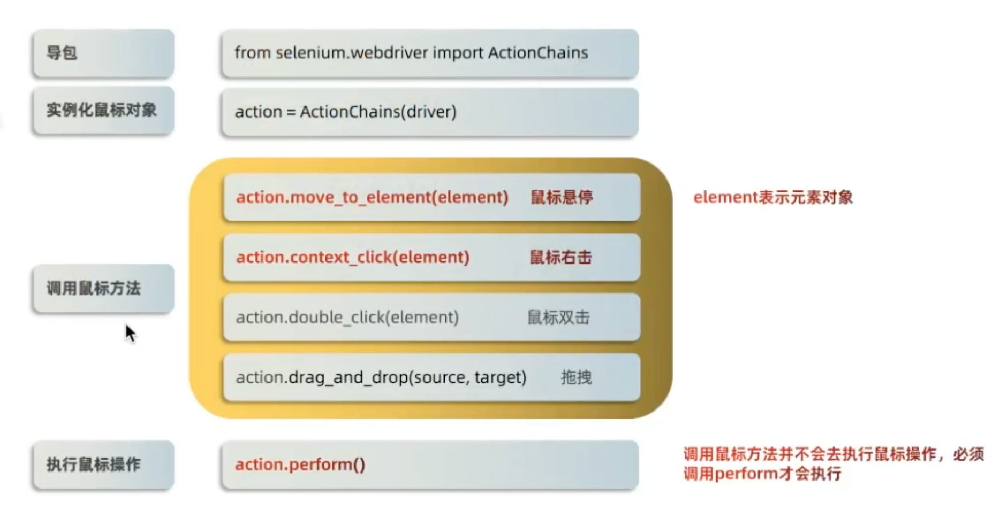

```python
# 1. 导包
from selenium.webdriver import ActionChains
# 2. 实例化鼠标对象
action = ActionChains(driver)
# 3. 调用鼠标方法
element = driver.find_element(By.xx,"")
action.move_to_element(element)  # 鼠标悬停
action.context_click(element)  # 鼠标右击
action.double_click(element)  # 鼠标双击
action.drag_and_drop(source, target)  # 鼠标拖拽
# 4. 执行鼠标操作
action.perform()  # 调用鼠标方法并不会去执行鼠标操作，必须调用perform方法
```

**拖拽**

```python
# 获取ActionChains対象
action = ActionChains (driver)
div1 = driver. find_element(By.CSS_SELECTOR, "#div1")
div2 = driver.find_element(By-CSS_SELECTOR, "#div2")
altion.drag_and_drop(div1,div2).perform()
# 4、关闭浏览器
sleep (3)
driver.quit()
```

---

### 1.8 键盘操作

Selenium中把键盘的按键都封装在Keys类中

`from selenium.webdriver.common.keys import Keys`

>1. send_keys(Keys.BACK_SPACE)   删除键(BackSpace)
>2. send_keys(Keys.SPACE)        空格键(Space)
>3. send_keys(Keys.TAB)          制表键(TAB)
>4. send_keys(Keys.ESCAPE)       回退键(Esc)
>5. send_keys(Keys.ENTER)        回车键(Enter)
>6. send_keys(Keys.CONTROL, 'a') 全选(Ctrl+A)  大小写是不一样的
>7. send_keys(Keys.CONTROL, 'c') 复制(Ctrl+C)


----

### 1.9 元素等待

界面渲染和脚本运行速度不一致，会导致出现`NoSuncElementException`异常

- time.sleep()影响运行效率


在定位页面元素时如未定位到，会在指定时间内一直处于等待的过程中

- 隐式等待
- 显示等待
- 强制等待 time.sleep(s)

`原因：`网络速度慢、电脑配置低、服务器处理请求慢等

==隐式等待==

1. 定位元素时，如果能定位到元素则直接返回该元素，不触发等待
2. 如果不能定位带该元素，则间隔一段时间后[间隔时间`不不`可以自定义]再去定位元素
3. 如果在达到最大时长时还没有找到指定元素，则抛出元素不存在的异常NoSuncElementException

`driver.implicitly_wait(timeout)`   timeout：为等待最大时长，单位：秒

- 针对的是`全部元素生效`   全局有效    只需设置一次就好了
  - **缺点**：
    - 当隐式等待被激活时，虽然目标元素已经出现了
    - 但是还是会由于当前页面内的其他元素的未加载完成，而继续等待，进而增加代码的时长
    - 比如说AJAX的内嵌图还没有加载出来

- 在项目中，未封装自动化框架，推荐使用

==显示等待==

1. 定位元素时，如果能定位到元素则直接返回该元素，不触发等待
2. 如果不能定位带该元素，则间隔一段时间[间隔时间可以自定义]后再去定位元素
3. 如果在达到最大时长时还没有找到指定元素，则抛出超时异常TimeoutException 

```python
# 导包
from selenium.webdriver.support.wait import WebDriverWait
# 创建显示等待类对象
WebDriverWait(driver,timeout,poll_frequency=0.5)
# 调用utils方法
until(method):直到...时
```

`element = WebDriverWait(driver,10,1).until(lambda x:x.find_element_by_id("xxx"))`

```python
#2、显示等待 ->返回查找到的元素
el = WebDriverWait(driver, 10, 0.5).until(lambda x: x.find.element(By.CSS_SELECTOR, "userA")
el.send_keys("admin")
```

- 说明：`针对单个元素生效`
- 特点：`查找并返回元素`

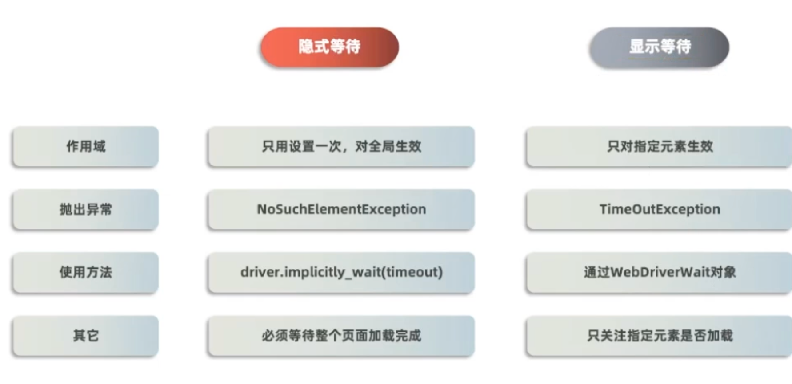

---

### 1.10 重要API

####  1.10.1 切换iframe

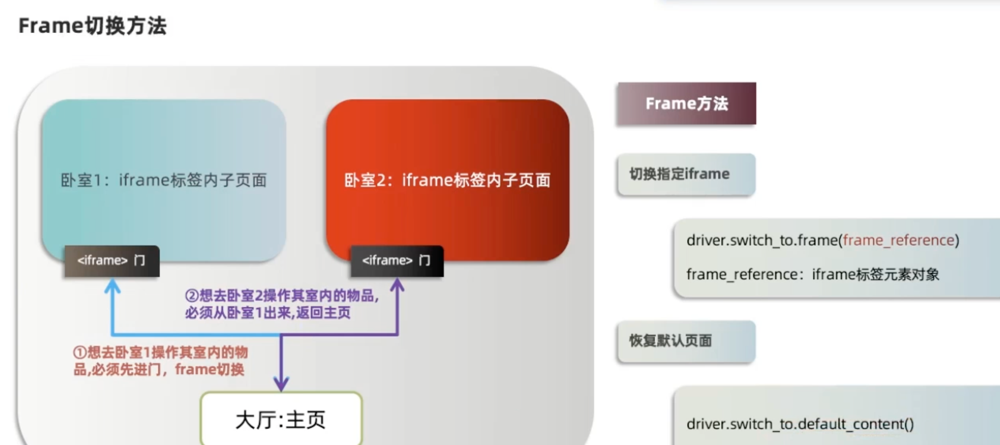

- iframe标签的作用是  在页面中加载另一个页面
- 为什么处理iframe
  - 焦点默认在启动页面，如果不处理iframe，无法操作iframe嵌入的页面元素
- 如何处理
  1. 切换到iframe `driver.switch_to.frame(iframe元素)`
  2. 操作元素
  3. 回到默认页面  `driver.switch_to.default_content()`
  4. 再切换到其他ifram页面(如果有需求的话)

```python
# 获取 A窗口 iframe元素
A = driver.find_element(By.CSS_SELECTOR, "#idframe1")
# 1. 切换到A  可以直接使用idframe1 不一定要去拿到
driver.switch_to_frame(A)
# 2. 注册A操作
driver.find_element(By.CSS_SELECTOR, "#userA").send_keys("admin")
# 3. 回到默认目录，注册实例
driver.switch_to.default_content()
# 4. 获取注册B iframe元素
B = driver.find_element(By.CSS_SELECTOR, "#idframe2")
# 5. 切换到B
driver.switch_to.frame(B)
# 6. 注册B的操作
driver.find_element(By.CSS_SELECTOR, "#userB").send_keys("admin")
```

==用法==

>```py
># 源码
>""":Usage:
>    ::
>
>        driver.switch_to.frame('frame_name')
>        driver.switch_to.frame(1)
>        driver.switch_to.frame(driver.find_elements(By.TAG_NAME, "iframe")[0])
>   """
>```
>
>1. 直接传特征值，id值name值都可以
>2. 默认第一个frame是0，下标
>3. 通过标签拿到一组frame，通过下标拿到第一个

---


#### 1.10.2 多窗口 句柄

标签栏多窗口

- selenium默认焦点在启动窗口，要操作其他窗口必须处理

**窗口切换**

- selenium需要通过窗口的`句柄`来实现窗口的切换

句柄：handle 窗口的唯一识别码

**切换步骤**

0. 获取**当前窗口**的句柄值
   - `driver.current_window_handle`

1. 获取所有窗口句柄
   - `handles = driver.window_handles` --->列表
2. 切换指定窗口
   - `driver.switch_to.window(handles[index])` 
     - index=-1  表示的是最新的窗口
   - `driver.switch_to.window(handle)` 

----

#### 1.10.3 封装多窗口工具类

- 获取所有句柄
- 切换窗口
- 获取当前所在窗口title
- 判断title是否为需要的窗口
- 执行代码

```python
def switch_window(title):
  # 1. 获取所有窗口句柄
  handles = driver.window_handles
  # 2. 遍历句柄进行切换
  for handle in handles:
  	# 操作
    driver.switch_to.window(handle)
    # 获取当前窗口title 并且判断是否自己需要的窗口
    if driver.title == title:
    	# 操作代码
    return "已找到{}窗口，并且切换成功".format(title)
```

- 使用

```python
def switch_window(title):
  # 1. 获取所有窗口句柄
  handles = driver.window_handles
  # 2. 遍历句柄进行切换
  for handle in handles:
  	# 操作
    driver.switch_to.window(handle)
    # 获取当前窗口title 并且判断是否自己需要的窗口
    if driver.title == title:
    	# 操作代码
    return "已找到{}窗口，并且切换成功".format(title)
title_A = "注册A"
title_B = "注册B"
# 打开注册A和注册B网页
driver.find_element(By.LINK_TEXT, "注册A网页").click()
driver.find_element(By.LINK_TEXT，"注册B网页").click()
# 填写注册A网页 用户名
switch_window(title_A)
driver.find_element(By.CSS_SELECTOR, "#userA").send_keys("admin")
switch_window(title_B)
driver.find_element (By.CSS_SELECTOR, "#userB").send_keys ("admin")
```

#### 1.10.4 窗口截图

断言失败后截图--->寻找错误在哪

有截图结合错误信息更方便快速查询分析错误

**获取所有窗口句柄**

```python
driver.get_screenshot_as_file(imgpath)  # 一般会封装到代码
# imgpath: 图片保存路径   最好是png格式
# as_file   as_png   as_base64

# 自动追加时间戳，方便命名
driver.get_screenshot_as_file("error_{}".format(time.strftime("%Y_%m"))) 
```

==扩展给元素截图==

```python
btn = driver.find_element_by_tag_name('button')
btn.screenshot('./btn.png')
```


#### 1.10.5 验证码处理

>说明：Selenium中并没有对验证码处理的方法
>
>方式：
>
>1. 去掉验证码（测试环境下-采用）
>2. 设置万能验证码（生产环境和测试环节下-采用）
>3. 验证码识别技术（通过python-tesseract来识别图片类型验证码，识别率很难达到100%）
>4. 记录`Cookie`(通过记录cookie进行跳过登录)   比较实用

1. 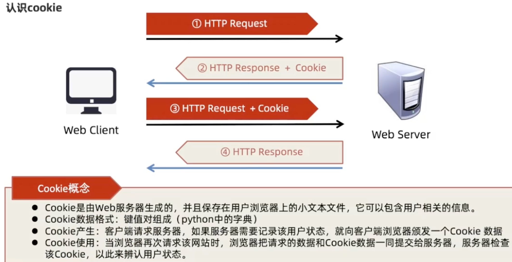


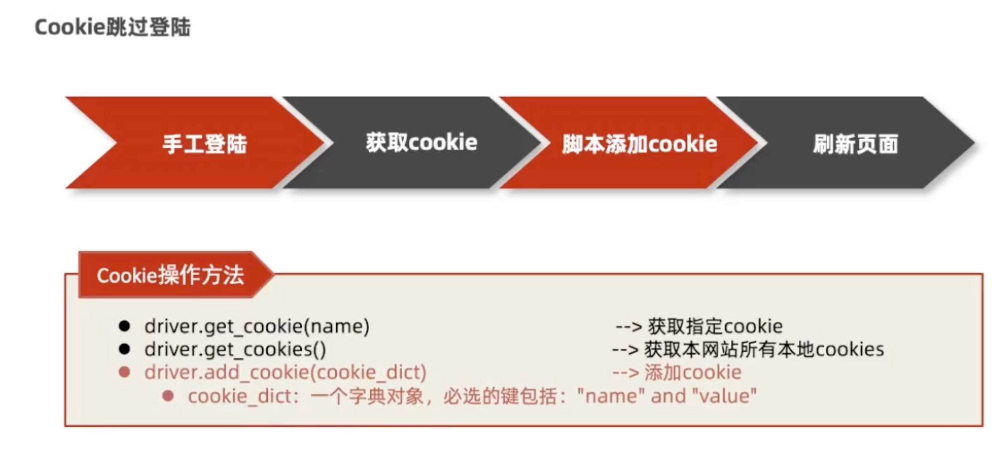

```python
from time import sleep
from selenium import webdriver

driver = webdriver.Chrome()
driver.get("https://www.baidu.com")
# 添加cookie
data = {"name":"BDUSS","value":"xxxxx"}
driver.add_cookie(data)
cookies = driver.get_cookies()
print(cookies)
sleep(5)
# 刷新
driver.refresh()
sleep(3)
driver.quit()
```

-----

## 2. PyTest

>1. windows下,pytest配置文件不允许写注释信息
>2. 一个工程只需要一个并且文件名正确
>3. 置于工程根目录下
>4. 配置有pytest配置文件的工程，只需要打开命令行，输入 pytest指令 即可执行测试

```ini
[pytest]
# 不知道了可以 pytest --help查看
# 所有参数都可以写这里，添加pytest命令选项
addopts = -vs
# 表示测试用例的位置
testpaths = ./testcases
# 指定测试模块文件名前缀
python_files = test*
# 指定测试类名前缀
python_classes = Test*
# 指定测试函数/测试方法名的前缀
python_functions = test_*
```


```python
# 特殊方法：类级别 和函数级别
import pytest

class TestDemo(object):
    """测试示例类"""

    # 特殊方法名写法固定，没有代码提示，需要手写
    # 函数级别的执行顺序 setup_class() - setup() - 测试方法 teardown() - setup() - 测试方法 teardown() - teardown_class()
    def setup_class(self):
        print("类级别的前置方法")

    def teardown_class(self):
        print("类级别的后置方法")

    def setup(self):
        print("函数级别前置方法")

    def teardown(self):
        print("函数级别后置方法")

    def test_method1(self):
        """示例测试方法"""
        print('测试方法111')

    def test_method2(self):
        """示例测试方法"""
        print('测试方法222')


if __name__ == '__main__':
    pytest.main(['-s', 'basic_pytest_06'])
```

---

### 2.1 常用插件

#### 2.1.1 pytest-html

在配置文件中(addopts)的命令行参数增加  `--html=用户路径/report.html`


#### 2.1.2 执行顺序

pip3 install pytest-ordering

**使用**

`对方法有效，对类也有效`

1. 标记于被测试函数，`@pytest.mark.run(order=x)`
2. 根据order传入的参数来解决运行顺序
3. order值全为正数或全为负数时，运行顺序：值越小，优先级越高（负数也一样）
4. 正数和负数同时存在：正数优先级高

```python
import pytest
# 对类也有效
class TestDemo1(object):
    @pytest.mark.run(order=2)
    def test_print1(self):
        print("测试1-1")

    @pytest.mark.run(order=1)
    def test_print2(self):
        print("测试1-2")
```


#### 2.1.3 失败重试

pip3 install pytest-rerunfailures

**使用**

1. 在配置文件中增加行参数 `--reruns n`

2. ```ini
   addopts = -s --reruns 3
   ```

----

### 2.2 高级用法

#### 2.2.1 跳过

也有mark.skip不带条件的

```python
# 跳过测试函数
# 参数：
# 	condition: 跳过的条件，必须传递
# 	reason: 标注的原因，必须传递
@pytest.mark.skipif(condition, reason=None)
```

```python
import pytest

version = 12

class TestDemo(object):
  # reason不能省略
    @pytest.mark.skipif(version >= 11, reason="xxx")
    def test_method1(self):
        print("方法1")

    def test_method2(self):
        print("方法2 不跳过")
```


#### 2.2.2 单个参数化

>数据参数化
>
>参数:
>
>- argnames: 参数名
>- argvalues: 参数对应值，类型必须为可迭代类型，一般使用list
>
>@pytest.mark.parametrize(argnames, argvalues, indirect=False, ids=None, scope=None)

**一个参数使用方式**

1. argnames 为字符串类型，根据需求决定合适的参数名
2. argvalues 为列表类型，根据需求决定列表元素中的内容
3. 在测试脚本中，参数，名字与argnames保持一致
4. 在测试脚本中正常使用

```python
import pytest


class TestDemo(object):

    @pytest.mark.parametrize('name', ['name1', 'name2'])  # 有两个name，输出两遍
    def test_01(self, name):
        print(name)
```


#### 2.2.3 多个参数化

`@pytest.mark.parametrize('参数1， 参数2', [(数据1-1, 数据1-2), (数据2-1, 数据2-2)])`

**注意 **

1. 多个参数必须要在一个字符串哪（同一个引号内）
2. 数据参数的格式: [(), ()] 或者 [[], []]
3. `扩展` @pytest.mark.parametrize(('参数1', '参数2'), [(数据1-1, 数据1-2), (数据2-1, 数据2-2)])

----

#### 2.2.4 通过函数或方法引入测试数据

```python
import pytest

def build_test_data():
    # 中间代码略
    return [('xm', 123123), ('xh', 123456)]

class TestDemo(object):

    @pytest.mark.parametrize("name, pwd", build_test_data())
    def test_01(self, name, pwd):
        print(name, pwd)
```

---

#### 2.2.4 断言

assert用的是python自带的断言

`assert 表达式`

assert 1==2   assert 'admin' in '欢迎admin'


---

## 3. PO模式

Page Object的缩写，PO模式是`UI自动化测试`项目开发实践的最佳设计模式之一

- 将自动化涉及的页面或模块封装成对象

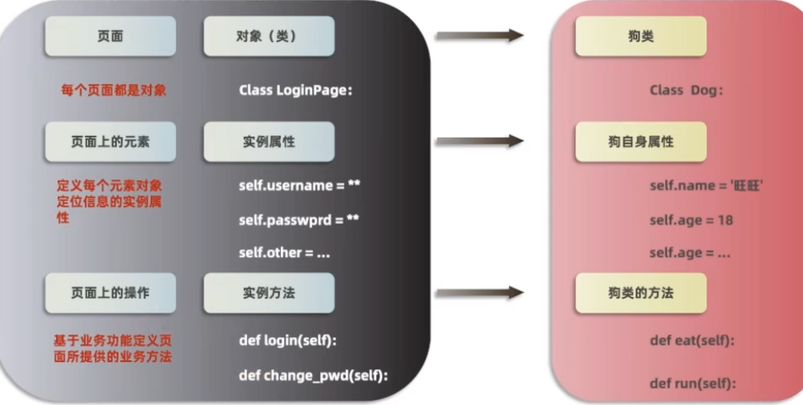

**能解决什么问题**

1. 代码复用性
2. 便于维护（脚本层与业务分离）-->如果元素信息发生变化，不用去修改脚本


**PO如何实现**

- Base层
  - 存放页面所有公共方法

- Page层
  - 基于页面或模块单独封装当前页面要操作的对象
- Script层
  - 脚本层+unitest/pytest

---

>PO模式是自动化测试项目开发实践的最佳设计模式之一。
>
>核心思想是通过对界面元素的封装减少冗余代码，同时在后期维护中，若元素定位发生变化时，只需要调整页面元素封装的代码，提高测试用例的可维护性、可读性

**PO(POM)模式可以把一个页面分为三层，对象库层、操作层、业务层**

- 对象库层: 封装定位元素的方法
- 操作层: 封装对元素的操作
- 业务层: 将一个或多个操作组合起来完成一个业务功能。
  - 比如登录: 需要输入账号、密码、点击登录三个操作

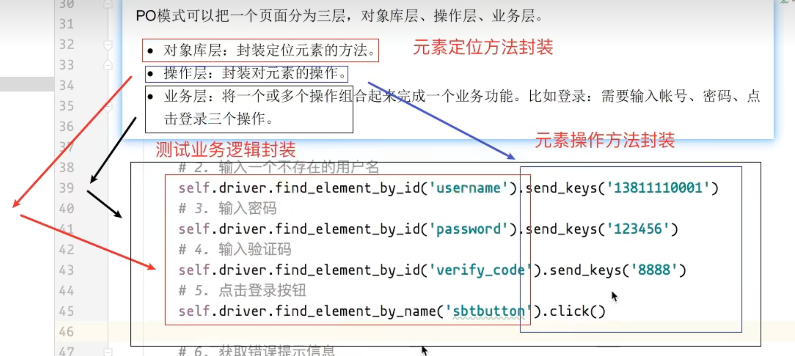

---

### 3.1 封装步骤

```yaml
1. 对应页面创建页面 PO 代码文件，命令规则: 页面功能_page.py, 例如首页: index_page.py
2. 定义三个类: 对象层(XxxPage) 操作层(XxxHandle) 业务层(XxxTask)
3. 对象层:
	1> init 方法中获取浏览器对象
	2> 自定义方法: 封装元素定位方法
	3> 封装元素定位方法需要添加返回值
4. 操作层: 
	1> init 方法获取对象层对象，根据类名写对象变量名
	2> 自定义方法: 获取元素操作方法
5. 业务层:
	1> init 方法获取操作层对象，根据类名写对象变量名
	2> 自定义方法: 封装测试业务逻辑
6. 在测试用例文件中，实例化业务层对象，调用测试业务方法，执行测试
```


**样例 首页页面**

```python
"""
首页页面
"""
from selenium.webdriver.common.by import By
from utils import DriverUtils


class IndexPage(object):
    """首页对象层"""

    def __init__(self):
        self.driver = DriverUtils.get_driver()  # 获取浏览器对象

    def find_login(self):
        """定位登录方法"""
        # self.driver.find_element(by=By.XPATH, value='//*[text()="学生登录"]')
        # self.driver = DriverUtils.get_driver()  # 获取浏览器对象  可以初始化
        return self.driver.find_element(by=By.XPATH, value='//*[text()="学生登录"]')

class IndexHandle(object):
    """首页操作层"""

    def __init__(self):
        self.index_page = IndexPage()  # 获取对象层对象

    def click_login(self):
        """点击登录方法"""
        # IndexPage().find_login().click()  # 实例化IndexPage  可以写初始化方法
        self.index_page.find_login().click()


class IndexTask(object):
    """首页业务层"""
    def __init__(self):
        self.index_handle = IndexHandle()  # 获取操作层对象

    def go_to_login(self):
        """跳转登录页面方法"""
        self.index_handle.click_login()
```


---


## 2. problem

### 2.1 执行ui自动化的时候找不到元素该怎么分析？

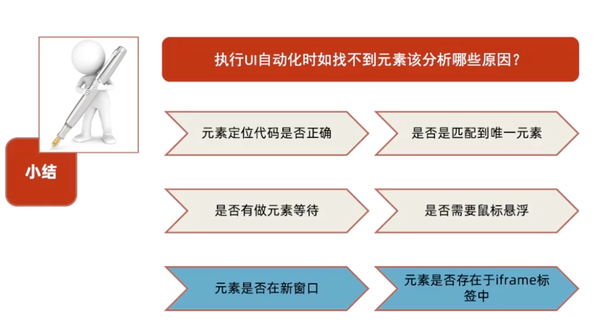

---

